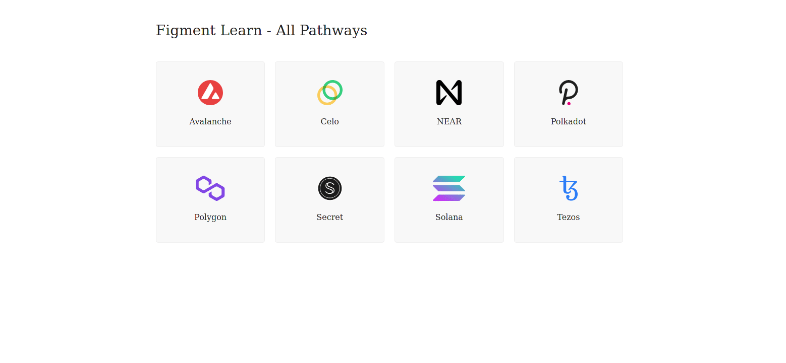

# Avalanche.js

[Avalanche.js](https://github.com/ava-labs/avalanchejs) is a client Javascript package that makes it easy to interact with the Avalanche blockchain nodes, query data, submit transactions and offers plenty of other functionality. It's the official package developed by Avalanche, and is a preferred method of communicating with nodes on the private or public networks for development purposes.
------------------------

# Lesson

Connecting to a node works pretty much the same as for a standard web server. There are two actors: Client & server, with a protocol managing how data are transferred from one to the other. 

The main difference here is in the protocol. To connect to Avalanche, we'll be using `json-rpc`: 
* `json`, stands for **J**ava**S**cript **O**bject **N**otation, which is a [text format for transferring data](https://www.w3schools.com/js/js_json_intro.asp).
* `rpc`, stands for **R**emote **P**rocedure **C**all - a way to [call a server-side function](https://en.wikipedia.org/wiki/Remote_procedure_call) from the client-side.

Need more info? => [AvalancheGo APIs](https://docs.avax.network/build/avalanchego-apis)

------------------------

# Challenge


In `pages/api/tezos/connect.ts`, complete the code of the function and try to establish your first connection to the avalanche network. To verify your connection has been correctly established, try to return the current protocol version.


```typescript
//...
  try {
    const client = undefined
    const info = undefined
    const version = undefined
    res.status(200).json(version)
  }
//...
```

**Need some help?** Check out these tips
* Use the `getAvalancheClient` helper function.
* Use the `Info` method on the client.
* Use the `getNodeVersion` method on the client info.
* [**`avalanchejs` library**](https://github.com/ava-labs/avalanchejs)

------------------------

# Solution

```typescript
//...
  try {
    const client = getAvalancheClient()
    const info = client.Info()
    const version = await info.getNodeVersion()
    res.status(200).json(version)
  }
//...
```

**What happened in the code above?**
* We instantiate an `Avalanche` object with `getAvalancheClient`.
* Calling the `Info` method returns a reference to the Info RPC.
* `getNodeVersion` sends the request and retrieves the answer.

------------------------

# Make sure it works

Once the code is complete and the file has been saved, refresh the page to see it update & display the current version.



-------------------------

# Next

Now that we have successfully connected to Avalanche node using DataHub, we are ready to move onto the next tutorial. We have also created the foundation for the next steps.

