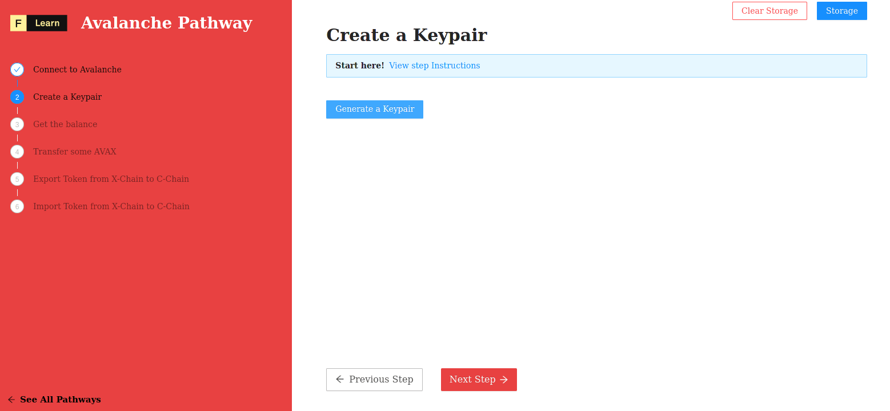

# Avalanche Architecture

In this step we will be creating your first Avalanche account on X-Chain using the Avalanche JavaScript API and DataHub.

Unlike other popular blockchain, Avalanche comes with a set of different chains, each for its own purposes:

* **X-Chain** - For asset transfers.
* **P-Chain** - For network validators and staking.
* **C-Chain** - For smart contract execution.

## X-Chain

The X-Chain acts as a decentralized platform for creating and trading digital smart assets, a representation of a real-world resource (e.g., equity, bonds) with a set of rules that govern its behavior, like "can’t be traded until tomorrow" or "can only be sent to US citizens."

One asset traded on the X-Chain is AVAX. When you issue a transaction to a blockchain on Avalanche, you pay a fee denominated in AVAX.

## P-Chain

The P-Chain is the metadata blockchain on Avalanche and coordinates validators, keeps track of active subnets, and enables the creation of new subnets. The P-Chain implements the Snowman consensus protocol.

## C-Chain

The C-Chain allows for the creation of smart contracts using the C-Chain’s API, and is an instance of the Ethereum Virtual Machine powered by Avalanche.

------------------------

# Challenge


In `pages/api/avalanche/account.ts`, complete the code of the function to create our private key. A private key is used to sign transactions on any Avalanche chain (X/P/C), and for educational purposes we'll use a single private key during the Pathway. To manage the keys we first configure the Keychain, a component for managing private/public key pairs and addresses.


```typescript
//...
	const client = getAvalancheClient()
	const chain = client.XChain(); 
	const keyChain = chain.keyChain(); 
	const keypair = keyChain..... //
	const secret = undefined
	const address = undefined
	res.status(200).json({
		secret, address
	})
//...
```

**Need some help?** Check out these tips
* Using code completion feature of your favorite code editor find a method which retrieve a KeyPair object
* On keypair instance call the good method to retrieve the `PrivateKey` in string format
* On keypair instance call the good method to retrieve the `Address` in string format
* [**`avalanchejs` library**](https://github.com/ava-labs/avalanchejs)

------------------------

# Solution

```typescript
//...
	const client = getAvalancheClient()
	const chain = client.XChain(); 
	const keyChain = chain.keyChain(); 
	const keypair = keyChain.makeKey()
	const secret = keypair.getPrivateKeyString()
	const address = keypair.getAddressString()
	res.status(200).json({
		secret, address
	})
//...
```

**What happened in the code above?**
* Calling `makeKey` method will give us a keypair
* `getPrivateKeyString` retrieve the string formated private key
* `getAddressString` retrieve the string formated public key



Do not forget to fund the newly created wallet using the [avalanche faucet](https://faucet.avax-test.network/) in order to activate it!


------------------------

# Make sure it works

Once the code is complete and the file is saved, Next.js will rebuild the API route. Now click on **Generate a Keypair** and you should see:



-------------------------

# Next

Nice now, you hold an identity it's time to interact, don't forget to go on a faucet to earn some token.
You want to know the amount of token you hold ? Good, this is exactly what the next challenge is asking for. 
