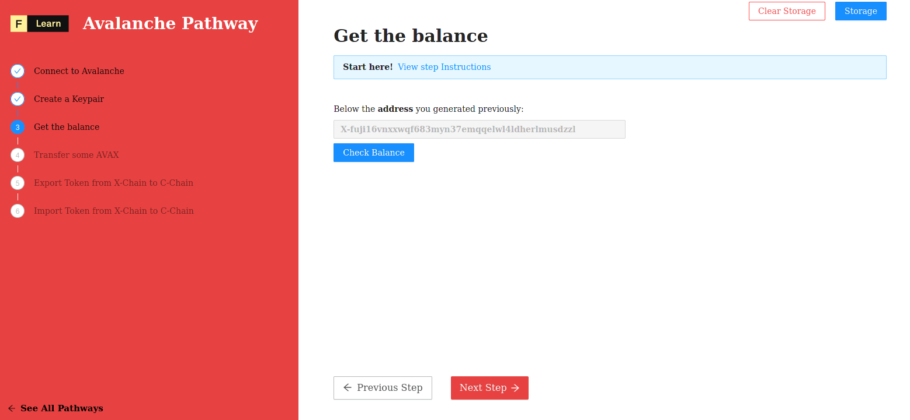

How much token do I hold ? Good question, token are the main tradable asset of web3 space. You can trade other asset but this one is everywhere.
Anytime you'll need to make a trade, you'll have to pay some fee. And theses fees have to be paid with the native token.

Remember, your identity is a keypair, and one of this key is an address. It allow anyone to locate you and the asset you own.
Then to get your balance you only need to know your address. But wait sometimes you do not remember your address, not problem you can always
recreate your keypair from your private key (your secret ^^)

------------------------

## Challenge


You wish to know the amount of token you hold: Decode `pages/api/avalanche/balance.ts` and your wish will be granted


```typescript
    try {
        const asset = "AVAX"
        const { secret } = req.body
        const client = getAvalancheClient()
        const chain = client.XChain(); 
		const keychain = chain.keyChain()
		const key = undefined 
		const address = undefined 
        const balance = await undefined as BalanceT; 
        res.status(200).json(balance.balance)
    }
```

Some hints : 
* `importKey` look like a good candidate to rebuild the keypair.
* Now with the keypair you can derive the address (again in string format).
* On `chain` and using code completion feature of your editor try to find the right method to call.

------------------------

## Solution

```typescript
    try {
        const { secret } = req.body
        const client = getAvalancheClient()
        const chain = client.XChain(); 
		const keychain = chain.keyChain()
		const key = keychain.importKey(secret)
		const address = key.getAddressString()
        const balance = await chain.getBalance(address, "AVAX") as BalanceT; 
        res.status(200).json(balance.balance)
    }
```

Quick review of the solution:
* Calling `importKey` method will rebuild the expected keypair.
* `getAddressString` retrieve the string formated public key.
* `getBalance` method will give what you are looking for.

------------------------

# Make sure it works

Once the code is complete and the file has been saved, refresh the page to see it update & display the current version.



-----------------------------

## Next

What one can expect to do with some token ? Made transfer it to someone could be a good start. 
This is your next challenge.
