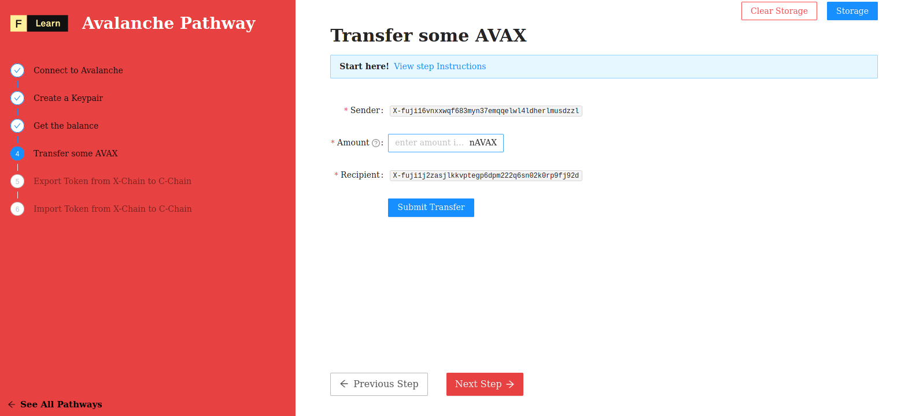

Still not sure how to do this? No problem! The solution is below so you don't get stuck.

------------------------

# Challenge


In `pages/api/avalanche/transfer.ts`, complete the code of the function and try to establish your first connection to the celo network. 


**Take a few minutes to figure this out**

```typescript
//...

//...
```

**Need some help?** Check out these links
* [**ContractKit usage**](https://docs.celo.org/developer-guide/contractkit/usage)  


[**You can join us on Discord, if you have questions**](https://discord.gg/fszyM7K)


Still not sure how to do this? No problem! The solution is below so you don't get stuck.

------------------------

# Solution

```typescript
//...
  try {
    const { secret, amount } = req.body
    const client = getAvalancheClient()
    const chain = client.XChain(); 
    const keychain = chain.keyChain()
    const key = keychain.importKey(secret)

    // constants
    const receiver = "X-fuji1j2zasjlkkvptegp6dpm222q6sn02k0rp9fj92d" 
    const asset = "AVAX" 

    // Fetch UTXO (i.e unspent transaction outputs)
    const address = key.getAddressString()
    const { utxos } = await chain.getUTXOs(address)

    // Determine the real asset ID from its symbol/alias
    // We can also get the primary asset ID with chain.getAVAXAssetID() call
    const binTools = BinTools.getInstance()
    const assetInfo = await chain.getAssetDescription(asset)
    const assetID = binTools.cb58Encode(assetInfo.assetID)

    // Generate a new transaction
    const transaction = await chain.buildBaseTx(
      utxos, // unspent outputs	
      new BN(amount), // transaction amount formatted as a BigNumber
      assetID, // AVAX asset
      [receiver], // addresses to send the funds
      [address], // addresses being used to send the funds from the UTXOs provided
      [address], // addresses that can spend the change remaining from the spent UTXOs
    )

    // Generate a signed transaction
    const signedTx = transaction.sign(keychain)
    const hash = await chain.issueTx(signedTx)
    console.log(`Visit https://explorer.avax-test.network/tx/${hash} to see transaction details`)

    res.status(200).json(hash)
  }
//...
```

**What happened in the code above?**
* First, we create a new `kit` instance.

------------------------

# Make sure it works

Once the code is complete and the file has been saved, refresh the page to see it update & display the current version.



-----------------------------

# Next

Once the code is complete and the file has been saved, refresh the page to see it update & display the current version.
