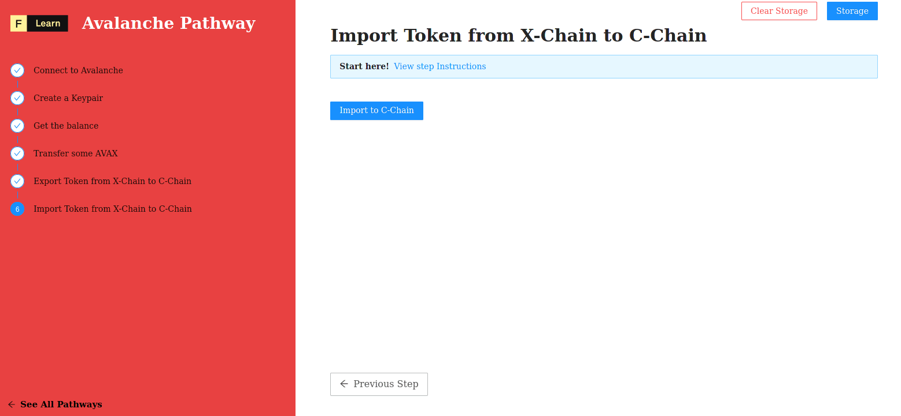

Since Avalanche operates on 3 chains (X/P/C), it allows users to transfer tokens in each direction.

AVAX tokens exist on the X-Chain, where they can be traded, on the P-Chain, where they can be provided as a stake when validating the Primary Network, and on the C-Chain, where they can be used in smart contracts or to pay for gas. Avalanche supports movement of AVAX between these chains.  We'll be concentrating our efforts on X->C swaps, with C-Chain being used for smart contract deployments. 

Interchain transfers are performed via a 2-step process:

* Create X-Chain export transaction
* Create C-Chain import transaction

On this step we will focus on **C-Chain import transaction**.

------------------------

# Challenge


In `pages/api/avalanche/import.ts`, complete the code of the function and try to establish your first connection to the celo network. 


**Take a few minutes to figure this out**

```typescript
//...
  try {
    const { secret } = req.body
    const client = getAvalancheClient()
    
    // Initialize chain components
    const [ xChain   , cChain    ] = [ client.XChain()            , client.CChain()             ];
    const [ xKeychain, cKeychain ] = [ xChain.keyChain()          , cChain.keyChain()           ];
    const [ xKeypair , cKeypair  ] = [ xKeychain.importKey(secret), cKeychain.importKey(secret) ];
    const [ _xAddress , cAddress ] = [ xKeypair.getAddressString(), cKeypair.getAddressString() ];

    // Get the real ID for X-Chain
    const xChainId = undefined;

    // Fetch UTXOs (i.e unspent transaction outputs)
    const { utxos } = await cChain.getUTXOs(cAddress, xChainId);

    // Derive Eth-like address from the private key
    const binTools = BinTools.getInstance();
    const keyBuff = binTools.cb58Decode(secret.split('-')[1]);
    // @ts-ignore
    const ethAddr = Address.fromPrivateKey(Buffer.from(keyBuff, "hex")).toString("hex");
    console.log("ethreum address: ", ethAddr);

    // Generate an unsigned import transaction
    const importTx = await cChain.buildImportTx(undefined)

    // Sign and send import transaction
    const hash = await cChain.issueTx(importTx.sign(cKeychain))

    res.status(200).json(hash)
  }
//...
```

**Need some help?** Check out these links
* [**Code examples**](https://github.com/ava-labs/avalanchejs/tree/master/examples/avm)  
* [**Manage X-Chain Keys**](https://docs.avax.network/build/tools/avalanchejs/manage-x-chain-keys)
* [**What The Heck is UTXO**](https://medium.com/bitbees/what-the-heck-is-utxo-ca68f2651819)


[**You can join us on Discord, if you have questions**](https://discord.gg/fszyM7K)


Still not sure how to do this? No problem! The solution is below so you don't get stuck.

------------------------

# Solution

```typescript
//...
  try {
    const { secret } = req.body
    const client = getAvalancheClient()
    
    // Initialize chain components
    const [ xChain   , cChain    ] = [ client.XChain()            , client.CChain()             ];
    const [ xKeychain, cKeychain ] = [ xChain.keyChain()          , cChain.keyChain()           ];
    const [ xKeypair , cKeypair  ] = [ xKeychain.importKey(secret), cKeychain.importKey(secret) ];
    const [ _xAddress , cAddress ] = [ xKeypair.getAddressString(), cKeypair.getAddressString() ];

    // Get the real ID for X-Chain
    const xChainId = await client.Info().getBlockchainID("X");

    // Fetch UTXOs (i.e unspent transaction outputs)
    const { utxos } = await cChain.getUTXOs(cAddress, xChainId);

    // Derive Eth-like address from the private key
    const binTools = BinTools.getInstance();
    const keyBuff = binTools.cb58Decode(secret.split('-')[1]);
    // @ts-ignore
    const ethAddr = Address.fromPrivateKey(Buffer.from(keyBuff, "hex")).toString("hex");
    console.log("ethreum address: ", ethAddr);

    // Generate an unsigned import transaction
    const importTx = await cChain.buildImportTx(
        utxos,
        ethAddr,
        [cAddress],
        xChainId,
        [cAddress]
    )

    // Sign and send import transaction
    const hash = await cChain.issueTx(importTx.sign(cKeychain))

    res.status(200).json(hash)
  }
//...
```

**What happened in the code above?**
* First, we need to build our C-Chain keypair and it's working exactly the same way for X-Chain.
* Next, we determine the chainId.
* Next, we fetch the latest `UTXOS`.
* Next, as we're working on a `evm` compatible blockhain (C-Chain emulate Solidity Smart contract on `evm`), we need to deduce the ethereum address from the private key.
* Next, we build our transaction the same way for a simple expect:
  * There is no amount as we're importing an existing amount.
  * The destination address is on ethereum format as we're working on a `evm` compatible chain.
* Finaly, we sign and send the transaction and return the transaction hash.

------------------------

# Make sure it works

Once the code is complete and the file is saved, Next.js will rebuild the API route. Click on **Import 0.05 AVAX** and you should see the balance displayed on the page:



-----------------------------

# Conclusion

Congratulations, you've made it this far and successfully completed an AVAX transfer from X-Chain to C-Chain. Similarly, the same approach works the other way around (C->X), or for any other inter-chain transfers.

Avalanche team has put together a [good list of examples](https://github.com/ava-labs/avalanchejs/tree/master/examples/avm), be sure to check them out if you need a bit more advanced experience with the Avalanche.js library.

Ready for more? No problem! While the basic Pathway is complete at this point, you are more than welcome to explore other [Avalanche](https://learn.figment.io/protocols/avalanche) tutorials.

If you had any difficulties following this tutorial or simply want to discuss Avalanche tech with us, you can join [our community](https://discord.gg/fszyM7K) today!
