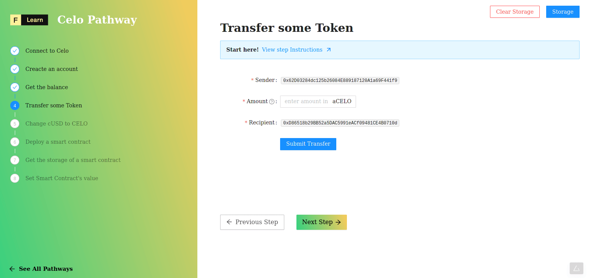

It’s time to submit your first transactions. In this challenge, we will connect to a Celo node hosted by DataHub and we will transfer our testnet token. As you remember from previous step, we funded our account on the `Alfajores` testnet with 5CELO and 10cUSD. Now let’s try to transfer some **CELO** token to another test account.

----------------------------------

# The challenge


In `pages/api/celo/transfer.ts`, complete the code of the **transfer** function. Celo has a number of core Smart Contracts that are deployed to the network. In this challenge. we'll use GoldToken contract wrappers, which have the transfer and send function allowing us to build a transfer transaction. 


**Take a few minutes to figure this out.**

```tsx
//..
  try {
    const { secret, amount, recipient, address } = req.body
    const url = getSafeUrl();
    const kit = newKit(url);

    // restore account usign your secret
    undefined
    // access CELO contract wrapper
    const celoToken = undefined;
    // Build the transaction and send
    const celotx = undefined
    // wait the confirmation of the transaction
    const celoReceipt = await celotx.waitReceipt();

    res.status(200).json(celoReceipt.transactionHash)
  }
//..
```

**Need some help?** Check out these links
* [**We can access the CELO contract via the SDK with kit.contracts.getGoldToken()**](https://docs.celo.org/developer-guide/contractkit/contracts-wrappers-registry#interacting-with-celo-and-cusd)
* [**Restore an account from private key `addAccount`**](https://docs.celo.org/developer-guide/sdk-code-reference/summary-17/modules/_rpc_wallet_.rpcwallet#methods)


[**You can join us on Discord, if you have questions**](https://discord.gg/fszyM7K)


Still not sure how to do this? No problem! The solution is below so you don't get stuck.

----------------------------------

# The solution

```tsx
//...
  try {
    const { secret, amount, recipient, address } = req.body
    const url = getSafeUrl();
    const kit = newKit(url);

    kit.addAccount(secret);
    const celoToken = await kit.contracts.getGoldToken();
    const celotx = await celoToken
      .transfer(recipient, amount)
      .send({from: address})

    const celoReceipt = await celotx.waitReceipt();

    res.status(200).json(celoReceipt.transactionHash)
    }
//..
```

**What happened in the code above?**
* First, we initialize the account with our private key
* Next, we store into `celoToken` variable the `GoldTokenWrapper` contract interface calling `getGoldToken`  
* finaly, we can interact with **CELO** token using the interface, chaining `transfert` and `send` method with the expected parameters (here recipient, amount and address respectively)

----------------------------------

# Make sure it works

Once you have the code above saved:
* Fill in the amount of **CELO** you want to send to your favorite pizza maker (and as you realize, it was yourself).
* Click on **Submit Transfer**.



----------------------------------

# Next

Now that we have funded our account and made a transfer, let's move on to perform a more trickier transfer a ***Swap**. With ContractKit, you can always exchange your cUSD to CELO and the other way around. Let’s see how we can do that.
