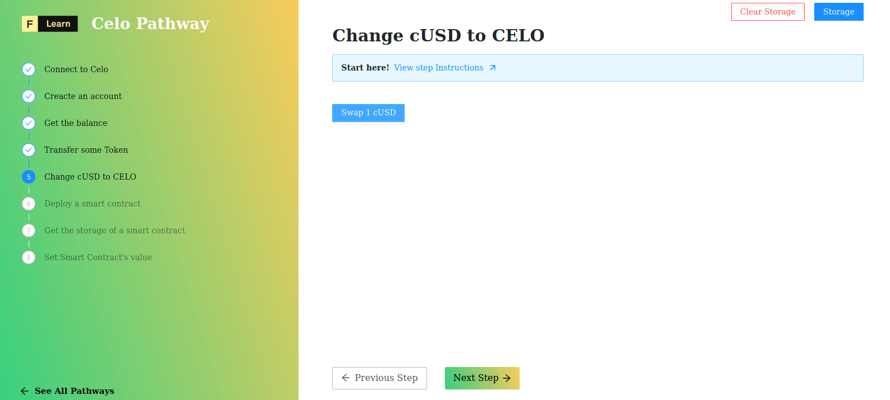

It’s time to submit another transactions. In this challenge, we will connect to a Celo node hosted by DataHub and we will swap 1 **cUSD** stable token against the expected amount of **CELO** token. As you remember from previous step, we funded our account on the `Alfajores` testnet with 5CELO and 10cUSD. Now let’s try to swap 1 **cUSD** token to **CELO**.

----------------------------------

# The challenge


In `pages/api/celo/swap.ts`, complete the code of the **swap** function. Celo has a number of core Smart Contracts that are deployed to the network. In this challenge. we'll use StableToken and Exchange contract wrappers, which have all the expected functions allowing to swap our tokens. 


**Take a few minutes to figure this out.**

```tsx
//...
    // Get contract wrappers
    // - StableTokenWrapper
    // - ExchangeWrapper
    const stableToken = undefined;
    const exchange = undefined;

    // Approve a user to transfer StableToken on behalf of another user.
    const approveTx = undefined;

    // Exchange cUSD for CELO
    const goldAmount = undefined;
    const sellTx = undefined;
//...
```

**Need some help?**
* [**We can access the cUSD contract with kit.contracts.getStableToken()**](https://docs.celo.org/developer-guide/contractkit/contracts-wrappers-registry#interacting-with-celo-and-cusd)
* [**Buying all the CELO I can, with the cUSD in my account**](https://docs.celo.org/developer-guide/contractkit/usage#buying-all-the-celo-i-can-with-the-cusd-in-my-account)


[You can **join us on Discord**, if you have questions](https://discord.gg/fszyM7K)


Still not sure how to do this? No problem! The solution is below so you don't get stuck.

----------------------------------

# The solution

```tsx
//...
    // Get contract wrappers
    const stableToken = await kit.contracts.getStableToken();
    const exchange = await kit.contracts.getExchange();

    // Approve a user to transfer StableToken on behalf of another user.
    const approveTx = await stableToken.approve(exchange.address, OneCUSD).send({from: address})

    // Exchange cUSD for CELO
    const goldAmount = await exchange.quoteStableSell(OneCUSD)
    const sellTx = await exchange.sellStable(OneCUSD, goldAmount).send({from: address})
    const sellReceipt = await sellTx.waitReceipt();
//...
```

**What happened in the code above?**
* First, we store into `stableToken` variable the `StableTokenWrapper` contract interface calling `getStableToken`  
* Next, we store into `exchange` variable the `ExchangeWrapper` contract interface calling `getExchange`  
* Next, we approve the transfer between the address using `approve` method of `stableToken` from our `StableTokenWrapper` contract interface 
* Next, we approve the transfer between the address using `approve` method of `stableToken` from our `StableTokenWrapper` contract interface 
* Next, we return the calculate the amount of **CELO** token to exchange from the amount of stable token expected to be exchange.
* Finaly, we sell the amount of stable token, here 1 cUSD against **CELO** token 

----------------------------------

# Make sure it works

Once you have the code above saved, click on **Swap 1cUSD**





Fun fact, if you take the inverse of the returned value you'll found the quotation displayed on [coinmarketcap](https://coinmarketcap.com/currencies/celo/)



----------------------------------

# Next

We now know how to query Celo network and how to submit transactions. So far we used only core Celo Smart Contracts but it’s time to deploy our own smart contract and interact with it.
