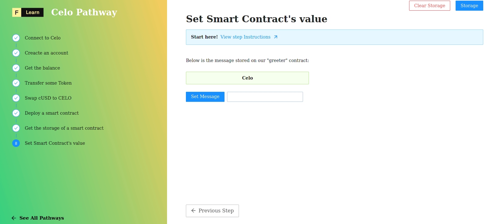

Our contract is on-chain, and we're going to learn how to modify the value stored in the state of the contract. 


If you want to learn more about Celo smart contracts, follow the [**Deploy and Interact with Contracts (Remotely)**](https://learn.figment.io/tutorials/hello-contracts) tutorial.


----------------------------------

# The challenge


In `pages/api/celo/setter.ts`, complete the code of the default function. 


**Take a few minutes to figure this out.**

```tsx
//...
  try {
    const { secret, newMessage, contract, address } = req.body;
    const url = getSafeUrl();
    const kit = newKit(url);
    kit.addAccount(secret);

    // Create a new contract instance with the HelloWorld contract info
    const instance = undefined
    // Call the setName function of our contract
    const txObject = undefined;
    // Send a transaction Object to modify the state of our contract
    let tx = undefined;

    let receipt = await tx.waitReceipt();

    res.status(200).json(receipt.transactionHash);
  }
//...
```

**Need some help?** Check out this link!
* [**Interacting with Custom contracts**](https://docs.celo.org/developer-guide/contractkit/usage#interacting-with-custom-contracts)  
* [**Web3.js eth contract interface**](https://web3js.readthedocs.io/en/v1.4.0/web3-eth-contract.html)  


[You can **join us on Discord**, if you have questions](https://discord.gg/fszyM7K)


Still not sure how to do this? No problem! The solution is below so you don't get stuck.

----------------------------------

# The solution

```tsx
//...
  try {
    const { secret, newMessage, contract, address } = req.body;
    const url = getSafeUrl();
    const kit = newKit(url);
    kit.addAccount(secret);

    // Create a new contract instance with the HelloWorld contract info
    const instance = new kit.web3.eth.Contract(
        HelloWorld.abi, 
        contract
    )

    const txObject = await instance.methods.setName(newMessage);
    let tx = await kit.sendTransactionObject(txObject, { from: address });

    let receipt = await tx.waitReceipt();

    res.status(200).json(receipt.transactionHash);
  }
//...
```

**What happened in the code above?**
* First, we create a new instance with the HelloWorld contract info
* Next, we call the `setName` function of our smart conract
* Finaly, we create a transaction to execute this function.

----------------------------------

# Make sure it works

Once you have the code above saved, click the button and watch the magic happen:



----------------------------------

# Conclusion

In this tutorial, we learned quite a lot! We took a quick look at one of Ethereum’s most powerful development tool - Truffle. We used it to compile our smart contract. Then we deployed our smart contract with few lines of Javascript code and called two methods on that smart contract.

We have only covered a very small area of contract development. We invite you to keep experimenting on your own, and we will be providing more advanced Celo tutorials shortly to help you get to the next level.

If you had any difficulties following this tutorial or simply want to discuss Celo and DataHub tech with us you can[ join our community](https://discord.gg/Chhuv5zHy3) today!