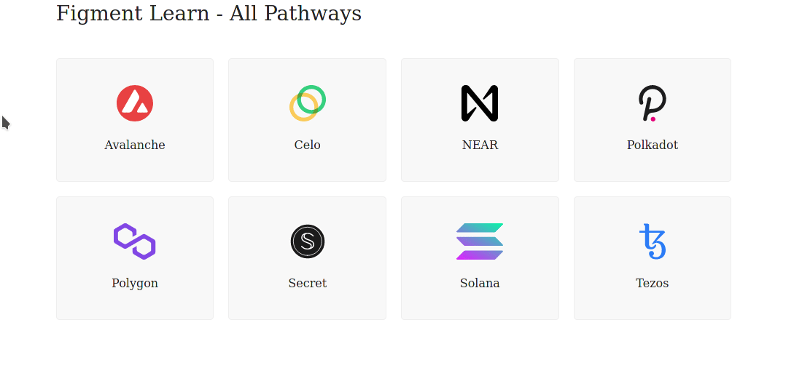

The following software is required to set up and complete the **Celo** Pathway

* [git](https://git-scm.com/book/en/v2/Getting-Started-Installing-Git) installed
* [Node.js](https://nodejs.org/) v14.17.0 or higher installed
* [yarn](https://yarnpkg.com/getting-started/install) installed

Start by cloning the repository and installing the dependencies with yarn :

```text
git clone https://github.com/figment-networks/learn-web3-dapp.git
cd learn-web3-dapp
yarn
```

---------------------------

# Set your key


If you have previously completed a Pathway, you may already have `.env.local`! Just add your Celo API key in the appropriate place and remember to save the file _before_ starting the development server.


Create an `.env.local` file at the root of the directory. Copy and paste the contents of the existing `.env.example` into the new file and save it to disk (you could also rename `.env.example` to `.env.local`).

The value for `DATAHUB_CELO_API_KEY` can be found on the [**DataHub Services Dashboard**](https://datahub.figment.io/services/secret). Click on the **Celo** icon in the list of available protocols and then copy your key as shown below. You can now paste your personal API key into `.env.local`. This will authenticate you and enable you to make JSON-RPC requests to Secret via DataHub.



[**Join us on Discord**](https://discord.gg/fszyM7K), if you encounter any issues with the tutorial or have any questions!**


---------------------------

# Start the server

With the API key in place, save the `.env.local` file and start the Next.js development server with:

```bash
yarn dev
```

Once the development server loads and compiles the application, open your default browser and navigate to `http://localhost:3000`:




Did you know you can change the port? By default Next.js uses port 3000, but if you have another service already running on that port, use the `--port` flag, like `yarn dev --port 1122`.


---------------------------

# Next

You can now move ahead to the next step by clicking on the "Next" button below on the right. There are also links to the instructions for each step on the UI.
