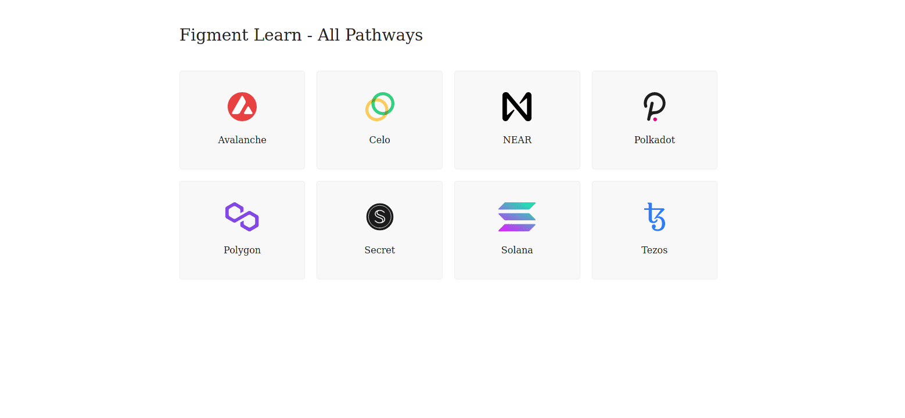

We are going to connect to a Polkadot node hosted by [**DataHub**](https://datahub.figment.io/sign_up?service=near) using an WS Provider. We are going to code a few simple challenge applications, which will serve as practical tools to develop further understanding of using Polkadot and other Substrate based blockchains. In each challenge, we will cover a different aspect of interacting with Polkadot, from simply connecting to a node; to estimate fees; all the way through to searching historical block data for specific transactions with DataHub.

Polkadot has built a [JavaScript library](https://github.com/polkadot-js/api) to help developers easily interface with its API. The documentation for Polkadot JS can be found at [https://polkadot.js.org/docs/](https://polkadot.js.org/docs/)

------------------------

# Challenge


In `pages/api/polkadot/connect.ts`, complete the code of the function and try to establish your first connection to the Polkadot network. 


**Take a few minutes to figure this out**

```typescript
//...
  try {
    const url = getSafeUrl();
    const provider = new WsProvider(url);
    const api = undefined;
    const rawVersion = undefined;
    const version = rawVersion.toHuman();
    res.status(200).json(version);
  }
//...
```

**Need some help?** Check out these links
* [**Basics & Metadata**](https://polkadot.js.org/docs/api/start/basics)  
* [**Providers**](https://polkadot.js.org/docs/api/start/create#providers)  


[**You can join us on Discord, if you have questions**](https://discord.gg/fszyM7K)


Still not sure how to do this? No problem! The solution is below so you don't get stuck.

------------------------

# Solution

```typescript
//...
  try {
    const url = getSafeUrl();
    const provider = new WsProvider(url);
    const api = await ApiPromise.create({ provider: provider });
    const rawVersion = await api.rpc.system.version();
    const version = rawVersion.toHuman();
    res.status(200).json(version);
  }
//...
```

**What happened in the code above?**
* First, we create a new `WsProvider` instance.
* Next, we create initialize the api with our provider.
* Then, using the `rpc` module we query the system.version method 
* Finaly, to display a human readable version of the version we use `toHuman` method

------------------------

# Make sure it works

Once the code is complete and the file has been saved, refresh the page to see it update & display the current version.



-----------------------------

# Next

In this tutorial you’ve learned how to use the [polkadot{.js}](https://polkadot.js.org/docs/) package and DataHub to connect to the Celo node. You also had a chance to run one simple query to test that connection.
