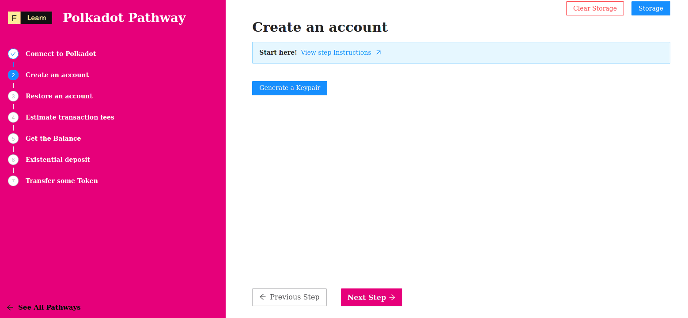

In this step, we will be creating our first Polkadot account on the Westend testnet and funding it with **WND** by connecting to a chatroom which hosts a faucet, a means for us to request free tokens.

There are currently a few different ways to create a new account on Polkadot or a testnet like Westend:

* **Programmatically** (with code) with the Polkadot API *(this tutorial)*
* **Through a web browser** by using the [Polkadot Apps Wallet](https://polkadot.js.org/apps/#/accounts) (*in some kind of hurry for a hackathon?*)
* **Through a terminal** by using [SubKey](https://wiki.polkadot.network/docs/en/learn-account-generation#subkey) (*advanced, will not be covered in this tutorial*)

We will be creating an account programmatically using the API, however you might find it useful to explore the other options depending on your needs.

------------------------

# Challenge


In `pages/api/polkadot/account.ts`, complete the code of the function and try to create your first account on the polkadot network. 


**Take a few minutes to figure this out**

```typescript
//...
  try {
    const keyring = new Keyring({ type: "sr25519" });

    // Create mnemonic string
    const mnemonic = undefined;

    const isValidMnemonic = mnemonicValidate(mnemonic);
    if (!isValidMnemonic) {
      throw Error('Invalid Mnemonic')
    }

    // Add an account derived from the mnemonic
    const account = undefined;
    const address = undefined;
    const jsonWallet = undefined;
    res.status(200).json({
      address,
      mnemonic,
      jsonWallet,
    });
  }
//...
```

**Need some help?** Check out these links
* [**Keyring Basic**](https://polkadot.js.org/docs/keyring/start/basics)  
* [**Using address or publicKey**](https://polkadot.js.org/docs/keyring/start/sign-verify#verify-using-address-or-publickey)  


[**You can join us on Discord, if you have questions**](https://discord.gg/fszyM7K)


Still not sure how to do this? No problem! The solution is below so you don't get stuck.

------------------------

# Solution

```typescript
//...
  try {
    const keyring = new Keyring({ type: "sr25519" });

    // Create mnemonic string
    const mnemonic = mnemonicGenerate();
    console.log(`Generated mnemonic: ${mnemonic}`);

    const isValidMnemonic = mnemonicValidate(mnemonic);
    if (!isValidMnemonic) {
      throw Error('Invalid Mnemonic')
    }

    // Add an account derived from the mnemonic
    const account = keyring.addFromUri(mnemonic);
    const address = account.address;
    const jsonWallet = JSON.stringify(keyring.toJson(account.address), null, 2)
    res.status(200).json({
      address,
      mnemonic,
      jsonWallet,
    });
  }
//...
```

**What happened in the code above?**
* First, we create a new `Keyring` instance.
* Next, we generate a new mnemonic using `mnemonicGenerate` method.
* Next, we check is the mnemonic is a valide one using `mnemonucValidate` method.
* Next we create our account from the mnemonic keyring using `addFromUri` method.
* Finaly, we return:
  * The address of our account.
  * The mnemonic to restore our account later.
  * A json representation of our Wallet.

------------------------

# Make sure it works

Once the code is complete and the file is saved, Next.js will rebuild the API route. Now click on **Generate a Keypair** and you should see:



-----------------------------

# Next

Now that we have a Polkadot account created and funded with testnet tokens, let’s move on to querying a Polkadot node to get the current balance of our account!
