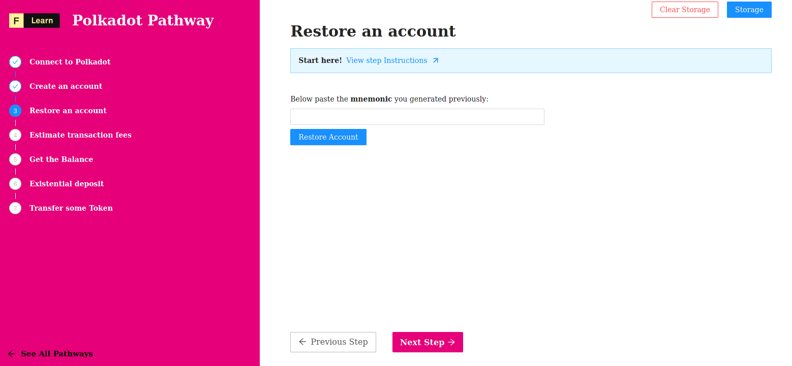

At the beginning of your this journey on Polkadot's world, we have generated a mnemonic. Now we're going to learn how to restore an wallet from a mnemonic and how derive the address and the private key when the wallet have been restored

Ready ?

------------------------

# Challenge


In `pages/api/polkadot/restore.ts`, complete the code of the function and try to restore your account using your mnemonic. 


**Take a few minutes to figure this out**

```typescript
//...
  try {
    const { mnemonic } = req.body    
    const keyring = undefined;
    const account = undefined;
    const address = undefined;
    res.status(200).json(address);
  }
//...
```

**Need some help?** Check out these links
* [**Keyring Basic**](https://polkadot.js.org/docs/keyring/start/basics)  
* [**Using address or publicKey**](https://polkadot.js.org/docs/keyring/start/sign-verify#verify-using-address-or-publickey)  


[**You can join us on Discord, if you have questions**](https://discord.gg/fszyM7K)


Still not sure how to do this? No problem! The solution is below so you don't get stuck.

------------------------

# Solution

```typescript
//...
  try {
    const { mnemonic } = req.body    
    const keyring = new Keyring({type: 'sr25519'});
    const account = keyring.addFromUri(mnemonic);
    const address = account.address;
    res.status(200).json(address);
  }
//...
```

**What happened in the code above?**
* First, we need to call `fromMnemonic` method of `Wallet` class.
* Next, we compare if the restored address match the existing one.
* Next, we store the address to display it in the UI.
* Last, we do the same for the private key.

------------------------

# Make sure it works

When you have completed the code, click on **Restore Account**



-----------------------------

# Next

The ability to restore an account whitout the need to depend on tier-party is a great feature from **Polkadot**. Now, we're ready to got further and prepare our first transaction. In the next, step we're going to estimate the fees one has to paid to submit a simple transfer.
