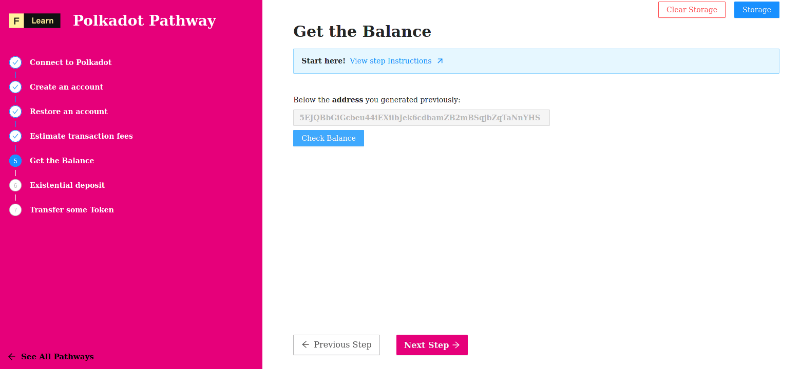

Making a transfer is basic and fundamental feature of Polkadot network. Anyway, transfer are not free as they modify the state of the blockchain. Then, how one can estimate the fee associated with a simple transfer ?

We're going to explore it on this challenge.

------------------------

# Challenge


In `pages/api/polkadot/estimate.ts`, complete the code of the function and try to estimate the fee associated with a simple transfer. 


**Take a few minutes to figure this out**

```typescript
//...
  try {
    const { address } = req.body

    const url = getSafeUrl();
    const provider = new WsProvider(url);
    const api = await ApiPromise.create({ provider: provider })
    
    // A generic address for recipient (//Alice) and amount to send
    const recipient = '5GrwvaEF5zXb26Fz9rcQpDWS57CtERHpNehXCPcNoHGKutQY'
    const gigaPlanck = '1000000000';

    // Transfer tokens
    const transfer =  undefined;
    const info = undefined;
    const fees = undefined;

    res.status(200).json(fees)
  }
//...
```

**Need some help?** Check out these links
* [**How do I estimate the transaction fees?**](https://polkadot.js.org/docs/api/cookbook/tx#how-do-i-estimate-the-transaction-fees)  


[**You can join us on Discord, if you have questions**](https://discord.gg/fszyM7K)


Still not sure how to do this? No problem! The solution is below so you don't get stuck.

------------------------

# Solution

```typescript
//...
  try {
    const { address } = req.body

    const url = getSafeUrl();
    const provider = new WsProvider(url);
    const api = await ApiPromise.create({ provider: provider })
    
    // A generic address for recipient (//Alice) and amount to send
    const recipient = '5GrwvaEF5zXb26Fz9rcQpDWS57CtERHpNehXCPcNoHGKutQY'
    const gigaPlanck = '1000000000'; // 1 milli WND

    // Transfer tokens
    const transfer =  api.tx.balances.transfer(recipient, gigaPlanck)
    const info = await transfer.paymentInfo(address)
    const fees = info.partialFee.toNumber()

    res.status(200).json(fees)
  }
//...
```

**What happened in the code above?**
* First, we create a new transaction for a transfer using `tx.balances.transfer` method.
* Next, we call `paymentInfo` method on the transaction object.
* Next, we convert `partialFee` porperty to a number.

------------------------

# Make sure it works

Once the code is complete and the file has been saved, and click on the button



-----------------------------

# Next

Now that we have a Polkadot account created and funded with testnet tokens, let’s move on to querying a Polkadit node to get the current balance of our account!
