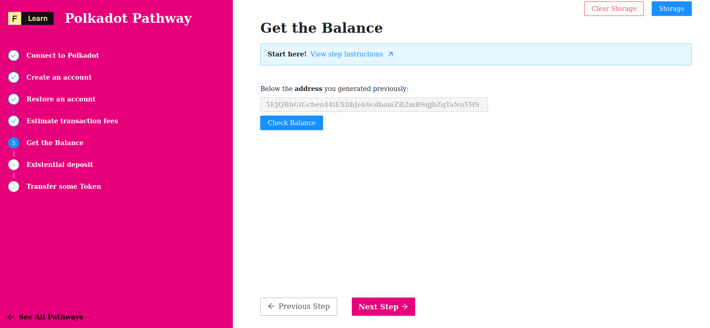

Now that we have our account created, wouldn’t it be nice to keep track of our **WND** balances? In this step, we will examine how we can do just that!

------------------------

# Challenge


In `pages/api/polkadot/balance.ts`, complete the code of the function and try to query the balance of your account. 


**Take a few minutes to figure this out**

```typescript
//...
  try {
    const { address } = req.body
    const url = getSafeUrl();
    const provider = new WsProvider(url);
    const api = await ApiPromise.create({ provider: provider });
    const { data: balance } = undefined;
    const amount = undefined;
    res.status(200).json(amount)
  } 
//...
```

**Need some help?** Check out these links
* [**Basic queries**](https://polkadot.js.org/docs/api/start/api.query#basic-queries)  


[**You can join us on Discord, if you have questions**](https://discord.gg/fszyM7K)


Still not sure how to do this? No problem! The solution is below so you don't get stuck.

------------------------

# Solution

```typescript
//...
  try {
    const { address } = req.body
    const url = getSafeUrl();
    const provider = new WsProvider(url);
    const api = await ApiPromise.create({ provider: provider });
    const { data: balance } = await api.query.system.account(address)
    const amount = balance.free.toNumber()
    res.status(200).json(amount)
  } 
//...
```

**What happened in the code above?**
* First, we need instantiate our API.
* Next, we destruct the data return by `query.system.account` method.
* Finaly, we can access our the free balance of our account.

------------------------

# Make sure it works

Once the code is complete and the file is saved, Next.js will rebuild the API route. Click on **Check Balance** and you should see the balance displayed on the page:



-----------------------------

# Next

Querying the balance information is fun, but being able to submit transactions and change the state of a blockchain is even better! Soon, we will dive deeper and submit our first transactions on Polkadot. But before, we need to understand the **existencial deposit** feature of Polkadot account. 
