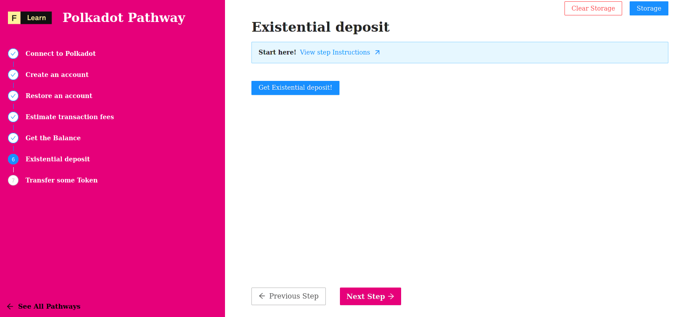

On substrate like blockchain an account can stay alive only is a minimal deposit is available. If an account balance fall under this minimal deposit then the system will erase the account and the dust token will be lost.

We're going to learn how to query the sytem in order to retrieve the existencial deposit.

------------------------

# Challenge


In `pages/api/polkadot/deposit.ts`, complete the code of the function and try to determine the existencial deposit an account need to have in order to stay alive. 


**Take a few minutes to figure this out**

```typescript
//...
  try {
    const url = getSafeUrl();
    const provider = new WsProvider(url);
    const api = await ApiPromise.create({ provider: provider });
    const deposit = undefined;
    res.status(200).json(deposit);
  }
//...
```

**Need some help?** Check out these links
* [**Polkadot{.js} documentation**](https://polkadot.js.org/docs/)  
* [**code examples**](https://polkadot.js.org/docs/api/examples/promise/)  


[**You can join us on Discord, if you have questions**](https://discord.gg/fszyM7K)


Still not sure how to do this? No problem! The solution is below so you don't get stuck.

------------------------

# Solution

```typescript
//...
  try {
    const url = getSafeUrl();
    const provider = new WsProvider(url);
    const api = await ApiPromise.create({ provider: provider });
    const deposit = api.consts.balances.existentialDeposit.toNumber();
    res.status(200).json(deposit);
  }
//...
```

**What happened in the code above?**
* First, we create a new instance of the api.
* Next, we call `existentialDeposit`  of the `const.balances` module.
* Finaly, we convert this porperty to a number.

------------------------

# Make sure it works

Once the code is complete and the file has been saved, and click on the button



-----------------------------

# Next

Once the code is complete and the file has been saved, refresh the page to see it update & display the current version.
