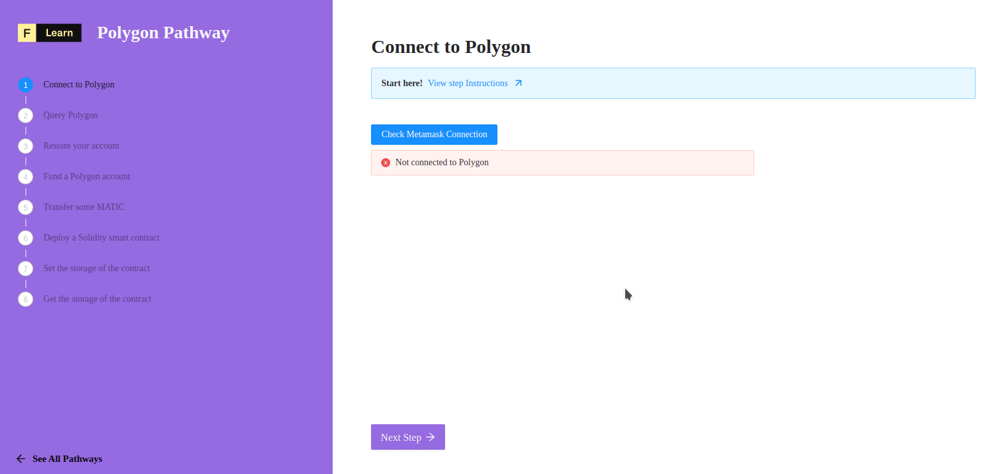

# Ethers.js

To manage our connection with Polygon and interact with smart contracts, we can use a popular and [well-tested](https://docs.ethers.io/v5/testing/) JavaScript library called [**ethers.js**](https://docs.ethers.io/v5/api/). We can connect to and perform operations with Polygon using ethers' API with only a few lines of code. 

In ethers, a **provider** is a read-only abstraction to access the blockchain data. A **signer** is an abstraction of an Ethereum Account, which can be used to sign messages and transactions, and send signed transactions to the network.

The ethers library has some helpful functions that will make this a snap! Read the ethers.js[ API documentation](https://docs.ethers.io/v5/api/) to learn more about its various functions. 


_It is important to note that throughout the Pathway, we will refer to the_ ethers.js _library only as "_ethers_"._


-------------------------------------

# The challenge


**Imagine this scenario:** You're a fresh Web3 developer who just landed a sweet role at a promising new startup, eager to show off our skills. You've been asked to show users of our dApp which network they are connected to (to avoid any confusion) and store the account currently selected address in Metamask (so that we can reference it later). In **`components/protocols/polygon/steps/Connect.tsx`**, implement the`checkConnection`function.


**Take a few minutes to figure this out.**

```tsx
const checkConnection = async () => {
  const provider = await detectEthereumProvider();

  if (provider) {
    // TODO
    // Connect to Polygon using Web3Provider and Metamask
    // Define address and network
    const web3provider = undefined
    const address = undefined
    const network = undefined

    setAccount(address)
    setNetwork(network)
  } else {
    alert("Please install Metamask at https://metamask.io")
  }
}
```

* **Connect to Polygon** using ethers' Web3Provider and the Metamask wallet  
  * [Ethers' docs for creating a Web3Provider instance](https://docs.ethers.io/v5/api/providers/other/#Web3Provider)  
  * [Stackoverflow post about connecting Metamask to Ethers](https://stackoverflow.com/questions/60785630/how-to-connect-ethers-js-with-metamask)  
* **Display the connected network**  
  * [Get the Network from a Ethers provider](https://docs.ethers.io/v5/api/providers/)


[Still not sure how to do this? **Join us on Discord** and someone will help!](https://discord.gg/fszyM7K)


----------------------------------

# The solution

```typescript
//...
  if (provider) {
    // Connect to Polygon using Web3Provider and Metamask
    const web3provider = new ethers.providers.Web3Provider(window.ethereum, "any");
    const signer = web3provider.getSigner();

    // Define address and network    
    const address = await signer.getAddress();
    const network = ethers.providers.getNetwork(await signer.getChainId());

    setAccount(address)
    setNetwork(network)
  } else {
    alert("Please install Metamask at https://metamask.io")
  }
//...
```

**What happened in the code above?**
* First, we need to define the provider by calling `Web3Provider` method of `providers`.
* As said above the `signer` represent the current connected account. Then, calling the `getAddress` method will do the job.
* Again using `signer` we can retrieve the current **chainId**, pass it to the `getNetwork` method and then deduce the network.


-------------------------------------

# Make sure it works

Once the code above save you can click on **Check Metamask Connection** and let's the magic happen.



-------------------------------------

# Addresses, Wallets, and Mnemonics

Every account on Polygon or Ethereum has a private key, a public key, and a mnemonic associated with it (referred to as a "[Secret Recovery Phrase](https://community.metamask.io/t/what-is-a-secret-recovery-phrase-and-how-to-keep-your-crypto-wallet-secure/3440)" by Metamask as of Q2 2021 - you will likely encounter a lot of documentation which still refers to "mnemonic seed phrase"). 

The format of all Polygon addresses match those on Ethereum. For example:`0x333314441798b549F0d4F952E61b4A1383F43104` exists on both Polygon and Ethereum. Each address is 42 characters in length - `0x` indicating that the following string is comprised of hexadecimal characters, and then the 40 hexadecimal characters representing the last 20 bytes of the account's public key. Sometimes people refer to an address as a public key, but they are not interchangeable in this case.

A **wallet** refers to either a piece of software used to manage cryptographic keys and the contents of associated addresses, such as Metamask or Trust Wallet, or _the address itself_. You may sometimes hear users refer to their address as their wallet.  

Generating a new address in Metamask is not the same as generating a new secret recovery phrase/mnemonic. However, [`ethers.Wallet.createRandom()`](https://docs.ethers.io/v5/api/signer/#Wallet-createRandom) can be used to make new accounts and mnemonics.   
The 12 words of a secret recovery phrase are taken from a specific wordlist. They give control of the entire contents of any address generated with them. For this reason it is vitally important that you protect your private keys and mnemonic seed phrases. _Never share them with anyone_. 


This is an important topic to be comfortable with as both a user and blockchain developer. Spend some time experimenting with providers, signers and wallets to get acquainted with these fundamental blockchain concepts. There are many good explanations of the workings of [Hierarchical Deterministic](https://weteachblockchain.org/courses/bitcoin-for-developers/3/hd-wallets) \(HD\) wallets available online, just know that a secret recovery phrase/mnemonic is a critical piece of information which should be kept secret and secure at all times. 


-------------------------------------

# Next Steps

Now that we have a connected to Polygon, we can use ethers to query information from the blockchain.  
In the next tutorial, we will cover how to query Polygon and display the information.
