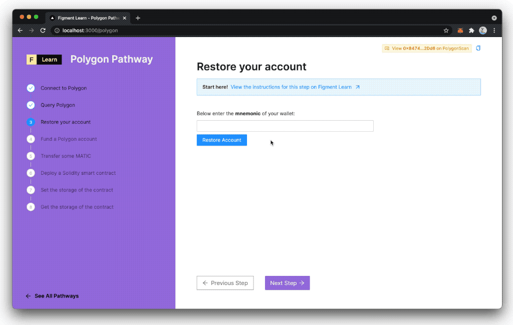

At the beginning of this journey into Polygon, we generated a mnemonic. Now we're going to learn how to restore a wallet from a mnemonic and how to derive the address and the private key when the wallet has been restored.

Ready? Let's go!

-------------------------------------

# The Challenge


In the file `components/protocols/steps/polygon/Restore.tsx`, implement the `restore` function. Using `ethers`, look for `Wallet`, then when the wallet has been regenerated try to deduce which property we're going to call in order to display the address and the private key, finally verify than the generated key matches the existing one.   


**Take a few minutes to figure this out.**

```tsx
    const restore = () => {
        console.log(value)
        try {
            const wallet = undefined
            const selectedAddress = window.ethereum.selectedAddress;
            if (undefined === selectedAddress) {
                setAddress(undefined)
                setSecret(undefined)
            } else {
                setError('Unable to restore account')
            }
        } catch (error) {
            setAddress(null)
            setSecret(null)
            setError('Invalid mnemonic')
        }
    }
```

Need some help? Check out these two tips/links  
* [**Create Wallet using ethers**](https://docs.ethers.io/v5/api/signer/#Wallet) 
* [**Properties of a Wallet**](https://docs.ethers.io/v5/api/signer/#Wallet--properties) 


You can [**join us on Discord**](https://discord.gg/fszyM7K), if you have questions or want help completing the tutorial.


Still not sure how to do this? No problem! The solution is below so you don't get stuck.

-------------------------------------

# The solution

```javascript
    const restore = () => {
        console.log(value)
        try {
            const wallet = ethers.Wallet.fromMnemonic(value.trim())
            const selectedAddress = window.ethereum.selectedAddress;
            if (wallet.address.toLocaleLowerCase() === selectedAddress) {
                setAddress(wallet.address.toLocaleLowerCase())
                setSecret(wallet.privateKey.toLocaleLowerCase())
            } else {
                setError('Unable to restore account')
            }
        } catch (error) {
            setAddress(null)
            setSecret(null)
            setError('Invalid mnemonic')
        }
    }
```

**What happened in the code above?**

* First, we need to call `fromMnemonic` method of `Wallet` class.
* Next, we compare if the restored address matches the existing one.
* Next, we store the address in the component state using `setAddress` to display it in the UI.
* Finally, we do the same for the private key - storing it in the component state with `setSecret`.

-------------------------------------

# Make sure it works

When you have completed the code:
* Copy-Paste your **mnemonic**
* Click on **Restore Account**



-------------------------------------

# Conclusion

The ability to restore an account without the need to depend on a third-party is a great feature of Web 3. Now, we're ready to fund our account with some **MATIC**, the native token of the Polygon blockchain.
