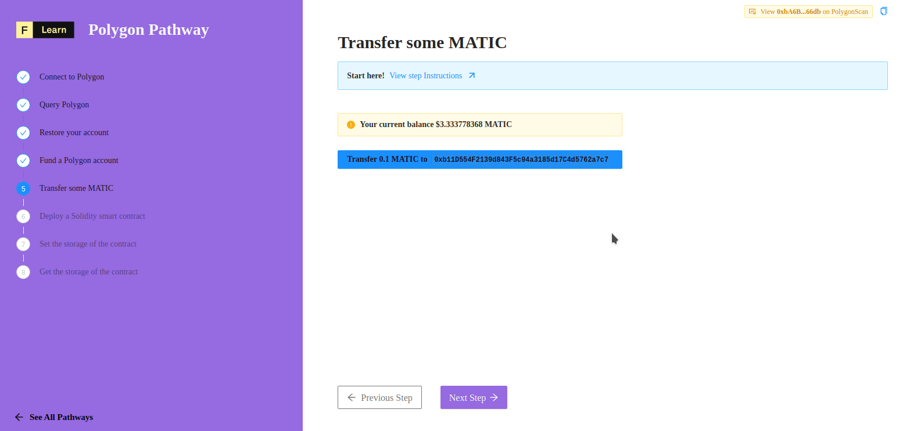

Transfering some token is one of the major feature of web3. In this challenge, we're going to learn how to transfer a know amount of **MATIC** to a choosen recipient. Each time, a transfert occurs, we'are going to re-query the new balance of our account.

-------------------------------------

# The challenge


**Imagine this scenario:** You know you have a big balance and you want to eat some pizza. Then, you need to transfer **0.1** MATIC to buy one! In `components/protocols/polygon/steps/Transfer.tsx`, implement the `transfer` function :


**Take a few minutes to figure this out.**

```tsx
    const transfer = async () => {
        setFetching(true)
        try {
            const provider = new ethers.providers.Web3Provider(window.ethereum)
            const send_account = provider.getSigner().getAddress()
    
            const currentGasPrice = await provider.getGasPrice();
            const gas_price = ethers.utils.hexlify(parseInt(currentGasPrice.toString()));

    		// try to figure out the expected parameters
            // to build a transaction
            const transaction = undefined 

			// try to figure out the expected method 
            const hash = undefined
            const receipt = await hash.wait()
            setHash(receipt.transactionHash)
            setFetching(false)
        } catch (error) {
            setError(error)
            setFetching(false)
        }
	}
```

**Need some help?** Check out these two links  
* [**A shor tutorial**](https://ethereum.org/fr/developers/tutorials/send-token-etherjs/) using ethers  
* [**send and sign a transaction**](https://docs.ethers.io/v5/api/signer/#Signer-sendTransaction)


[Still not sure how to do this? **Join us on Discord** and someone will help!](https://discord.gg/fszyM7K)


-------------------------------------

# The solution

```javascript
    const transfer = async () => {
        setFetching(true)
        try {
            const provider = new ethers.providers.Web3Provider(window.ethereum)
            const send_account = provider.getSigner().getAddress()
    
            const currentGasPrice = await provider.getGasPrice();
            const gas_price = ethers.utils.hexlify(parseInt(currentGasPrice.toString()));
    
            const transaction = {
                from: send_account,
                to: recipient,
                value: ethers.utils.parseEther('0.1'),
                nonce: provider.getTransactionCount(send_account, "latest"),
                gasLimit: ethers.utils.hexlify(100000),
                gasPrice: gas_price 
            }
            const hash = await provider.getSigner().sendTransaction(transaction)
            const receipt = await hash.wait()
            setHash(receipt.transactionHash)
            setFetching(false)
        } catch (error) {
            setError(error)
            setFetching(false)
        }
	}
```

What happened in the code above? Let's take a closer look!

* We first need to fill our transaction object with:
    * A from address
    * A recipient address
    * The amount
    * nonce: the latest transaction's numbering
    * A default gas limit
    * And the current gas price
* Finaly we sign and send our transaction and wait it's confirmation
-------------------------------------

# Make sure it works

Once the code above save you can click and this is what the UI should look like!



-------------------------------------

# Next Steps

Now that we have a funded Polygon account, we can use our MATIC tokens to deploy a smart contract.  
In the next tutorial, we will cover writing, testing and deploying the Solidity code using Truffle, a smart contract development suite.
