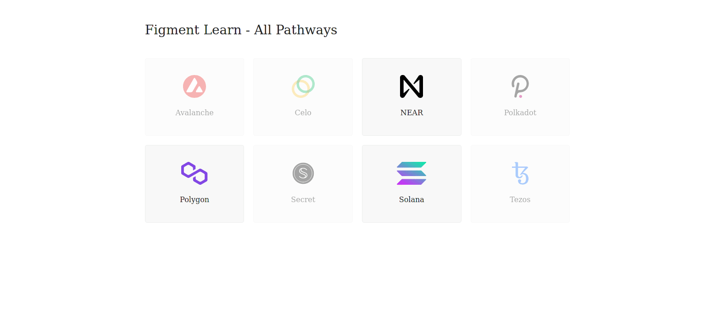

The ability to establish a connection is the first step for anyone wanting to discover and travel through web3 space. Fasten your seat belt, it's time to take off 🚀!

Connecting to a node works pretty much the same as for a standard web server. There are two actors: Client & server, with a protocol managing how data is transferred from one to the other.

The main difference here is in the protocol. To connect to NEAR, we'll be using `json-rpc`: 
* `json`, stands for **J**ava**S**cript **O**bject **N**otation, which is a [text format for transferring data](https://www.w3schools.com/js/js_json_intro.asp).
* `rpc`, stands for **R**emote **P**rocedure **C**all - a way to [call a server-side function](https://en.wikipedia.org/wiki/Remote_procedure_call) from the client-side.

------------------------

# Challenge


In `pages/api/near/connect.ts`, implement `connection` by creating a `Connection` instance and getting the API's version. Render it on the webpage.


**Take a few minutes to figure this out**

```typescript
// Do not forget we're in an "async" world,
// so you may need to "await" some results.
try {
    const url = undefined
    const client = undefined
    const nodeInfo = undefined
    const version = undefined
    res.status(200).json(version);
  }
```

* Await the `getSafeUrl()` helper function.
* Instantiate a new `CosmWasmClient` using that `url`.
* Await the `nodeInfo()` on the client.
* Access the version property of `nodeInfo.application_version`

**Need some help?** Check out those two links
* [Creating a `Connection` instance](https://near.github.io/near-api-js/modules/connect.html)  
* [Provider property of `Connection` Class](https://near.github.io/near-api-js/classes/connection.connection-1.html#provider)
* [Status method of `Provider` class](https://near.github.io/near-api-js/classes/providers_json_rpc_provider.jsonrpcprovider.html#status)


[You can **join us on Discord**, if you have questions](https://discord.gg/fszyM7K)


Still not sure how to do this? No problem! The solution is below so you don't get stuck.

------------------------

# Solution

```typescript
try {
    const url = await getSafeUrl();
    const client = new CosmWasmClient(url);
    const nodeInfo = await client.restClient.nodeInfo();
    const version = nodeInfo.application_version.version;
    res.status(200).json(version);
  }
```

**What happened in the code above?**
* The `getSafeUrl()` helper function returns a valid endpoint URL.
* Instantiate a new `CosmWasmClient` from SecretJS with the endpoint URL.
* The `nodeInfo()` method gives us access to information about the node as well as the `application_version`.

------------------------

# Make sure it works

Once the code is complete and the file has been saved, refresh the page to see it update & display the current version.



-----------------------------

# Next

Well done! Your fluency in the NEAR dialect of web3 is growing. As a newcomer, building an identity is important so you can distinguish yourself from other users on the NEAR network. Ready to take the next step forward?
