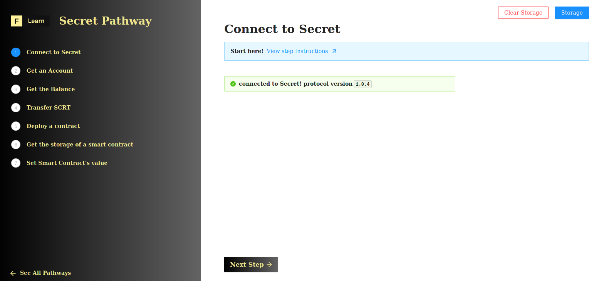

The ability to establish a connection is the first step for anyone wanting to discover and travel through web3 space. Fasten your seat belt, it's time to take off 🚀!

Connecting to a node works pretty much the same as for a standard web server. There are two actors: Client & server, with a protocol managing how data is transferred from one to the other.

------------------------

# Challenge


In `pages/api/secret/connect.ts`, complete the code of the function and try to establish your first connection to the secret network. To verify your connection has been correctly established, try to return the current protocol version.


**Take a few minutes to figure this out**

```typescript
//...
try {
    const url = await getSafeUrl();
    const client = undefined
    const nodeInfo = undefined
    const version = undefined
    res.status(200).json(version);
  }
//...
```

**Need some help?** Check out these links
* [**Connection example**](https://github.com/enigmampc/SecretJS-Templates/tree/master/1_connecting_to_node)  
* [**Read the code for `secretjs` & `cosmwasm`**](https://github.com/enigmampc/SecretNetwork/tree/master/cosmwasm-js/packages/sdk)  


[**You can join us on Discord, if you have questions**](https://discord.gg/fszyM7K)


Still not sure how to do this? No problem! The solution is below so you don't get stuck.

------------------------

# Solution

```typescript
try {
    const url = await getSafeUrl();
    const client = new CosmWasmClient(url);
    const nodeInfo = await client.restClient.nodeInfo();
    const version = nodeInfo.application_version.version;
    res.status(200).json(version);
  }
```

**What happened in the code above?**
* First, we instantiate a new `CosmWamClient` passing the url of the `holodeck-2` network.
* Next, using the `nodeInfo` method of the rest client returns a `NodeInfoResponse`. 
* Inspecting the methods of our object will lead us naturally to reference the `application_version.version` property.
* Finally, we send the `version` back to the client-side as JSON.

------------------------

# Make sure it works

Once the code is complete and the file has been saved, refresh the page to see it update & display the current version.



-----------------------------

# Next

Well done! Your fluency in the Secret dialect of Web 3 is growing. As a newcomer, creating an account is the next step in your exploration. Ready to take the next step forward?
