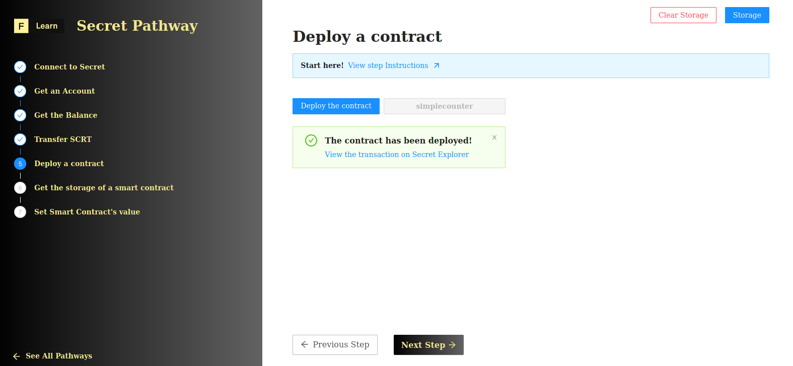

We won't go through the process of reviewing the smart contract code base, compiling it or testing it. We will focus instead on how one can deploy a smart contract using the `secretjs` lib. To do this, we're going to use a pre-compiled smart contract, you can find it under `./contract/secret/contract.wasm`.

Our contract implements a simple counter. The contract is created with a parameter for the initial count and allows subsequent incrementing:
* The `get_count` function returns the value of the counter stored on the contract.
* The `increment` function returns the value of the counter stored on the contract, incremented by 1.


If you want to learn more about Secret smart contracts, look at [**Developing your first secret contract**](https://learn.figment.io/tutorials/creating-a-secret-contract-from-scratch)



You can experience some issue with the availbility of the network [**To check the current status**](https://secretnodes.com/secret/chains/holodeck-2)



Before, focusing on the deployement instuctions let's take a look on some global variable:

```typescript
const customFees = {
  upload: {
    amount: [{ amount: '2000000', denom: 'uscrt' }],
    gas: '2000000',
  },
  init: {
    amount: [{ amount: '500000', denom: 'uscrt' }],
    gas: '500000',
  }
};
```

* `CONTRACT_PATH` is pointing to the locations of the optimized **wasm** version of the smart contract.  
* `customFees` object stored the predfined amount of fees to pay in order to **upload** and **init** the smart contract.  

----------------------------------

# The challenge


In`pages/api/secret/deploy.ts`, complete the code of the default function. Upload your first smart contract on the **Secret** network.


**Take a few minutes to figure this out.**

```tsx
//...
  // Upload the contract wasm
  const wasm = fs.readFileSync(CONTRACT_PATH);
  const uploadReceipt = await client.undefined;
  if (!uploadReceipt) {
    throw new Error("uploadReceipt error");
  }
  // Get the code ID from the receipt
  const { codeId } = uploadReceipt;

  // Create an instance of the Counter contract, providing a starting count
  const initMsg = { count: 101 };
  const receipt = undefined;
  } 
//...
```

**Need some help?**
* [**Contract example**](https://github.com/enigmampc/SecretJS-Templates/tree/master/5_contracts)  
* [**Documentation of `secrectjs`**](https://github.com/enigmampc/SecretNetwork/tree/master/cosmwasm-js/packages/sdk)  


[You can **join us on Discord**, if you have questions](https://discord.gg/fszyM7K)


Still not sure how to do this? No problem! The solution is below so you don't get stuck.

----------------------------------

# The solution

```tsx
//...
  // Upload the contract wasm
  const wasm = fs.readFileSync(CONTRACT_PATH);
  const uploadReceipt = await client.upload(wasm, {});
  if (!uploadReceipt) {
    throw new Error("uploadReceipt error");
  }
  // Get the code ID from the receipt
  const { codeId } = uploadReceipt;

  // Create an instance of the Counter contract, providing a starting count
  const initMsg = { count: 101 };
  const receipt = await client.instantiate(codeId, initMsg, `My Counter${Math.ceil(Math.random() * 10000)}`);
  } 
//...
```

**What happened in the code above?**
* First, we upload the contract using `upload` method.
* Next, we destructure the `uploadReceipt` response object to get the `codeId` of the deployed contract
* Finaly, we instantiate the contract using `instantiate` methode passing:
  * The `codeId`
  * The contract method to instantiate the storage here `initMsg`

----------------------------------

# Make sure it works

Once you have the code above saved, click on **Deploy Contract**



----------------------------------

# Next

Now that we have deployed a smart contract, let's interact with it. In the following tutorials, we will look at how to use both view and change functions.
