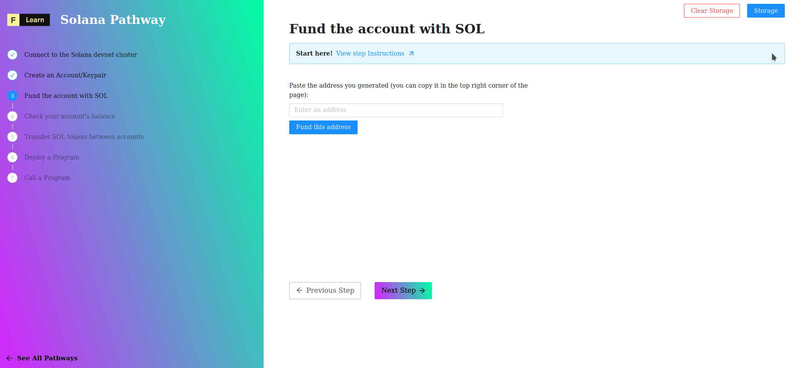

# 

With some protocols, different networks (testnet, mainnet, etc) have different tokens names. For example with Polkadot, the mainnet token is *DOT* and the testnet token is *WND*. But in the Solana world, the token is always called **SOL**, no matter what network (or **cluster**) you are on. But don't get too excited: the tokens you get for free on the devnet cannot be used on Solana's mainnet. Nice try though.

----------------------------------

## Airdropping

To fund an account, we will do what is called an **airdrop** some tokens will magically fall from the sky onto our wallets! This will provide us with some **SOL** so that we can test making transfers as well as view the transaction details on a block explorer.


1 **SOL** is equal to 1,000,000,000 **lamports**.The name of **lamports** is in honour of Solana's biggest technical influence, [Leslie Lamport](https://en.wikipedia.org/wiki/Leslie_Lamport).


----------------------------------

## The challenge


In `pages/api/solana/fund.ts`, implement `fund()`. Convert the text input to an address and use `requestAirdrop`to get 1 **SOL**.


**Take a few minutes to figure this out.**

```typescript
//..
    const { address } = req.body.address as PublicKey;
    const url = getSafeUrl();
    const connection = new Connection(url, "confirmed")
    const address = undefined  
    const hash = undefined
    await undefined
    res.status(200).json(hash)
  
//..
}
```

**Need some help?** Here are a few hints.
* [Create a publicKey from a string](https://solana-labs.github.io/solana-web3.js/classes/PublicKey.html#constructor)  
* [`requestAirdrop()`documentation](https://solana-labs.github.io/solana-web3.js/classes/Connection.html#requestairdrop)



[You can **join us on Discord**, if you have questions](https://discord.gg/fszyM7K)


Still not sure how to do this? No problem! The solution is below so you don't get stuck.

----------------------------------

## The solution

```typescript
//..
    const { address } = req.body.address as PublicKey;
    const url = getSafeUrl();
    const connection = new Connection(url)
    const address = new PublicKey(req.body.address as PublicKey)  
    const hash = await connection.requestAirdrop(address, LAMPORTS_PER_SOL)
    await connection.confirmTransaction(hash);
    res.status(200).json(hash)
//..
}
```

**What happened in the code above?**

* We created a `PublicKey` from the string formated address
* We passed it to `requestAirdrop` together with a constant wich repesent one `SOL`
* We verify than the transaction is confirmed
* Then we return the hash of the transaction for the UI.

----------------------------------

## Visual's test

Once you have the code above saved:
* Copy and paste the genrated address in the text input.   
* Click on **Fund this Address** 

And let's the magic happen



----------------------------------

## Next

Before we make our first transfer, let's first check that that the account is correctly funded.
