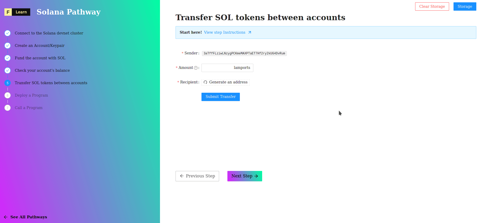

# 

A **program** is to Solana what a **smart contract** is to other protocols. Once a program has been deployed, any app can interact with it by sending a transaction to a Solana cluster that will pass it to the program.


[You can learn more about Solana's programs here](https://docs.solana.com/developing/on-chain-programs/overview).


-----------------------------------------

## Set up the Solana CLI

### Install Rust and Solana CLI

So far we've been using Solana's JS API to interact with the blockchain. In this chapter we're going to deploy a Solana program using another Solana developer tool: their CLI. We'll install it and use it through our Terminal.

For simplicity, perform both of these installations inside the project root:

[**Install the latest Rust stable**](https://rustup.rs) : 

```bash
curl --proto '=https' --tlsv1.2 -sSf https://sh.rustup.rs | sh
```

[**Install Solana CLI**](https://docs.solana.com/cli/install-solana-cli-tools) v1.6.6 or later :

```bash
sh -c "$(curl -sSfL https://release.solana.com/stable/install)"
```

-----------------------------------------

### Set up Solana CLI

Next, we're going to configure the Solana cluster, create an account, request airdrop and check that everything is alright.

Set the CLI config URL to the devnet cluster:

```bash
solana config set --url https://api.devnet.solana.com
```

Next, we're going to generate a new keypair, Run the following command in your Terminal :

```bash
mkdir solana-wallet
solana-keygen new --outfile solana-wallet/keypair.json
```

You will need **SOL** to deploy the program, Run the following command in your Terminal :

```bash
solana airdrop 5 $(solana-keygen pubkey solana-wallet/keypair.json)
```

Verify that everything is ok:

```bash
solana config get
solana account $(solana-keygen pubkey solana-wallet/keypair.json)
```

-----------------------------------------
## Deploy a Solana program

### Building the program

The first thing we're going to do is compile the Rust program to prepare it for the CLI. To do this we're going to use a custom script that's defined in `package.json`. Let's run the script and build the program by running the following command in the terminal (from the project root directory):

```bash
yarn run solana:build:program
```


This step can take 5 or 10 minutes!


When it's successful you should see the next instruction to execute to deploy the program `hello-world.so`

```bash
To deploy this program:
  $ solana program deploy /home/zu/project/figment/learn-web3-dapp/dist/solana/program/helloworld.so
Done in 1.39s.
```


The `.so` extension does not stand for Solana! It stands for "shared object". You can read more about Solana Programs [here](https://docs.solana.com/developing/on-chain-programs/overview) 


-----------------------------------------

### Deploying the program

Next we're going to deploy the program to the devnet cluster. The CLI provides a very simple interface for this :

```bash
solana deploy -v --keypair solana-wallet/keypair.json dist/solana/program/helloworld.so 
```


The `-v` Verbose flag is optional, but it will show some related information like the RPC URL and path to the default signer keypair, as well as the expected [**Commitment level**](https://docs.solana.com/implemented-proposals/commitment). When the process completes, the Program Id will be displayed :


On success, the CLI will print the **programId** of the deployed contract.

```bash
RPC URL: https://api.devnet.solana.com
Default Signer Path: solana-wallet/keypair.json
Commitment: confirmed
Program Id: 7KwpCaaYXRsjfCTvf85eCVuZDW894zZNN38UMxMpQoaQ
```

-----------------------------------------

## Challenge


Before we move to the next step we need to check if our program have been correctly deploy! For this, we'll need the `programId` of the program previously generated.


**Take a few minutes to figure this out.**

```tsx
//...
try {
    const programId = req.body.programId as PublicKey;
    const url = getSafeUrl();
    const connection = new Connection(url, "confirmed");
    const publicKey = new PublicKey(programId);
    const programInfo = await connection.getAccountInfo(publicKey);

    if (programInfo === null) {
        if (fs.existsSync(PROGRAM_SO_PATH)) {
            throw new Error(
              'Program needs to be deployed with `solana program deploy`',
            );
        } else {
          throw new Error('Program needs to be built and deployed');
        }
    } else if (!programInfo.executable) {
      throw new Error(`Program is not executable`);
    }

    res.status(200).json(true);
  }
//...
```

**Need some help?** Check out those two links
* [Generate a`Keypair`](https://solana-labs.github.io/solana-web3.js/classes/Keypair.html#constructor)  
* [Convert a`PublicKey`to a string](https://solana-labs.github.io/solana-web3.js/classes/PublicKey.html#tostring)


[You can **join us on Discord**, if you have questions](https://discord.gg/fszyM7K)


Still not sure how to do this? No problem! The solution is below so you don't get stuck.

----------------------------------

## The solution

```tsx
//...
try {
    const programId = req.body.programId as PublicKey;
    const url = getSafeUrl();
    const connection = new Connection(url, "confirmed");
    const publicKey = new PublicKey(programId);
    const programInfo = await connection.getAccountInfo(publicKey);

    if (programInfo === null) {
        if (fs.existsSync(PROGRAM_SO_PATH)) {
            throw new Error(
              'Program needs to be deployed with `solana program deploy`',
            );
        } else {
          throw new Error('Program needs to be built and deployed');
        }
    } else if (!programInfo.executable) {
      throw new Error(`Program is not executable`);
    }

    res.status(200).json(true);
  }
//...
```

**What happened in the code above?**

* We used the JS API's `Keypair` to generate a keypair
* Once we have it we call `setKeypair` to save it in the react hook
* Once React re-renders, we parse the keypair object to extract the public key using `keypair.publicKey`
* But this value is a `Buffer` so we need to convert it to a string using `PublicKey.toString()`

----------------------------------

## Make sure it works

Once you've filled in the form, press "Submit" and you should see:



**About the explorer**, it's very good practice to look over all the fields one by one to familiarize yourself with the structure of a transaction. This page features the transaction result (`SUCCESS`), status (`FINALIZED`), the amount sent, the `from` and `to` addresses, the block that included this transaction, the fee that was paid, etc.

----------------------------------

## Next

So at this point, we've deployed our dummy smart contract to Solana's devnet cluster. We're finally ready for the big moment: Interacting with the program by calling its functionality from the UI!
