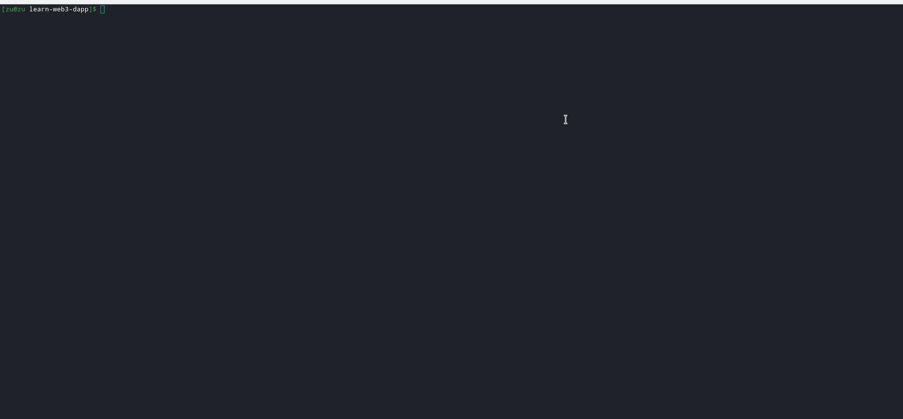
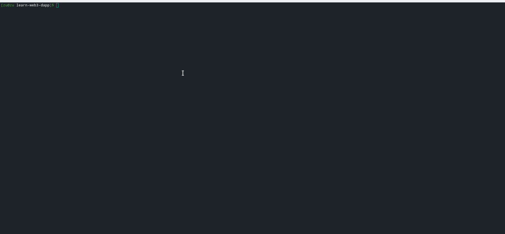

A **program** is to Solana what a **smart contract** is to other protocols. Once a program has been deployed, any app can interact with it by sending a transaction containing the program instructions to a Solana cluster, which will pass it to the program to be run.


[You can learn more about Solana's programs here](https://docs.solana.com/developing/on-chain-programs/overview).


-----------------------------------------

# Set up the Solana CLI

## Install Rust and Solana CLI

So far we've been using Solana's JS API to interact with the blockchain. In this chapter we're going to deploy a Solana program using another Solana developer tool: their Command Line Interface (CLI). We'll install it and use it through our Terminal.

For simplicity, perform both of these installations inside the project root:

[**Install the latest Rust stable**](https://rustup.rs) : 

```bash
curl --proto '=https' --tlsv1.2 -sSf https://sh.rustup.rs | sh
```

[**Install Solana CLI**](https://docs.solana.com/cli/install-solana-cli-tools) v1.6.6 or later :

```bash
sh -c "$(curl -sSfL https://release.solana.com/stable/install)"
```

-----------------------------------------

## Set up Solana CLI

We need to configure the Solana cluster, create an account, request an airdrop and check that everything is functioning properly.

Set the CLI config URL to the devnet cluster:

```bash
solana config set --url https://api.devnet.solana.com
```

Next, we're going to generate a new keypair using the CLI. Run the following command in your Terminal:

```bash
mkdir solana-wallet
solana-keygen new --outfile solana-wallet/keypair.json
```

You will need **SOL** available in the account to deploy the program, so get an airdrop with:

```bash
solana airdrop 5 $(solana-keygen pubkey solana-wallet/keypair.json)
```

Verify that everything is ok:

```bash
solana config get
solana account $(solana-keygen pubkey solana-wallet/keypair.json)
```



-----------------------------------------
# Deploy a Solana program


The program we're going to deploy is an easy but pretty complete program. This program keeps track of the number of times an account has sent a greeting instruction to it.



## Building the program

The first thing we're going to do is compile the Rust program to prepare it for the CLI. To do this we're going to use a custom script that's defined in `package.json`. Let's run the script and build the program by running the following command in the terminal (from the project root directory):


This step can take a few minutes!


```bash
yarn run solana:build:program
```

When it's successful, you will see the instructions to execute the deploy command with the path to the compiled program named `helloworld.so`. While this would work, we want to specify the keypair we generated just for this purpose, so read on.

```bash
To deploy this program:
  $ solana program deploy /home/zu/project/figment/learn-web3-dapp/dist/solana/program/helloworld.so
Done in 1.39s.
```


The `.so` extension does not stand for Solana! It stands for "shared object". You can learn more about Solana Programs in the [developer documentation](https://docs.solana.com/developing/on-chain-programs/overview).


-----------------------------------------

## Deploying the program

Now we're going to deploy the program to the devnet cluster. The CLI provides a very simple interface for this :

```bash
solana deploy -v --keypair solana-wallet/keypair.json dist/solana/program/helloworld.so 
```


The `-v` Verbose flag is optional, but it will show some related information like the RPC URL and path to the default signer keypair, as well as the expected [**Commitment level**](https://docs.solana.com/implemented-proposals/commitment). When the process completes, the Program Id will be displayed :


On success, the CLI will print the **programId** of the deployed contract.

```bash
RPC URL: https://api.devnet.solana.com
Default Signer Path: solana-wallet/keypair.json
Commitment: confirmed
Program Id: 7KwpCaaYXRsjfCTvf85eCVuZDW894zZNN38UMxMpQoaQ
```




-----------------------------------------

# Challenge


Before moving to the next step, we need to check that our program has been correctly deployed! For this, we'll need the `programId` of the program. Copy & paste it into the text input, then try to figure out how to complete the code for `pages/api/solana/checkProgram.ts`.


**Take a few minutes to figure this out.**

```tsx
//...
  // Re-create publicKeys from params
  const publicKey = undefined;
  const programInfo = undefined;

  if (programInfo === null) {
      if (fs.existsSync(PROGRAM_SO_PATH)) {
          throw new Error(
            'Program needs to be deployed with `solana program deploy`',
          );
      } else {
        throw new Error('Program needs to be built and deployed');
      }
  } else if (!programInfo.executable) {
    throw new Error(`Program is not executable`);
  }

  res.status(200).json(true);
//...
```

**Need some help?** Check out those two links
* [How to get account Info ?](https://solana-labs.github.io/solana-web3.js/classes/Connection.html#getAccountInfo)  
* [Is an account executable ?](https://solana-labs.github.io/solana-web3.js/modules.html#AccountInfo)


[You can **join us on Discord**, if you have questions](https://discord.gg/fszyM7K)


Still not sure how to do this? No problem! The solution is below so you don't get stuck.

----------------------------------

# The solution

```tsx
//...
  const publicKey = new PublicKey(programId);
  const programInfo = await connection.getAccountInfo(publicKey);

  if (programInfo === null) {
      if (fs.existsSync(PROGRAM_SO_PATH)) {
          throw new Error(
            'Program needs to be deployed with `solana program deploy`',
          );
      } else {
        throw new Error('Program needs to be built and deployed');
      }
  } else if (!programInfo.executable) {
    throw new Error(`Program is not executable`);
  }

  res.status(200).json(true);
//...
```

**What happened in the code above?**

* We create a new `PublicKey` instance from the `programId` string formatted address.
* Once we have it, we call the `getAccountInfo` method to check if info is available for this address.
  * If none, then no account is linked to this address, meaning the program has not yet been deployed.
* Then we check if the account's executable property is true. If it is, then the specified account contains a loaded program.
* Finally, we send a value of `true` to the client-side in JSON format.

----------------------------------

# Make sure it works

Once you have the code above saved:
* Copy and paste the generated address in the text input.   
* Click on **Check ProgramId** 


For the rest of the challenge we'll keep this programId in the localStorage of our application.

----------------------------------

# Next

So at this point, we've deployed our program to Solana's devnet cluster and checked that it ent smoothly. Now it's time to create an account that is owned by our program, to store some state! 
