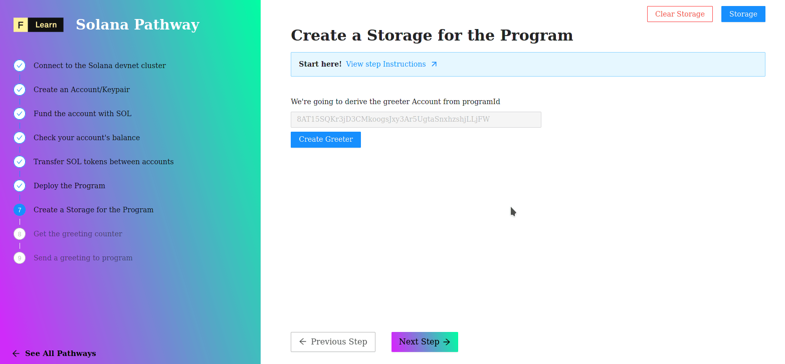

# 

In Solana's world program are stateless, which mean they doesn't store the value they act on. Then how our program can count the number of times its have been greeted ? 

We have to rely on another account to store data. Which why, we're going to create a new account, the **greeter account** owned by our program in order to store the `count` info.


Solana program are stateless to store value we use account


----------------------------------

## The challenge


In `pages/api/solana/greeter.ts`, implement `greteer`. We are going to first derive the **greeter** address from some values. Next, we create a transaction which instruct the blockchain to create the **greeter** account. 


**Take a few minutes to figure this out**

```typescript
//...
    // Is there any methods from PublicKey allowing to derive a pub's key from a seed ?
    const greetedPubkey = await PublicKey.undefined  

    // This function allow to calculate how many fees one have to pay to keep the newly 
    // created account alive on the blockchain.
    const lamports = await connection.getMinimumBalanceForRentExemption(GREETING_SIZE);

    // Find which method are expected and fill with the required arguements.
    const transaction = new Transaction().add(
        SystemProgram.undefined
    );
    
    // complete with the expected arguments 
    const hash = await sendAndConfirmTransaction(undefined)
//...
```

**Need some help?** Here are a few hints
* [Create a publicKey from a seed](https://solana-labs.github.io/solana-web3.js/classes/PublicKey.html#createWithSeed)  
* [Create a account from a seed](https://solana-labs.github.io/solana-web3.js/classes/SystemProgram.html#createAccountWithSeed)  


[You can **join us on Discord**, if you have questions](https://discord.gg/fszyM7K)


Still not sure how to do this? No problem! The solution is below so you don't get stuck.

----------------------------------

## The solution

```typescript
//...
  const greetedPubkey = await PublicKey.createWithSeed(
      payer.publicKey,
      GREETING_SEED,
      programId,
    );

  const lamports = await connection.getMinimumBalanceForRentExemption(GREETING_SIZE);

  const transaction = new Transaction().add(
    SystemProgram.createAccountWithSeed({
        fromPubkey: payer.publicKey,
        basePubkey: payer.publicKey,
        seed: GREETING_SEED,
        newAccountPubkey: greetedPubkey,
        lamports,
        space: GREETING_SIZE,
        programId,
    }),
  );
  const hash = await sendAndConfirmTransaction(connection, transaction, [payer])
//...
```

**What happened in the code above?**

* We derive a `PublicKey` from three values: the payer of the transaction, a random seed and the programId.
* Next, we call the system's program `createAccountWithSeed` to create an account:
  * Feeded with the minimal amount of lamport to exempt him to pay any rent.
  * With a predefined public's key, the one derived before.
  * Owned by the programId then giving permission to the program to perform write access.  
* Finally we send and await that the transaction confirm; payer being the account created during firsts' steps.


[Learn more about rent exemption](https://docs.solana.com/developing/programming-model/accounts#rent-exemption)



[Learn more about system program](https://docs.solana.com/developing/runtime-facilities/programs#system-program)


----------------------------------

## Make sure it works

Once you have the code above saved:
* Click on **Create Greeter** 
* Let's the magic happen



----------------------------------

## Next

Now that we have an account owned by the program and dedicated to store the program data. We are ready to go forward and act on theses data.
The first natural action is to read the data. Ready ?
