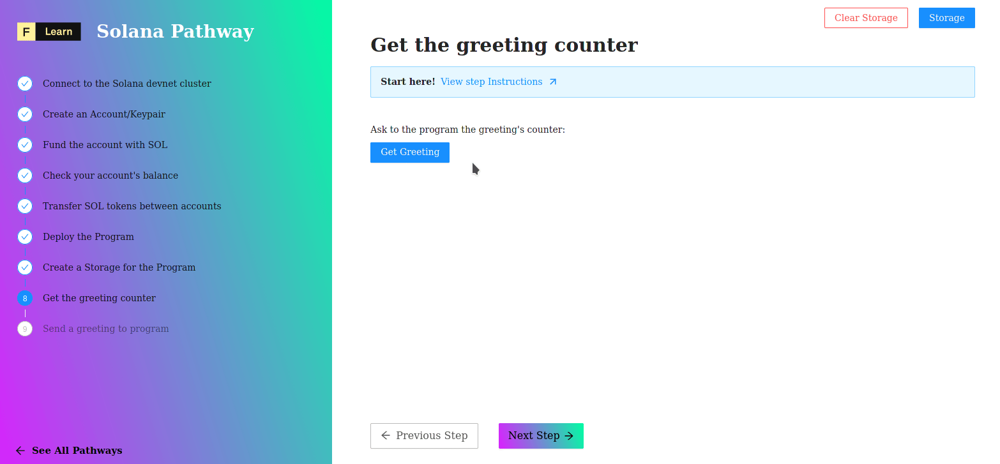

# 

Data are stored into account as **buffer**. If one want to read them he'll have to first unpack this blob of data into well defined structure. The code below allow our typescript program to achive this goal: deserializing a greeter's buffer into a typescript's class. 

```typescript
// The state of a greeting account managed by the hello world program
class GreetingAccount {
  counter = 0;
  constructor(fields: {counter: number} | undefined = undefined) {
    if (fields) {
      this.counter = fields.counter;
    }
  }
}

// Borsh schema definition for greeting accounts
const GreetingSchema = new Map([
  [GreetingAccount, {kind: 'struct', fields: [['counter', 'u32']]}],
]);
```


[Learn more about borsh lib](https://npm.io/package/borsh)


----------------------------------

## The challenge


In `pages/api/solana/getGreetings.ts`, complete the code of `getGreetings`. First `deserialize` the greeter data to a typescript class and next access the counter value and pass it to response object using json method.


**Take a few minutes to figure this out**

```typescript
//...
    if (accountInfo === null) {
      throw new Error('Error: cannot find the greeted account');
    }

    // Find the expected parameters.
    const greeting = borsh.deserialize(undefined)

    // A short helper
    console.log(greeting)

    // Pass down the counter
    res.status(200).json(undefined);
//...
```

**Need some help?** Here are a few hints
* [Read about deserialize method](https://npm.io/package/borsh)


[You can **join us on Discord**, if you have questions](https://discord.gg/fszyM7K)


Still not sure how to do this? No problem! The solution is below so you don't get stuck.

----------------------------------

## The solution

```typescript
//...
    if (accountInfo === null) {
      throw new Error('Error: cannot find the greeted account');
    }

    const greeting = borsh.deserialize(
      GreetingSchema,
      GreetingAccount,
      accountInfo.data,
    );

    res.status(200).json(greeting.counter);
//...
```

**What happened in the code above?**

* First, we pass the **Schema**, then the **Account**'s key (here key refer to the key of a map struct), and the the binary data stored into **greeter**.
* Finaly, we just need to call the propriety counter of `greeting` to pass down the value. 

----------------------------------

## Make sure it works

Once you have the code above saved:
* Click on **Get Greeting** 
* Let's the magic happen



----------------------------------

## Next

Geeting the number of Greetings is not enough, we'd like to send a greeting to our contract. We're going to learn how to do it in the next step. Ready ?
