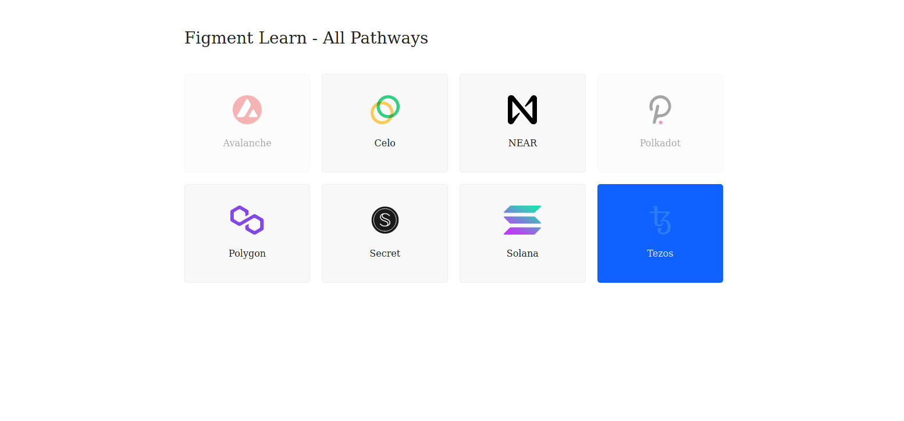

Still not sure how to do this? No problem! The solution is below so you don't get stuck.

------------------------

## Challenge

You are stuck in the web2.0 waiting room and need to *connect* to the web3 world. On the wall, an instruction is engraved:   
> Decode **pages/api/tezos/connect.ts** and the door will open!

```typescript
// Fill in the gaps to connect with Tezos & be one of us :)
// Do not forget we're in an "async" world,
// so you may need to "await" some results.
  try {
    const url = getTezosUrl();
    const toolkit = new TezosToolkit(url);
    const chainId = await toolkit.rpc.getChainId();
    console.log(chainId, b58decode(chainId));
    if (validateChain(chainId) != 3) {
      throw Error("invalid chain Id");
    }
    res.status(200).json(chainId);
  } 
```

A footnote below the instruction reminds us to: 
* Use the `getTezosUrl` helper method to get a valid endpoint URL.
* Instantiate a new `TezosToolkit` using that `url`.
* Get the chainId via the toolkit RPC.

------------------------

## Solution

```typescript
  try {
    const url = getTezosUrl();
    const toolkit = new TezosToolkit(url);
    const chainId = await toolkit.rpc.getChainId();
    console.log(chainId, b58decode(chainId));
    if (validateChain(chainId) != 3) {
      throw Error("invalid chain Id");
    }
    res.status(200).json(chainId);
  } 
```

Quick overview:
* `getTezosUrl()` is a helper function to generate a valid endpoint URL.
* The `TezosToolkit` instance manages the connection.
* Tezos does not expose a software version for nodes, so we will instead retrieve the Chain ID with `getChainId()`.

------------------------

# Make sure it works

Once the code is complete and the file has been saved, refresh the page to see it update & display the current version.




Congratulations, you have successfully made a function that can connect to the Celo node! This can be applied either on the client-side or server-side, depending on your needs.

-----------------------------


## Next

Well done! Your fluency in the Tezos dialect of web3 is growing. As a newcomer, building an identity is important so you can distinguish yourself from other users on the Tezos network. Ready to take the next step forward?
