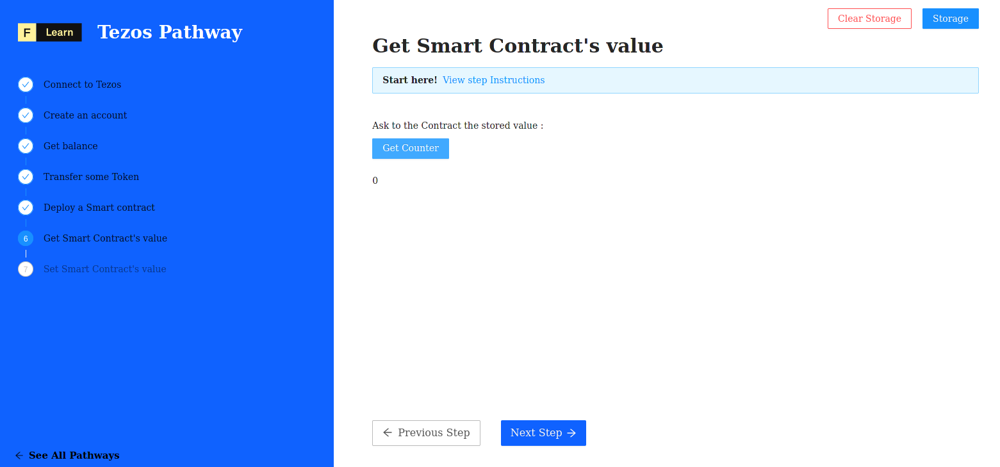

Our Contract is on-chain, and we're going to learn how to fetch the data stored on the contract. 


If you want to learn more about Tezos smart contracts, follow the [**The Taco Shop Smart Contract**](https://ligolang.org/docs/tutorials/get-started/tezos-taco-shop-smart-contract) tutorial.


------------------------

# Challenge


In `pages/api/tezos/getter.ts`, complete the code of the function and try to read the value of the counter of the smart contract. 


**Take a few minutes to figure this out**

```typescript
//...
  try {
    const { mnemonic, email, password, secret, contract } = req.body
    const url = getTezosUrl();
    const tezos = new TezosToolkit(url);

    await importKey(
      tezos,
      email,
      password,
      mnemonic,
      secret
    )

    // use the contract module to get the storage
    const counter = undefined;

    // @ts-ignore
    res.status(200).json(counter.toString());
  } 
//...
```

**Need some help?** Check out these links
* [**Interface ContractProvider method `getStorage`**](https://tezostaquito.io/typedoc/interfaces/_taquito_taquito.contractprovider.html#getstorage)  


[**You can join us on Discord, if you have questions**](https://discord.gg/fszyM7K)


Still not sure how to do this? No problem! The solution is below so you don't get stuck.

------------------------

# Solution

```typescript
//...
  try {
    const { mnemonic, email, password, secret, contract } = req.body
    const url = getTezosUrl();
    const tezos = new TezosToolkit(url);

    await importKey(
      tezos,
      email,
      password,
      mnemonic,
      secret
    )

    const counter = await tezos.contract.getStorage(contract)

    // @ts-ignore
    res.status(200).json(counter.toString());
  } 
//...
```

**What happened in the code above?**
* First, we create a new `TezosToolkit` instance.
* Next, we import our wallet data using `importKey`.
* Finaly, using `getStorage` function of `contract` module we return the counter stored on the contract.

------------------------

# Make sure it works

Once you have the code above saved, click the button and watch the magic happen:



-----------------------------

# Next

Now, time for the last challenge! Time to modify the state of the contract and thus the state of the blockchain. Let's go!