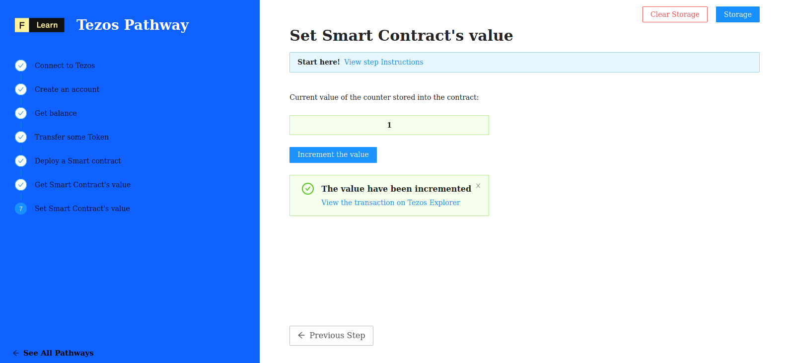

Our Contract is on-chain, and we're going to learn how to fetch the data stored on the contract. 


If you want to learn more about Tezos smart contracts, follow the [**The Taco Shop Smart Contract**](https://ligolang.org/docs/tutorials/get-started/tezos-taco-shop-smart-contract) tutorial.


------------------------

# Challenge


In `pages/api/tezos/setter.ts`, complete the code of the function and try to increment the value of the smart contract by one. 


**Take a few minutes to figure this out**

```typescript
//...
  try {
    const { mnemonic, email, password, secret, contract } = req.body
    const url = getTezosUrl();
    const tezos = new TezosToolkit(url);
    await importKey(
      tezos,
      email,
      password,
      mnemonic,
      secret
    )
    
    const n = 1;
    // load the interface of the contract
    const counterContract = undefined;
    // call the increment function of the contract
    const transaction = await counterContract.methods.increment(n).send()

    // await for confirmation
    await transaction.confirmation(3)

    res.status(200).json(transaction.hash);
  }
//...
```

**Need some help?** Check out these links
* [**Interact with a smart contract**](https://tezostaquito.io/docs/quick_start/#interact-with-a-smart-contract)  
* [**Interface ContractProvider method `at`**](https://tezostaquito.io/typedoc/interfaces/_taquito_taquito.contractprovider.html#at)  


[**You can join us on Discord, if you have questions**](https://discord.gg/fszyM7K)


Still not sure how to do this? No problem! The solution is below so you don't get stuck.

------------------------

# Solution

```typescript
//...
  try {
    const { mnemonic, email, password, secret, contract } = req.body
    console.log(CONTRACT_JSON)
    const url = getTezosUrl();
    const tezos = new TezosToolkit(url);

    await importKey(
      tezos,
      email,
      password,
      mnemonic,
      secret
    )
    
    const i = 1;
    const counterContract = await tezos.contract.at(contract)
    const transaction = await counterContract.methods.increment(i).send()
    await transaction.confirmation(3)

    res.status(200).json(transaction.hash);
  }
//...
```

**What happened in the code above?**
* First, we must supply the address of our newly deployed contract to `Tezos.contract.at`.
* Next, using `contract.methods.increment(n).send()` will pass a value of n to the `increment` method of the deployed contract. 
* Next, using the instruction `transaction.confirmation(3)` we wait for **3** block confirmations before returning.
* Finaly, The transaction is then available and we can retrieve the hash with `transaction.hash`

------------------------

# Make sure it works

Once you have the code above saved, click the button and watch the magic happen:



-----------------------------

# Conclusion

Congratulations! We have completed the Tezos Pathway, all the way from initial setup to being able to deploy smart contracts. We are now empowered to learn and build on Tezos, using the dedicated infrastructure of DataHub. It is time to head to the References section and explore the LIGO documentation, or perhaps dive straight into the RPC documentation. We welcome everyone who is interested to join the Figment Learn community today!

If you had any difficulties following this tutorial or simply want to discuss Tezos with us you can join [our Discord](https://discord.gg/fszyM7K) or head over to our [community forums](https://community.figment.io).
