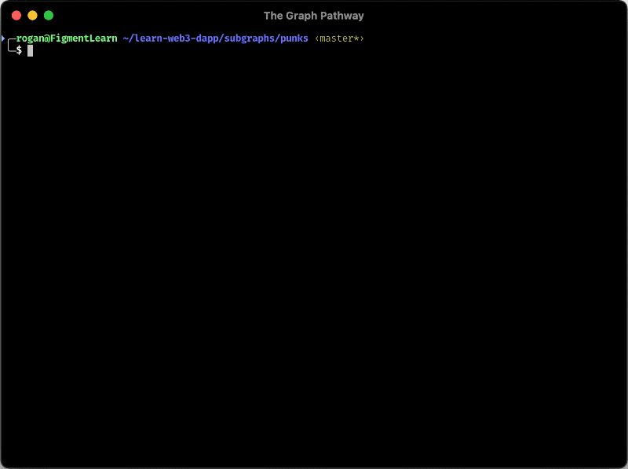

## 🗺 Mapping event to feed entity

Remember in the **Tweak the manifest** step we defined a handler next to an event? This handler will the maestro of our subgraph. This piece of code will orchestrate events with entities, to give us what we are asking for: A lovely concerto of data!

## 👤 Define entities

Now, we're going to create the `handlePunkBought` function.

- Open `src/mapping.ts`
- Erase the content

First we need to import some code and prototype the function:

```typescript
import { BigInt } from "@graphprotocol/graph-ts";

import { PunkBought as PunkBoughtEvent } from "../generated/punks/punks";
import { Account, Punk } from "../generated/schema";

export function handlePunkBought(event: PunkBoughtEvent): void {
  // Implement the function here
}
```

`Account` and `Punk` imported objects are the ones we've just defined, and `PunkBoughtEvent` is referencing the definition of an event we made in the `subgraph.yaml`.

```typescript
let account = Account.load(event.params.toAddress.toHexString());
```

To create the `Account` entity, we first need to test if the entity already exists:

```typescript
if (account == null) {
  account = new Account(event.params.toAddress.toHexString());
  account.id = event.params.toAddress.toHexString();
  account.numberOfPunkBought = BigInt.fromI32(1);
}
```

If it does not, we create a new one by filling all the fields. Otherwise, we only need to increment the `numberOfPunkBought`.

```typescript
else {
    account.numberOfPunkBought = account.numberOfPunkBought.plus(
      BigInt.fromI32(1),
    );
  }
```

At last and for both cases, we call `save()`.

```typescript
account.save();
```

The creation of a `Punk` entity follows the same logic, as an helper be inform that we can access timestamp of the event using `event.block.timestamp`.

# 👉 The solution

At the end, your `src/mapping.ts` should look like this:

```typescript
// solution
import { BigInt } from "@graphprotocol/graph-ts";

import { PunkBought as PunkBoughtEvent } from "../generated/punks/punks";
import { Account, Punk } from "../generated/schema";

export function handlePunkBought(event: PunkBoughtEvent): void {
  let account = Account.load(event.params.toAddress.toHexString());
  if (account == null) {
    account = new Account(event.params.toAddress.toHexString());
    account.id = event.params.toAddress.toHexString();
    account.numberOfPunkBought = BigInt.fromI32(1);
  } else {
    account.numberOfPunkBought = account.numberOfPunkBought.plus(
      BigInt.fromI32(1)
    );
  }
  account.save();

  let punk = Punk.load(event.params.punkIndex.toHexString());
  if (punk == null) {
    punk = new Punk(event.params.punkIndex.toHexString());
    punk.id = event.params.punkIndex.toHexString();
    punk.index = event.params.punkIndex;
  }
  punk.owner = event.params.toAddress.toHexString();
  punk.value = event.params.value;
  punk.date = event.block.timestamp;

  punk.save();
}
```

## ✅ Make sure it works

Last but not least, run the following command to create the subgraph and deploy it to your local Graph node:

```bash
yarn create-local
yarn deploy-local
```

Some notes about the above commands:

- `yarn create-local` will create an endpoints for our subgraph: here `http://localhost:8000/subgraphs/name/punks
- `yarn deploy-local` will deploy the subgraph to the above mention endpoints.



Now it's time for you to verify that you have followed the instructions carefully. Click on the **Check subgraph deployment** button on the right to check that your deployment has succeeded.
