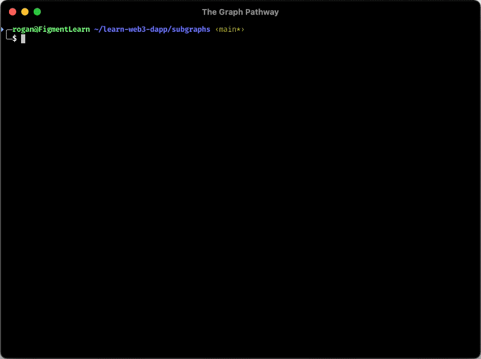

## Entity and relation

To capture and process information from a blockchain, we must:

- Define which information we're looking for
- Know what this information is made of
- Define the shape of the processed information when we are finished with it

The right place to do so is within the `schema.graphql`.

## Define entities

To define our entities:

- Erase the content of `schema.graphql`
- Copy And paste following code snippet

```graphql
type Account @entity {
  id: ID!
  punksBought: [Punk!] @derivedFrom(field: "currentOwner")
  punksSell: [Punk!] @derivedFrom(field: "previousOwner")
  numberOfPunkBought: BigInt!
  numberOfPunkSell: BigInt!
  LastBought: BigInt!
  LastSell: BigInt!
}

type Punk @entity {
  id: ID!
  tokenId: BigInt!
  currentOwner: Account!
  previousOwner: Account
  lastValue: BigInt!
  tradeDate: BigInt!
}
```

Accordingly with what has been done on the manifest, we have defined the entities `Account` and `Punk`.

## Specify relation

In the above code snippet, there is two points worth to mention:

- For indexing purpose both _must have_ an `ID` field to uniquely identify them.
- As an `Account` can be the **owner** of multiple `Punk` we must explicitly define the `1:n` relation on the `Account` **punksOwned** attribute using `[Punk!] @deriveFrom(field: "owner")` directive

```text
                               |      ------
                               | --- | Punk |
                               |      ------
                               ...
     ---------                 |      ------
    | Account |  1 : ----- n : | --- | Punk |
     ---------                 |      ------
                               ...
                               |      ------
                               | --- | Punk |
                               |      ------
```

## Make sure it works

Last but not least, run the following command to generate boilerplate code from our **entities**

```bash
cd punks
yarn codegen
```



Now, it's time for you to verify if you have followed the instructions carefully, click on the button **Test Entites** to check that your entities are well formed.
