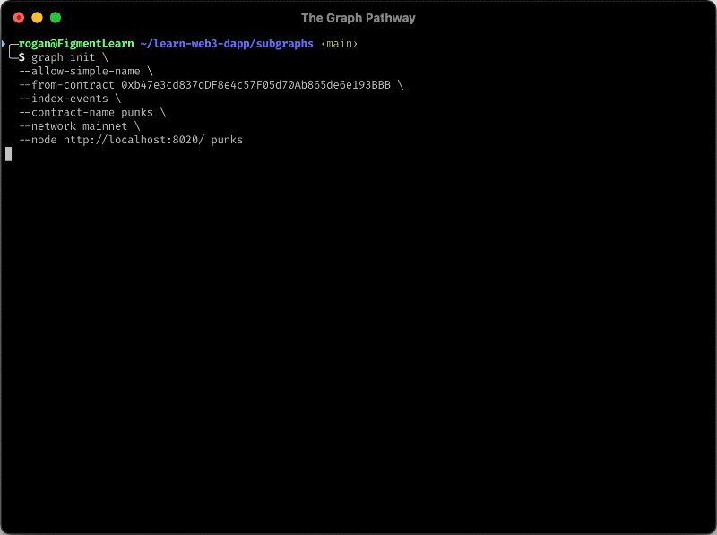

## 🌐 What's a subgraph?

A subgraph defines which data The Graph will index from Ethereum, and how it will store it.

It's made up of 3 main pieces: a manifest, a schema of entities and mappings.


## 🤝 Picking a smart contract

A subgraph is basically a piece of software that indexes events emitted by a smart contract. So the first thing we need to do is pick the smart contract our subgraph will be listening to.

For the purpose of this tutorial we have decided to pick a fun and popular smart contract: the Crypto Punk ETH-20 contract. You can view it on Etherscan [here](https://etherscan.io/address/0xb47e3cd837dDF8e4c57F05d70Ab865de6e193BBB) and if you click on the "Contract" tab you can also have a look at [its Solidity code](https://etherscan.io/address/0xb47e3cd837dDF8e4c57F05d70Ab865de6e193BBB). The contract's address is `0xb47e3cd837dDF8e4c57F05d70Ab865de6e193BBB`.

> Looking at the code, can you find its Events? What functions are they calling? What arguments are they passing? Browse around the codebase, we will come back to those events very soon.

## 🧑🏼‍💻 Install the Graph CLI

Fortunately, we won't have to build a subgraph from scratch, The Graph provides a CLI to do this. Install the CLI by running:

```text
yarn global add @graphprotocol/graph-cli
```

Verify the installation was successful by running:

```text
graph --version
```

This should output the current version of the graph-cli.

Let's then cd into the `subgraphs` folder:

```text
cd subgraphs
```

## 🧑🏼‍💻 Your turn! Generate a subgraph scaffold

Scaffolding a subgraph will create a subgraph template. It will have the right shape but will be incomplete.

We will be using the `init` command of the Graph CLI (see the [docs](https://github.com/graphprotocol/graph-cli) if you need more info). Your job is to fill in the missing fields:

- Set the contract address to the CryptoPunk contract
- Set the Ethereum network to `mainnet`

```text
graph init \
  --allow-simple-name \
  --index-events \
  --contract-name punks \
  --node http://localhost:8020/ punks
  // pass the CryptoPunk contract address
  // set the Ethereum network to mainnet
```

When you're done, run this command in your terminal to generate a subgraph scaffold.
If you need to start over, simply delete the folder `punks` inside `subgraphs` and run the `graph init ...` command again.

# 👉 The solution

```text
// solution
graph init \
  --allow-simple-name \
  --from-contract 0xb47e3cd837dDF8e4c57F05d70Ab865de6e193BBB \
  --index-events \
  --contract-name punks \
  --network mainnet \
  --node http://localhost:8020/ punks
```

That's a mouthful! Let's look at it line by line.

- `graph init` is the CLI command that will initialize an empty subgraph.
- `--allow-simple-name` simplifies the naming convention of our local graph.
- `--from-contract` uses an already deployed contract at the specified address.
- `--index-event` creates entities from events (not a good idea).
- `--contract-name punks` sets the contract name to the supplied string, for example: punks
- `--network mainnet` tells the Graph CLI to look on Mainnet Ethereum to find the contract ABI
- `--node http://localhost:8020/` will prepare our script to deploy to our local graph node
- `punks` is the name of the folder under which the files are created

> **NOTE**: Linux and macOS use the backslash character \ for multi-line input. Windows uses the ^ character. If you paste this command into a Windows terminal (PowerShell, cmd.exe or Windows Terminal), replace the \ with ^

Once you type Enter, you will be prompted to confirm the information: you can just accept the five suggested inputs The output should look like:



You don't need to run the next steps for now!

## ✅ Make sure it works

Now it's time for you to verify that you have followed the instructions carefully. Click on the **Check for a subgraph scaffold** button on the right to see if your scaffold exists, and is in the right place.
