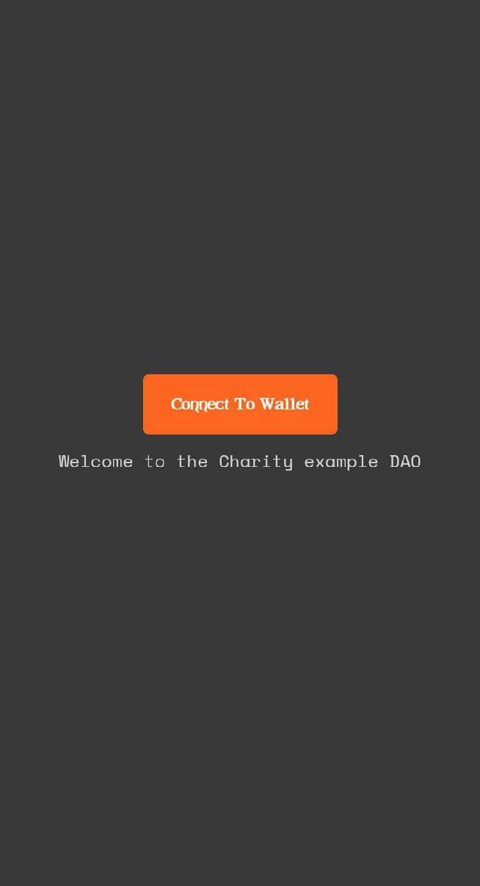
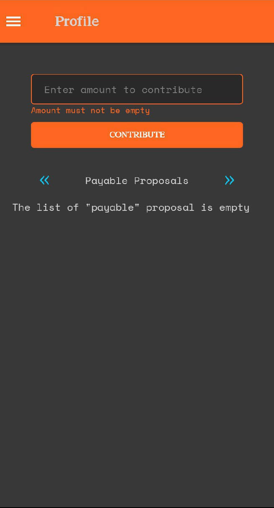
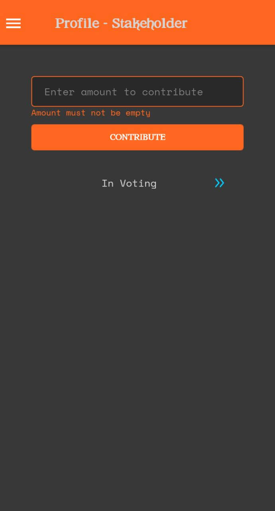

# Build a Decentralized Autonomous Organization (DAO) on Celo - Part 3

In this tutorial, we are going to build a fully functional DAO by writing the Smart Contract Code and then build a React Native App to communicate with the Smart Contract.
This part 3 section focuses on building the React Native App

&nbsp;

# Prerequisite

If you have never built an app using React Native to connect to the Celo wallet, you can follow our previous guide [here](https://learn.figment.io/network-documentation/celo/tutorial/how-to-successfully-connect-to-a-celo-wallet-with-a-react-native-dapp#project-setup
) 

# Building the React Native dApp
We are building the dApp using Javascript and Redux. We will make use of the React Native [UI kitten library](https://akveo.github.io/react-native-ui-kitten/) to style the dApp. This section outline the Pages and Components that make up the dApp and then the section on Redux is a deep dive into how to connect the dApp to the Smart Contract.

First, we will outline the screens and then write out the code for building each one:
- Welcome Screen (Connect Wallet)
- Side Menu Navigation
- All Proposal Screen 
- Votable Proposals [List]
- Create Proposal [Modal, Form]
- View Proposal [Modal]
- Upvote [Button]
- Downvote [Button]
- Profile Screen
- Contribute to the DAO[Modal, Form]
- Proposals voted on [List]
- View Proposal [Modal]
- Payable Proposals [List]
- View Proposal [Modal]
- Make Payment [Button] 
- Paid Proposals [List]
- View Proposal [Modal]
- About

&nbsp;

# Initial Setup


For this section of the dApp, we will outline how the various actions across the Smart Contract are carried out with a connection to the dApp. First, let’s code the screens. The screens at this point do not yet interact with the Smart Contract.

&nbsp;

# Initialize the dApp
This section assumes that you already know how to initialize and start a React Native App. We will simply do a high level overview on how to start your React Native app.

## Starting a React Native APP


## Setting up UI Kitten Library

UI Kitten is a customizable React Native UI Library based on Eva Design System specifications, it is a framework of UI components that can easily be added to a React Native app. Initializing the app with the expo init command and the blank managed workflow as the selected template sets up a basic @ui-kitten/components configuration for us. If not:

Install UI Kitten using the following command:
```
yarn add @ui-kitten/components @eva-design/eva react-native-svg
```
Once it has completely installed, you can use any of the components available in the UI Kitten library. First, we have to configure the UI Kitten library at the root of the application, before its components can be called anywhere in the dApp.

Open the `App.js` file and wrap the project in UI Kitten’s ApplicationProvider module and also add the IconRegistry module so we can use @ui-kitten/eva-icons Icons.

```
import './global';
import * as eva from '@eva-design/eva';
import { ApplicationProvider, IconRegistry } from '@ui-kitten/components';
import { EvaIconsPack } from '@ui-kitten/eva-icons';
import { StatusBar } from 'expo-status-bar';
import React from 'react';
import { Navigation } from './navigation'


export default function App() {
  const isLoadingComplete = useCachedResources();
  const colorScheme = useColorScheme();

  if (!isLoadingComplete) {
    return null;
  } else {
    return (
      
        <ApplicationProvider
          {...eva}
          theme={{...eva.dark, ...theme}}
          customMapping={mapping}>

          <IconRegistry icons={EvaIconsPack} />
          <Navigation coloScheme={colorScheme} />
          <StatusBar />
          
        </ApplicationProvider>

    );
  }
}
```

We are making use of the eva dark theme. Configured IconRegistry using the EvaIconsPack. Now that we have the UI Kitten library setup, we can style our dApp as we build. Let’s go ahead and build the screens.

# Screens 
## Welcome Screen
The Welcome Screen is the first screen that loads when the user launches the DAO dApp. The screen has only one button which the user clicks to connect (login) to the DAO. Since our app is on the  Celo protocol, we have to connect to the Alfajores/Valora wallet.



Below is the code snippet to create the screen:

```
 export const WelcomePage = ({navigation}) => {

 return (
   <Layout style={styles.container}>
     <Button
       raised='true'
       accessoryLeft={profile.loading ? loadingIndicator : ""}
     >Connect To Wallet</Button>

     <Text style={styles.text}>
       Welcome to the Charity example DAO
     </Text>
   </Layout>
 );
};

const styles = StyleSheet.create({
  container: {
    flex: 1,
    alignItems: 'center',
    justifyContent: 'center',
    padding: 20,
  },
  text: {
    paddingTop: 10,
  },
  indicator: {
    justifyContent: 'center',
    alignItems: 'center',
  },
});
```


Subsequently, in the Redux section, we will add the functionality to connect the Screen to the Wallet and carry out user actions.

Side Menu Navigation

This is based on React Navigation’s Drawer Navigation. To use the React Drawer navigation, you have to install and set up React Navigation following the instructions in the [docs](https://reactnavigation.org/docs/getting-started)
The instructions for designing a Drawer based navigation can be found [here](https://reactnavigation.org/docs/drawer-based-navigation).


&nbsp;

## All Proposals Screen
The All Proposals Screen contains all the DAO proposals that have been created. It contains a button at the top which a User can click upon to create a Proposal. When the button to create a Proposal is clicked upon, it opens a modal that contains a form that a user can fill to create a new proposal.


Below is the code snippet to create the screen:

```
export const ProposalsPage = ({ navigation }) => {
  
  const theme = useTheme();

  const chaFooter = (props, info) => {
    return(
      <View {...props} style={{...props.style, flexDirection: 'row', justifyContent: 'space-evenly', padding: 8}}>
        <Text style={{color: theme['color-info-default']}}>For: {info.for}</Text>
        <Text style={{color: theme['color-danger-default']}}>Against: {info.against}</Text>
      </View>
    );
  };

  const cardItem = (info) => {
    return(
      <Card
        style={{borderColor: theme['color-primary-default'], marginVertical: 4}}
        footer={props => chaFooter(props, {for: 10, against: 3})}
        >
        
        <Text category='s2' numberOfLines={4} ellipsizeMode='tail'>{info.item.desc}</Text>
      </Card>
    );
  };

  return (
    <SafeAreaView style={{ flex: 1 }}>
      <Layout style={{ flex: 1, padding: 16 }}>
        <Card
          disabled='true'
          style={{borderColor: theme['color-primary-default'], margin: 8, padding: 8}}>

          <Button size='medium'>Create Proposal</Button>
        </Card>

        <List
          contentContainerStyle={{paddingHorizontal: 8, paddingVertical: 4}}
          renderItem={cardItem}/>


      </Layout>
    </SafeAreaView>
  );
};
```
&nbsp;

## Create Proposal Modal
The Create Proposal modal component is imported into the Proposals page and is displayed when the Create proposal Button is clicked.


Below is the code snippet to create the modal:

```
export const CreateProposalModal = ({setVisible, visible,}) => {
  const theme = useTheme();

  const cardHeader = (props) => {
    return(
      <View {...props} style={{...props.style, flex: 1, flexDirection: 'row', justifyContent: 'space-between'}}>
        <Text style={{margin: 16}} category='h6'>Create Proposal</Text>
        <Button
          size='large'
          onPress={() => setVisible(false)}
          appearance='ghost'
          accessoryLeft={closeIcon}/>
          
      </View>
    );
  };

  const cardFooter = (props) => {
    return(
      <View {...props} style={{...props.style, flexDirection: 'row', justifyContent: 'flex-end', padding: 8}}>
        <Button
          style={{marginHorizontal: 2}}
          size='small'
          status='basic'
          onPress={() => setVisible(false)}>
          CANCEL
        </Button>
        <Button
          style={{marginHorizontal: 2}}
          size='small'
          >
          CREATE
        </Button>
      </View>
    );
  };

  return(
    <Modal
      visible={visible}
      backdropStyle={{backgroundColor: theme['color-primary-transparent-300']}}
      onBackdropPress={() => setVisible(false)}
      >
      <Card
        disabled='true'
        style={{flex: 1, borderColor: theme['color-primary-default'], margin: 2}}
        header={cardHeader}
        footer={cardFooter}>
        
        <Layout style={{flex: 1, padding: 8, width: 250}}>
          <Input
            size='medium'
            style={{marginVertical: 8}}
            status='primary'
            keyboardType='numeric'
            placeholder='Enter amount'
            />

          <Input
            size='medium'
            style={{marginVertical: 8}}
            status='primary'
            placeholder='Enter Charity address'
            />

          <Input
            multiline={true}
            textStyle={{minHeight: 64}}
            style={{marginVertical: 8}}
            status='primary'
            placeholder='Enter the description'
            />
        </Layout>
        
      </Card>
  </Modal>
  );
};

const closeIcon = (props) => {
  return(
    <Icon {...props} name='close-circle-outline'/>
  );
};
``` 

Before we go on to all the Modal proposal to the Create Proposal Screen, we can code data input and validation logic for the input fields on the form.

Add the following code snippet after `useTheme()`;

```
const descriptionInput = useInputState('Description');
const charityAddressInput = useInputState('Address');
const amountInput = useInputState('Amount');

  const addItem = () => {
    if (amountInput.value == ''
      || descriptionInput.value.length < 20
      || charityAddressInput.value == '') {
      

      return;
    }
    let newData = [...data];
    newData.push({
      amount: amountInput.value,
      desc: descriptionInput.value,
      chaAdd: charityAddressInput.value
    });

    amountInput.setValue('');
    descriptionInput.setValue('');
    charityAddressInput.setValue('');

    setData(newData);
    setVisible(false);
  };
```

On the Create Button, call the function to add an item: additem

```
        <Button
         ...
          onPress={addItem}>
          CREATE
     </Button>
```

On the input fields, pass the variable to set Input items:

```
<Input
     ...            
     placeholder='Enter amount'
     {...amountInput}/>

<
     ...
     placeholder='Enter Charity address'
     {...charityAddressInput}/>

 <Input
      ...
      placeholder='Enter the description'
      {...descriptionInput}/>
 ```

The `useInputState()` method which the input fields were assigned is used for Data Validation. Add the code below after the close of the return block, before the closeIcon() function:

```
const useInputState = (name, initialValue = '') => {
  const [value, setValue] = React.useState(initialValue);

  let caption;
  if (value === '') {
    caption = `${name} cannot be empty`;
  }

  if (name === 'Description' && value.length < 20) {
    caption = `${name} must be more than 20 characters`
  }

  return {value, onChangeText: setValue, caption, setValue};
};
```

After creating the Modal, we can then import it into the Create Proposal Screen and establish the state of the modal, by coding states to toggle it as `“visible”` and `“hidden”`. Here is how to get it done:

First import the CreateProposal module into the Proposal page:

```
import { CreateProposalModal, ViewProposalModal } from '../components'; 
```

Set a state to set the modal to visible when clicked

```
const [createVisible, setCreateVisible] = React.useState(false);

```
In the return statement inside of `Layout` add the CreateProposalModal Component and set the state of the component

```
<CreateProposalModal
       setVisible={setCreateVisible}
       visible={createVisible}/>
```

&nbsp;

## Profile Screen
The Profile Screen contains an input field in which the user has to contribute some celo tokens (at least 5 Celo) to enable a user to become a contributor. This is the static elements of the Profile screen, we will update the User actions in the Redux section below.





The Profile Page is completely styled and contains cards which hold the different sections. The code is broken down below:

```
import * as React from 'react';
import { View, SafeAreaView } from 'react-native';
import { Button, Card, Input, Layout, List, useTheme, Text, Spinner, ViewPager, Icon } from '@ui-kitten/components';


export const ProfilePage = ({ navigation }) => {
  
  const theme = useTheme();

  const cardItem = (info) => {
    return(
      <Card
        style={{borderColor: theme['color-primary-default'], marginVertical: 4}}
        footer={props => cardFooter(props, {for: info.item[3], against: info.item[4]})}
        onPress={() => getProposal(info.item[0])}>
        
        <Text category='s2' numberOfLines={4} ellipsizeMode='tail'>{info.item[5]}</Text>
      </Card>
    );
  };
  
  const cardFooter = (props, info) => {
    return(
      <View {...props} style={{...props.style, flexDirection: 'row', justifyContent: 'space-evenly', padding: 8}}>
        <Text style={{color: theme['color-info-default']}}>For: {info.for}</Text>
        <Text style={{color: theme['color-danger-default']}}>Against: {info.against}</Text>
      </View>
    );
  };

  const page = () => {
    return(
      <>
        <Layout style={{flexDirection: 'row', justifyContent: 'space-around'}}>
          <Button
            appearance='ghost'
            status='info'
            accessoryLeft={leftIcon}
            onPress={handleLeftClick}
            />
          <Text style={{alignSelf: 'center', marginVertical: 16}}>{selectedIndex == 0 ? 'In Voting' : selectedIndex == 1 ? 'Payable Proposals' : 'Paid Proposals'}</Text>
          <Button
            appearance='ghost'
            status='info'
            accessoryRight={rightIcon}
            onPress={handleRightClick}
            />
        </Layout>
        {
          (profile.loading || !profile.isStakeholder) ?
          <Text style={{backgroundColor: theme['color-basic-800']}}>{selectedIndex == 0 ? 'The list of "in voting" proposal is empty' : selectedIndex == 1 ? 'The list of "payable" proposal is empty' : 'The list of "paid" proposal is empty'}</Text> :
          <List
          style={{backgroundColor: theme['color-basic-800']}}
          contentContainerStyle={{paddingHorizontal: 8, paddingVertical: 4}}
          data={selectedIndex == 0 ? inVotingVotes : selectedIndex == 1 ? payableVotes : paidVotes}
          renderItem={cardItem}/>
        }
      </>
    );
  };

  const rightIcon = (props) => {
    if (selectedIndex != 2) {
      return(
        <Icon
          {...props}
          name='arrowhead-right-outline'/>
      );
    }

    return(null);
  };

  const leftIcon = (props) => {
    if (selectedIndex != 0) {
      return(
        <Icon
          {...props}
          name='arrowhead-left-outline'/>
      );
    }
    
    return(null);
  };

  return (
    <SafeAreaView style={{ flex: 1 }}>
      <Layout style={{ flex: 1, padding: 16 }}>
        <Card style={{flexDirection: 'column', justifyContent: 'space-between', borderColor: theme['color-basic-800']}}>
          <Input
            style={{marginVertical: 8}}
            size='medium'
            status='primary'
            keyboardType='numeric'
            placeholder='Enter amount to contribute'
            {...amountInput}/>
          
          <Button
            size='small'
            onPress={contribute}
            accessoryLeft={profile.loading ? loadingIndicator : ''}
            >
            CONTRIBUTE
          </Button>
        </Card>

        <ViewPager style={{height: 480}}
          selectedIndex={selectedIndex}
          shouldLoadComponent={shouldLoadComponent}
          onSelect={setSelectedIndex}>

            <Layout level='2'>
              {page()}
            </Layout>

            <Layout level='2'>
              {page()}
            </Layout>

            <Layout level='2'>
              {page()}
            </Layout>
          </ViewPager>

      </Layout>
    </SafeAreaView>
  );
};
```

## View Proposal Modal
The View Proposal modal component is imported into the Profile page and is displayed when a Proposal Card is clicked.


Below is the code snippet to create the modal:

```
import * as React from 'react';
import { View } from 'react-native';
import { Button, Card, Icon, Input, Layout, Modal, Text, useTheme, Spinner } from '@ui-kitten/components';

export const ViewProposalModal = ({setVisible, visible }) => {
  
  const theme = useTheme();

  const cardHeader = (props) => {
    return(
      <View {...props} style={{...props.style, flex: 1, flexDirection: 'row', justifyContent: 'space-between'}}>
        <Text style={{margin: 16}} category='h6'>Proposal</Text>
        <Button
          size='large'
          onPress={() => setVisible(false)}
          appearance='ghost'
          accessoryLeft={closeIcon}/>
      </View>
    );
  };

  const cardFooter = (props) => {
    
          return(
            <View {...props} style={{...props.style, flexDirection: 'row', justifyContent: 'space-around', padding: 8}}>
              <Button
                style={{marginHorizontal: 2}}
                size='small'
                status='success'
                >
                UPVOTE
              </Button>
              <Button
                style={{marginHorizontal: 2}}
                size='small'
                status='warning'>
                DOWNVOTE
              </Button>
            </View>
          );
  };

  return(
    <Modal
      visible={visible}
      backdropStyle={{backgroundColor: theme['color-primary-transparent-300']}}
      onBackdropPress={() => setVisible(false)}>
      
      <Card
        disabled='true'
        style={{flex: 1, borderColor: theme['color-primary-default'], margin: 2}}
        header={cardHeader}
        footer={cardFooter}>
          
            <>
              <Layout style={{flex: 1, width: 250}}>
                <Text style={{marginVertical: 8}}>Description: </Text>
                <Text style={{marginVertical: 8}} category='p2'>Requested:  Celo</Text>
                <Text style={{marginVertical: 8}} category='p2'>Proposer: </Text>
                <Text style={{marginVertical: 8}} category='p2'>Charity: </Text>
              </Layout>

              <Layout style={{flex: 1, flexDirection: 'row', justifyContent: 'space-around'}}>
                <Text style={{color: theme['color-success-default']}}>For: </Text>
                <Text style={{color: theme['color-danger-default']}}>Against: </Text>
              </Layout>
            </>
          
          
      </Card>
    </Modal>
  );
};

const closeIcon = (props) => {
  return(
    <Icon {...props} name='close-circle-outline'/>
  );
};
```

&nbsp;

**Our Pages are thus complete! To be able to interact with the Smart Contract, we are using redux actions and reducers to connect with the functions in the smart contract. The next step with be to make these connections!**

[Part 4](./part-4)

