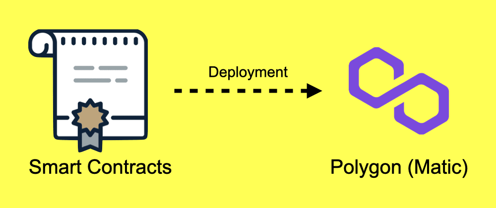

# Deploying & Debugging the Smart Contracts on Polygon
<div align="center"></div>


## Introduction
In this tutorial, I'll show you how to deploy smart contracts of your DApp to the Polygon (Matic) Mumbai Test Network.
I'll cover all the possible errors which I faced during the deployment.
So, grab a cup of coffee ☕️ and follow the steps.

## Prerequisites
This tutorial assumes that you have some beginner-level experience in programming & blockchain understanding.

## After this tutorial you will be able to:
* Deploy the smart contracts on polygon (Matic) Mumbai Test Network.<br>
* Tackle the errors while deploying the smart contracts on polygon (Matic) Mumbai Test Network.

## About the Author
I'm Akhilesh Thite, an Indian tech enthusiast with a passion for Software Development, Open-Source & Decentralization. Feel free to connect with me on [GitHub](https://github.com/AkhileshThite) & [Twitter](https://twitter.com/AkhileshThite_).

## MetaMask setup.
To deploy the smart contracts on Matic you first have to create a Matic network in MetaMask wallet.
`Settings -> Networks -> Add network -> Save`

<div align="center"></div>


To get test Matic for deployment and testing,<br>
`go to Matic Faucet -> Select Mumbai -> Paste wallet address -> Submit`, Matic Faucet [link](https://faucet.matic.network).<br>
Done! check your wallet, you'll see some Matic there.

<div align="center"></div>

## truffle-config
* `truffle-config.js` for Mac users
* `truffle.js` for Windows users

truffle-config file is the main and the most important file of your DApp which interacts with everything. In this file, you can mention the path of your solidity file (smart contracts), ABI's, and define **networks**.
```javascript
const HDWalletProvider = require("@truffle/hdwallet-provider")
require('dotenv').config(); // Load .env file

module.exports = {
  networks: {
   // For Ganache, your personal blockchain
   development: {
      host: "127.0.0.1",     // Localhost (default: none)
      port: 8545,            // Standard Ethereum port 
      network_id: "*",       // Any network (default: none)
    },
    matic: {
      provider: () => new HDWalletProvider(process.env.MNEMONIC, 
     `https://rpc-mumbai.matic.today`),
      network_id: 80001,
      confirmations: 2,
      timeoutBlocks: 200,
      skipDryRun: true,
    },
  },
  contracts_directory: './src/contracts/', // path to Smart Contracts
  contracts_build_directory: './src/abis/', // Path to ABIs
  compilers: {
    solc: {
      optimizer: {
        enabled: true,
        runs: 200
      }
    }
  }
}
```
Make sure you create `.env` file in the root dir and paste mnemonics (12 secret words) of your MetaMask wallet with variable name MNEMONIC (give any name).
```.env
MNEMONIC= 12 secret words here..
```
Now, let's add `matic` network in our truffle-config file which will contain our environment variable MNEMONIC and RPC URL.
```javascript
    matic: {
      provider: () => new HDWalletProvider(process.env.MNEMONIC, 
      `https://rpc-mumbai.matic.today`),
      network_id: 80001,
      confirmations: 2,
      timeoutBlocks: 200,
      skipDryRun: true,
    },
  },
```
You can set gas price and gas limits for faster transactions by adding,
```javascript
      gas: 6000000,
      gasPrice: 10000000000,
```

## Deploy Smart Contracts
* Command: `truffle migrate --network matic`<br>
If you're deploying it for the second time then deploy with this command just to **reset** and avoid JSON errors.<br>
* Command: `truffle migrate --network matic --reset`

If everything worked fine, you'll see something like this:
```javascript
2_deploy_contracts.js
=====================

   Replacing 'MyContract'
   ------------------
   > transaction hash:    0x1c94d095a2f629521344885910e6a01076188fa815a310765679b05abc09a250
   > Blocks: 5            Seconds: 5
   > contract address:    0xbFa33D565Fcb81a9CE8e7a35B61b12B04220A8EB
   > block number:        2371252
   > block timestamp:     1578238698
   > account:             0x9fB29AAc15b9A4B7F17c3385939b007540f4d791
   > balance:             79.409358061899298312
   > gas used:            1896986
   > gas price:           0 gwei
   > value sent:          0 ETH
   > total cost:          0 ETH

   Pausing for 2 confirmations...
   ------------------------------
   > confirmation number: 5 (block: 2371262)
initialised!

   > Saving migration to chain.
   > Saving artifacts
   -------------------------------------
   > Total cost:                   0 ETH


Summary
=======
> Total deployments:   2
> Final cost:          0 ETH
```
*Code snippet from matic truffle docs.*

## Dealing with different errors
If you get any of these errors then follow these steps

### Error:
```javascript
Error: PollingBlockTracker - encountered an error while attempting to update latest block:
```

### Fix_1:
Change `https://rpc-mumbai.matic.today` by using [Infura custom RPC](https://infura.io)
<br>
`infura -> Create new project -> Settings -> Endpoints -> Polygon Mumbai`
```javascript
    matic: {
      provider: () => new HDWalletProvider(process.env.MNEMONIC, 
      `https://polygon-mumbai.infura.io/v3/process.env.PROJECT_ID`),
      network_id: 80001,
      confirmations: 2,
      timeoutBlocks: 200,
      skipDryRun: true,
    },
  },
```
Paste your PROJECT_ID there from .env file.<br>
`truffle migrate --network matic --reset`

If still dealing with error, try this 2nd fix.

### Fix_2:
Change `https://rpc-mumbai.matic.today` by using [Matic custom RPC](https://rpc.maticvigil.com/)
<br>
```javascript
    matic: {
      provider: () => new HDWalletProvider(process.env.MNEMONIC, 
      `https://rpc-mumbai.maticvigil.com/v1/process.env.PROJECT_ID`),
      network_id: 80001,
      confirmations: 2,
      timeoutBlocks: 200,
      skipDryRun: true,
    },
  },
```
Paste your PROJECT_ID there from .env file.<br>
`truffle migrate --network matic --reset`

### Error:
```javascript
*** Deployment Failed ***

"Migrations" -- only replay-protected (EIP-155) transactions allowed over RPC.
```

### Fix:
`npm install @truffle/hdwallet-provider@1.4.0`<br>
Truffle hdwallet-provider version 1.4.0 will fix this error.

### Error:
```javascript
Error:  *** Deployment Failed ***

"Migrations" -- Transaction was not mined within 750 seconds, please make sure your transaction was properly sent. Be aware that it might still be mined!.
```
### Fix:
```javascript
    matic: {
      provider: () => new HDWalletProvider(process.env.MNEMONIC, 
      `https://rpc-mumbai.maticvigil.com/v1/process.env.PROJECT_ID`),
      network_id: 80001,
      confirmations: 2,
      timeoutBlocks: 200,
      skipDryRun: true,
      networkCheckTimeout: 100000,
    },
  },
```
Just add `networkCheckTimeout: 100000`


*If you discover any new errors and If you know the solution for it, then feel free to make a PR, we'll add your Error-Fix here.*

## References
*Truffle docs: https://www.trufflesuite.com/docs/truffle/overview*<br>
*Polygon (Matic) docs: https://docs.matic.network/docs/develop/getting-started*<br>
*GitHub repo: https://github.com/AkhileshThite/DTube*
