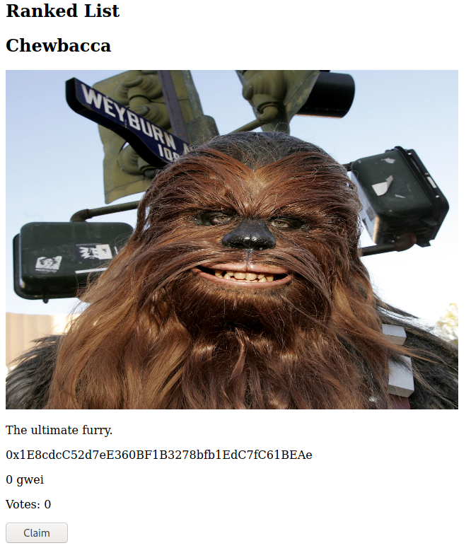
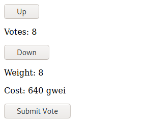

# Introduction

In this tutorial, we will be learning how to create a quadratic voting app with collaboratively managed ranked lists.

Here's a preview of what we will be building:


# Prerequisites

This tutorial assumes basic knowledge of blockchain, Solidity and Vue.js.

By the end of this tutorial you will be able to:

- Build a full stack dApp on the Ethereum blockchain
- Create smart contracts with Solidity
- Write tests for smart contracts
- Compile and migrate smart contracts with Truffle
- Build a front-end with Vue.js and Tailwind CSS
- Call smart contract functions with Web3
- Serve images with IPFS
- Deploy smart contracts to the Polygon Mumbai testnet

# Requirements

## Node, NPM and Yarn

Node.js is a runtime environment that allows us to execute JavaScript outside of a web browser.

NPM and Yarn are package managers. Which you use is a matter of preference. We will be using Yarn in this tutorial.

1. Install Node.js [here](https://nodejs.org).
2. Check NPM installation: `npm -v`
3. Install yarn: `npm i -g yarn`

## Truffle

Truffle is a development environment for Ethereum that we will use to compile and deploy our smart contract.

`npm i -g truffle`

## MetaMask

MetaMask is a browser extension that allows you to access your Ethereum wallet and interact with dApps.

Install it [here](https://metamask.io/).

Use the following configuraton to add the Polygon Mumbai testnet.


## Other

These are the additional technologies we will be using:

- Solidity
- Polygon (Matic)
- Web3.js
- IPFS
- Vue.js
- Tailwind CSS

# Project setup

To generate initial project files, we will use the Truffle and Vue cli tools.

```bash
npm i -g truffle @vue/cli

vue create quadratic-voting-app
> Default (Vue 3)
> Use Yarn

cd quadratic-voting-app
truffle init
```

Your project should look like this.


# Creating the smart contract in Solidity

Create a new file called `QuadraticVoting.sol` in the `contracts` folder.

```solidity
// SPDX-License-Identifier: MIT
pragma solidity >=0.4.0 <0.9.0;

contract QuadraticVoting {
  struct Item {
    address payable owner;
    uint amount;
    bytes32 title;
    string imageHash;
    string description;
    mapping(address => uint) positiveVotes;
    mapping(address => uint) negativeVotes;
    uint positiveWeight;
    uint negativeWeight;
  }
```

The primary data structure in our app is going to be the Item. Users will vote up or down on items to control their ranking, paying a fee that depends on the weight of their vote. Votes are quadratically funded, which means that anyone can add as much weight to their vote as they like, however, the price of submitting this vote will be the weight squared.

Any fee paid for a positive vote is rewarded to the creator of the item, creating an economy where the best suggestions, meaning the ones ranked the highest by others, receive the highest earnings. This incentivizes high quality, honest suggestions. Negative vote fees are redistributed to other items.

```solidity
  uint constant public voteCost = 10_000_000_000;

  mapping(uint => Item) public items;
  uint public itemCount = 0;
```

The variable `items` is a mapping of `itemId => item` and `itemCount` is the amount of items that have been created, as well as the next itemId to be used.

The `voteCost` constant is the price of a vote of weight 1 in terms of wei. One ether consists of 1,000,000,000,000,000,000 wei and one gwei consists of 1,000,000,000 wei. Therefore, `voteCost` is set to 10 gwei, or 0.00000001 ether. You can change this value to whatever you wish.

As an example of how quadratic voting works, let's say this contract was for a ranked list of the most favored Star Wars characters. One person may suggest Han Solo while another may suggest Chewbacca. If someone votes +2 for Han Solo, it will cost them `10 gwei * 2 * 2 =` 40 gwei. If someone votes +3 for Chewbacca, it will cost them `10 gwei * 3 * 3 =` 90 gwei. This leads to an ecosystem where a single person may vote more times than another if they care about the topic more, but it gets exponentially more expensive with each vote, ensuring a fair democracy.

```solidity
  event ItemCreated(uint itemId);
  event Voted(uint itemId, uint weight, bool positive);

  function currentWeight(uint itemId, address addr, bool isPositive) public view returns(uint) {
    if (isPositive) {
      return items[itemId].positiveVotes[addr];
    } else {
      return items[itemId].negativeVotes[addr];
    }
  }

  function calcCost(uint currWeight, uint weight) public pure returns(uint) {
    if (currWeight > weight) {
      return weight * weight * voteCost;
    } else if (currWeight < weight) {
      return (weight * weight - currWeight * currWeight) * voteCost;
    } else {
      return 0;
    }
  }

  function createItem(bytes32 title, string memory imageHash, string memory description) public {
    uint itemId = itemCount++;
    Item storage item = items[itemId];
    item.owner = msg.sender;
    item.title = title;
    item.imageHash = imageHash;
    item.description = description;
    emit ItemCreated(itemId);
  }
```

`currentWeight` and `calcCost` are helper functions we will be using later.

The function `createItem` is used to publish a new Item object to the ranked list. The item will require a title, IPFS image hash and text description to be set before the object can be created. The current sender is considered the owner of the item.

```solidity
  function positiveVote(uint itemId, uint weight) public payable {
    Item storage item = items[itemId];
    require(msg.sender != item.owner);

    uint currWeight = item.positiveVotes[msg.sender];
    require(currWeight != weight);

    uint cost = calcCost(currWeight, weight);
    require(msg.value >= cost);

    item.positiveVotes[msg.sender] = weight;
    item.negativeVotes[msg.sender] = 0;
    item.positiveWeight += weight;
    item.amount += msg.value;

    emit Voted(itemId, weight, true);
  }
```

Users are not able to vote for their own items because this would allow them to claim what they spent and use it to vote again, essentially meaning they could infinitely vote on their own items. Therefore we need to make sure the sender is not the item owner. The value of the transaction must also be enough to cover the cost of voting.

```solidity
  function negativeVote(uint itemId, uint weight) public payable {
    Item storage item = items[itemId];
    require(msg.sender != item.owner);

    uint currWeight = item.negativeVotes[msg.sender];
    require(currWeight != weight);

    uint cost = calcCost(currWeight, weight);
    require(msg.value >= cost);

    item.negativeVotes[msg.sender] = weight;
    item.positiveVotes[msg.sender] = 0;
    item.negativeWeight += weight;

    uint reward = msg.value / (itemCount - 1);
    for (uint i = 0; i < itemCount; i++) {
      if (i != itemId) items[i].amount += reward;
    }

    emit Voted(itemId, weight, false);
  }
```

Negative votes are slightly different in their distribution. Rather than reward the owner for a poor addition to the list, the funds are distributed to every item except for the one being voted on. This acts as a sort of basic income for all participants.

```solidity
  function claim(uint itemId) public {
    Item storage item = items[itemId];
    require(msg.sender == item.owner);
    item.owner.transfer(item.amount);
    item.amount = 0;
  }
}
```

This allows the owner of an item to transfer any reward to their wallet.

And there we go! Our smart contract is finished. Now let's learn how to deploy it.

# Compiling and deploying with Truffle

We'll need to compile our contracts before we can use them.

```bash
truffle compile
```

You should get similar output.


You can find the compiled contracts in the `build/contracts` directory.

Create a new file called `2_quadratic_voting.js` in the `migrations` folder.

```js
const QuadraticVoting = artifacts.require("QuadraticVoting")

module.exports = function (deployer) {
  deployer.deploy(QuadraticVoting)
}
```

Edit the `truffle-config.js` file to add the Matic Mumbai test network.

```js
const fs = require("fs");
const HDWalletProvider = require("@truffle/hdwallet-provider");

const mnemonic = fs.readFileSync(".secret").toString().trim();

module.exports = {
  networks: {
    development: {
      host: "localhost",
      port: 7545,
      network_id: "*",
    },
    matic: {
      provider: () => new HDWalletProvider(mnemonic, "https://rpc-mumbai.maticvigil.com/v1/{APP_ID}"),
      network_id: 80001,
      confirmations: 2,
      timeoutBlocks: 200,
      skipDryRun: true
    },
  },
  compilers: {
    solc: {
      optimizer: {
        enabled: true,
        runs: 200,
      },
    },
  },
  db: {
    enabled: false,
  },
}
```

We'll need to install the HD wallet provider.

```bash
yarn add -D @truffle/hdwallet-provider
```

In order to publish contracts to the blockchain we will need to pay the gas fees. Get testnet MATIC from the [Mumbai faucet](https://faucet.polygon.technology/) by inputting your wallet address.

Export your private key from MetaMask and put it in the `.secret` file, which will be used as the `mnemonic` variable in the config.

We'll need to create an account [here](https://rpc.maticvigil.com/) to have a quota for the RPC. Create an App and replace `{APP_ID}` in the config with the App Id.

Now we'll deploy our contracts to Polygon.

```bash
truffle migrate --network matic
```

You should see similar output.


# Writing tests for the smart contract

Next we will be writing tests for our contract. Tests allow us to ensure our contract code is working as intended in a programmatic way.

Create a file named `quadratic-voting-test.js` in the `test` directory.

```js
const QuadraticVoting = artifacts.require("QuadraticVoting");

contract("QuadraticVoting", (accounts) => {
  describe("deployment", () => {
    it("should be a valid contract address", () =>
      QuadraticVoting.deployed()
        .then((instance) => instance.address)
        .then((address) => {
          assert.notEqual(address, null)
          assert.notEqual(address, 0x0)
          assert.notEqual(address, "")
          assert.notEqual(address, undefined)
        })
    )
  })

  describe("items", () => {
    it("should be the correct item data", () => {
      let instance

      QuadraticVoting.deployed()
        .then((i) => (instance = i))
        .then(() => instance.createItem(
          web3.utils.utf8ToHex("Chewbacca"), // title
          web3.utils.utf8ToHex("ipfs_hash"), // imageHash
          "The ultimate furry.", // description
        ))
        .then(() => instance.itemCount())
        .then((count) => assert.equal(count, 1))
        .then(() => instance.items(0))
        .then((item) => {
          assert.equal(web3.utils.hexToUtf8(item.title), "Chewbacca")
          assert.equal(web3.utils.hexToUtf8(item.imageHash), "ipfs_hash")
          assert.equal(item.description, "The ultimate furry.")
        })
    })
  })
})
```

The Truffle testing suite uses [Chai](https://www.chaijs.com/) as its library for writing tests.

Tests are broken up into two groups: `deployment` and `items`. The `deployment` tests are used to ensure successful deployment and valid contract address. The `items` tests are used to ensure the correct item data is being published to the blockchain.

You may write additional tests for the remaining smart contract functions if you wish.

You will need to install [Ganache](https://www.trufflesuite.com/ganache) to set up a local development blockchain to run our tests on. Once it is downloaded select Quickstart. This will allow us to use the development network configured earlier. Alternatively, you can use `--network matic` to test on the Mumbai testnet.

```bash
truffle test
```

You should see similar output.


# Communicating with the smart contract with Web3

Now we'll be using Web3 to communicate with our smart contracts from JavaScript.

Create the directory `src/lib` and add a file named `quadratic-voting.js`.

Install the web3 package.

```bash
yarn add web3
```

```js
import Web3 from "web3"
import QuadraticVoting from "../../build/contracts/QuadraticVoting.json"

let web3
let contract
let accounts
let loaded = false

;(async () => {
  if (window.ethereum) {
    web3 = new Web3(window.ethereum)
    await window.ethereum.request({ method: "eth_requestAccounts" })
  } else if (window.web3) {
    web3 = new Web3(window.web3.currentProvider)
  } else {
    window.alert("No compatible wallet detected. Please install the Metamask browser extension to continue.")
  }

  const networkData = QuadraticVoting.networks["80001"]
  contract = new web3.eth.Contract(QuadraticVoting.abi, networkData.address)

  accounts = await web3.eth.getAccounts()

  loaded = true
})()
```

The anonymous function allows us to asynchronously define the following variables when the web app is loaded:

- `web3`: An instance of the imported `Web3` class which allows us to interact with the Ethereum blockchain.
- `contract`: An instance of our QuadraticVoting contract which allows us to use its methods and events.
- `accounts`: List of our client's Ethereum account addresses.
- `loaded`: Tells our front-end it's safe to call contract functions.

```js
export function isReady() {
  return loaded
}

export function address() {
  return accounts[0]
}

export async function voteCost() {
  return await contract.methods.voteCost().call()
}

export async function items(itemId) {
  const item = await contract.methods.items(itemId).call()

  if (item) {
    return {
      id: itemId,
      owner: item.owner,
      amount: item.amount,
      title: web3.utils.hexToUtf8(item.title),
      imageHash: item.imageHash,
      description: item.description,
      positiveWeight: item.positiveWeight,
      negativeWeight: item.negativeWeight,
    }
  } else {
    return null
  }
}

export async function itemCount() {
  return await contract.methods.itemCount().call()
}

export async function currentWeight(itemId, isPositive) {
  return await contract.methods.currentWeight(itemId, address(), isPositive).call()
}

export async function calcCost(currWeight, weight) {
  return await contract.methods.calcCost(currWeight, weight).call()
}

export async function createItem(title, imageHash, description) {
  return await contract.methods.createItem(
    web3.utils.utf8ToHex(title),
    imageHash,
    description,
  )
    .send({ from: address() })
}

export async function positiveVote(itemId, weight, cost) {
  return await contract.methods.positiveVote(itemId, weight)
    .send({ from: address(), value: cost })
}

export async function negativeVote(itemId, weight, cost) {
  return await contract.methods.negativeVote(itemId, weight)
    .send({ from: address(), value: cost })
}

export async function claim(itemId) {
  return await contract.methods.claim(itemId)
    .send({ from: address() })
}

export async function rankedItems() {
  const count = await itemCount()
  let itemsArr = []

  for (let i = 0; i < count; i++) {
    const item = await items(i)
    if (item) itemsArr.push(item)
  }
  
  return itemsArr.sort((a, b) => (b.positiveWeight - b.negativeWeight) - (a.positiveWeight - a.negativeWeight))
}
```

These exported functions allow us to serialize/deserialize data to and from our smart contracts.

We need to use `utf8ToHex` because `title` is defined as the `bytes32` type in our contract.

`rankedItems` creates a list of all published items and sorts it based off of votes, from most positive to most negative.

We'll be using these from our Vue components later.

# Uploading image files with IPFS

We'll need to add a few things to our `quadratic-voting.js` file to add support for image uploads.

To begin, add the IPFS package.

```bash
yarn add ipfs-core
```

Now we will edit the top of our file to import the package.

```js
import Web3 from "web3"
import * as IPFS from "ipfs-core"
import QuadraticVoting from "../../build/contracts/QuadraticVoting.json"

let web3
let contract
let accounts
let ipfs
let loaded = false
```

We will need to create our IPFS node in the loading function.

```js
  accounts = await web3.eth.getAccounts()

  ipfs = await IPFS.create()

  loaded = true
})()
```

And then we will define a new `uploadFile` function.

```js
export async function uploadFile(file) {
  const { cid } = await ipfs.add(file)
  return cid
}
```

That's all for now! When we upload the image file from an input element, the returned `cid` is what we will use as the `imageHash` variable.

# Creating the front-end with Vue.js

It's finally time to create our Vue components and build our app UI.

### App

Edit the `src/App.vue` file.

```vue
<template>
  <main>
    <CreateItem />
    <RankedList />
  </main>
</template>

<script>
import CreateItem from "@/components/CreateItem.vue"
import RankedList from "@/components/RankedList.vue"

export default {
  name: "App",
  components: {
    CreateItem,
    RankedList,
  }
}
</script>
```

This is a simple component containing the item creation form and ranked list of items we will be creating later.

### CreateItem

Create a file at `src/components/CreateItem.vue`.

```vue
<template>
  <form @submit.prevent="submit">
    <input type="text" v-model="title" placeholder="Title" required />
    <br />
    <input type="file" placeholder="Upload image" @input="uploadImage" required />
    <br />
    <p v-if="imageHash">{{ imageHash }}</p>
    <textarea v-model="description" placeholder="Description" required />
    <br />
    <input type="submit" value="Create Item" />
  </form>
</template>

<script>
import { uploadFile, createItem } from "@/lib/quadratic-voting"

export default {
  name: "CreateItem",
  methods: {
    async uploadImage(e) {
      const file = e.target.files[0]
      this.imageHash = await uploadFile(file)
    },
    async submit() {
      await createItem(this.title, this.imageHash, this.description)
    }
  },
  data() {
    return {
      title: "",
      imageHash: null,
      description: "",
    }
  }
}
</script>
```

This is a form that allows us to fill in data for item creation. In the `uploadImage` function you will see we respond to a file input element's `oninput` event, take the first file and upload the file using IPFS. In our form element we use `@submit.prevent` to automatically call `e.preventDefault()` before the `submit` function to prevent the page from redirecting.

The component will look like this. We will style it later.


When you click on the "Create Item" button you should see MetaMask prompt you to confirm the transaction.


### RankedList

Create a file at `src/components/RankedList.vue`.

```vue
<template>
  <section>
    <h1>Ranked List</h1>
    <Item v-for="item in items" :key="item.id" :item="item" />
  </section>
</template>

<script>
import Item from "@/components/Item.vue"
import { isReady, rankedItems } from "@/lib/quadratic-voting"

export default {
  name: "RankedList",
  components: {
    Item,
  },
  data() {
    return {
      items: [],
    }
  },
  created() {
    const wait = async () => {
      if (isReady()) {
        this.items = await rankedItems()
      } else {
        setTimeout(wait, 100)
      }
    }

    wait()
  },
}
</script>
```

This component waits until the contract and IPFS node are defined, checking every 100ms, before filling the page with a sorted list of all items published to the contract.

We will create the `Item` component next so that this will display correctly.

### Item

Create a file at `src/components/Item.vue`.

```vue
<template>
  <div>
    <h2>{{ item.title }}</h2>
    
    <p>{{ item.description }}</p>
    <p>{{ item.owner }}</p>
    <template v-if="address() === item.owner">
      <p>Amount: {{ item.amount / 1_000_000_000 }} gwei</p>
      <button @click="claimGwei">Claim</button>
    </template>
    <template v-else>
      <button @click="upvote">Up</button>
      <p>Votes: {{ item.positiveWeight }}</p>
      <button @click="downvote">Down</button>
      <p>Votes: {{ item.negativeWeight }}</p>
      <div v-if="weight !== startWeight">
        <p>Weight: {{ weight }}</p>
        <p>Cost: {{ cost / 1_000_000_000 }} gwei</p>
        <button @click="submitVote">Submit Vote</button>
      </div>
    </template>
  </div>
</template>

<script>
import { address, currentWeight, calcCost, positiveVote, negativeVote, claim } from "@/lib/quadratic-voting"

export default {
  name: "Item",
  props: ["item"],
  methods: {
    address,
    upvote() {
      this.weight += 1
      this.setCost()
    },
    downvote() {
      this.weight -= 1
      this.setCost()
    },
    async setCost() {
      if (this.weight === 0) {
        this.cost = 0
      } else {
        const currWeight = await currentWeight(this.item.id, this.weight > 0)
        this.cost = await calcCost(currWeight, Math.abs(this.weight))
      }
    },
    async submitVote() {
      if (this.weight >= 0) {
        await positiveVote(this.item.id, Math.abs(this.weight), this.cost)
      } else if (this.weight < 0) {
        await negativeVote(this.item.id, Math.abs(this.weight), this.cost)
      }
    },
    async claimGwei() {
      await claim(this.item.id)
    },
  },
  data() {
    return {
      weight: 0,
      startWeight: 0,
      cost: 0,
    }
  },
  created() {
    const getWeight = async () => {
      const posWeight = await currentWeight(this.item.id, true)
      const negWeight = await currentWeight(this.item.id, false)
      this.weight = posWeight - negWeight
      this.startWeight = this.weight
    }
    getWeight()
  }
}
</script>
```

This will by far be our largest and most complex component. We'll need to break it down.

- The first thing to notice is the `src` attribute of the image. `ipfs.io` is the gateway we will be using to access our IPFS files.
- Next is the `v-if` template which ensures the "Claim" button is only displayed to the one who can claim the amount stored in the item (the item owner). `v-else` is then used to instead show voting controls only to non-owners. `weight !== startWeight` means that the "Submit Vote" section will only be displayed if the user changes their voting weight.
- You may also see `item.amount` and `cost` are divided by `1_000_000_000`. This is because those values are stored in terms of wei but need to be displayed as gwei.
- `calcCost` calls the smart contract function we defined a while back to notify our user of how much their voting submission will cost. `submitVote` will submit either a negative or positive vote depending on the weight the user inputted.
- Finally, when the component is created, we will fetch the positive and negative weight currently associated with the user and use that to determine the weight they start with before interacting with the item.

Our `RankedList` component should now look something like this depending on the data you posted. We will style this later.



If you switch your MetaMask wallet to a different account and reload the page, you should see voting controls instead of the "Claim" button. Both positive and negative votes are displayed.


Interacting with the "Up"/"Down" buttons will reveal a submit section that allows you to quadratically vote on the item.



Notice the `640 gwei` fee, which is calculated from `8 * 8 * 10 gwei` where `10 gwei` is the `voteCost` we defined in our contract.

Clicking the "Submit Vote" button should allow you to confirm a transaction.


# Styling the components with Tailwind CSS

Our last step will be styling our Vue components to make the app look prettier.

### Configuration

We'll need the following packages to style our components with Tailwind CSS.

```bash
yarn add -D tailwindcss@npm:@tailwindcss/postcss7-compat postcss@^7 autoprefixer@^9 postcss-loader
```

Create a file named `postcss.config.js`. This allows us to use `tailwindcss` as a PostCSS plugin.

```js
module.exports = {
  plugins: {
    tailwindcss: {},
    autoprefixer: {},
  }
}
```

Create a file named `tailwind.config.js`. The purge option removes any unused styles from our compiled CSS output when building in production.

```js
module.exports = {
  purge: ["./src/**/*.vue"],
  darkMode: false,
  theme: {
    extend: {},
  },
  variants: {},
  plugins: [],
}
```

Then add the following to `src/App.vue`. Note that this is a global stylesheet.

```vue
<style lang="postcss" global>
@tailwind base;
@tailwind components;
@tailwind utilities;
</style>
```

### Components

Now it's finally time to make our components look like part of a real app.

Edit `App.vue` to add a dark background to our app.

```vue
<template>
  <main class="p-10 min-h-screen bg-gray-900">
    <CreateItem />
    <RankedList />
  </main>
</template>
```

Edit `CreateItem.vue` to make our form pop out more. Take note of the changes made to the `imageHash` paragraph.

```vue
<template>
  <form @submit.prevent="submit" class="bg-gray-300 p-10 w-1/2 mx-auto rounded">
    <input type="text" v-model="title" placeholder="Title" required class="px-3 py-1 w-full mb-10" />
    <br />
    <input type="file" placeholder="Upload image" @input="uploadImage" required class="text-gray-300" />
    <br />
    <p class="mb-10 text-gray-300" :class="imageHash ? 'mt-3' : ''">{{ imageHash || "" }}</p>
    <textarea v-model="description" placeholder="Description" required class="px-3 py-1 w-full mb-10" />
    <br />
    <input type="submit" value="Create Item" class="block mx-auto px-5 py-3 bg-blue-600 hover:bg-blue-500 text-white cursor-pointer" />
  </form>
</template>
```

Edit `RankedList.vue` to add spacing between items and style our heading.

```vue
<template>
  <section class="flex flex-col items-center gap-10">
    <h1 class="text-2xl text-center text-white font-bold mt-10">Ranked List</h1>
    <Item v-for="item in items" :key="item.id" :item="item" />
  </section>
</template>
```

And finally, edit `Item.vue`. The layout of this component will change a lot.

```vue
<template>
  <div class="bg-gray-300 p-10 rounded flex items-center">
    
    <div class="mr-5">
      <button @click="upvote" class="text-xl px-4 py-3 border border-b-2 border-black rounded hover:bg-black hover:text-white">&uarr;</button>
      <p class="text-lg text-center mt-2">{{ item.positiveWeight }}</p>
    </div>
    <div class="mr-10">
      <button @click="downvote" class="text-xl px-4 py-3 border border-b-2 border-black rounded hover:bg-black hover:text-white">&darr;</button>
      <p class="text-lg text-center mt-2">{{ item.negativeWeight }}</p>
    </div>
    <div>
      <h2 class="text-xl font-bold mb-5">{{ item.title }}</h2>
      <p class="text-gray-600 mb-5">{{ item.description }}</p>
    </div>
    <div v-if="address() === item.owner" class="ml-auto">
      <p class="mb-5 text-center">Amount: {{ item.amount / 1_000_000_000 }} gwei</p>
      <button @click="claimGwei" class="block mx-auto px-5 py-3 bg-blue-600 hover:bg-blue-500 text-white">Claim</button>
    </div>
    <div v-else-if="weight !== startWeight" class="ml-auto">
      <p class="mb-5 text-center">Weight: {{ weight }}</p>
      <p class="mb-5 text-center">Cost: {{ cost / 1_000_000_000 }} gwei</p>
      <button @click="submitVote" class="block mx-auto px-5 py-3 bg-blue-600 hover:bg-blue-500 text-white">Submit Vote</button>
    </div>
  </div>
</template>
```

We're done! Your app should now have a much better appearance.


# Conclusion

Congratulations! After completing this tutorial, you should now know how to create a smart contract in Solidity, interact with smart contracts using Web3, deploy contracts to the Polygon testnet and build a front-end with Vue/Tailwind. You are now a full stack dApp developer.

# About the author

I'm giraffekey, a free software developer interested in decentralized technologies. Feel free to connect with me on [GitHub](https://github.com/giraffekey).
