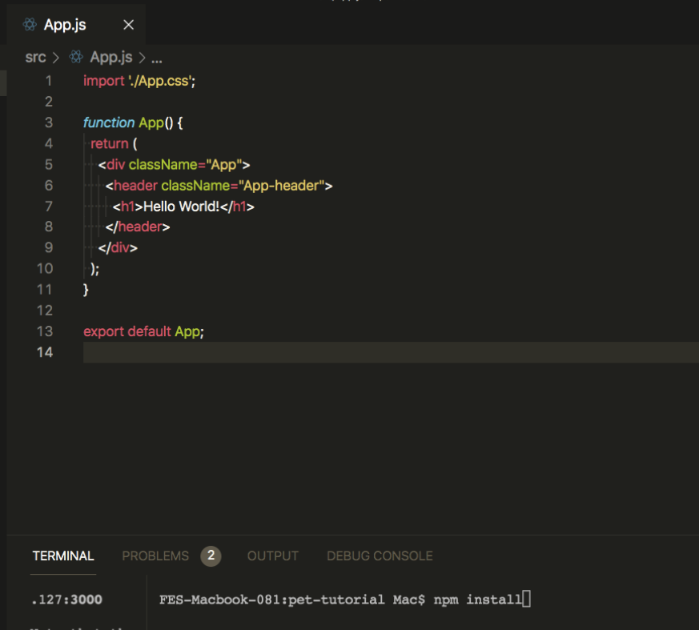

# Introduction

In this tutorial, you will learn how to build a Social Media dApp (Decentralized Application) similar to Instagram and how to deploy it on the Polygon (Matic) Mumbai test network. So grab your favorite drink and let's get started ☕️!

PetGram is a decentralized version of the Instagram platform for pets where users can browse cute photos of their favorite pets, see details of a specific pet, create a post and earn NFTs.


# Prerequisites
For this tutorial, it is recommendable to complete the [Polygon pathway](https://learn.figment.io/protocols/polygon).

# Requirements
You will need the following software on your computer to build this dApp:
- [Node.js](https://nodejs.org/en/download/) v14.17.6 LTS or higher installed
- [Truffle](https://www.trufflesuite.com/truffle) latest version installed
- [Ganache](https://www.trufflesuite.com/ganache) latest version installed
- [Metamask](https://metamask.io/) installed in your browser
- You will also need a [GitHub](https://github.com/) account

It is strongly recommended to create a new MetaMask account for testing. You will want to keep the Secret Recovery Phrase for this fresh account handy because it is needed for deployment of the smart contract.

To interact with Polygon via Metamask, you first have to add a new RPC endpoint. Open the Metamask extension by clicking on the Fox icon in your browser toolbar then select Settings -> Networks -> Add network -> Save. Fill out the information as given in the image below:


Now you'll notice zero balance (0 MATIC) in your wallet, to get test Matic for deployment and testing go to the Matic Faucet [link](https://faucet.matic.network) -> Select Mumbai -> Paste your wallet address -> Click "Submit".

When this is complete, check your Metamask & you'll see some MATIC tokens there. We only need a small amount of MATIC (about 5-10) to deploy and test our dApp.


# Project Setup

To avoid potential version related errors & instead of installing the supporting code libraries (dependencies) one-by-one, we'll start building the Petgram dApp by cloning a GitHub repository that contains the project files and installing all the necessary dependencies.

- Fork the repository located at https://github.com/electrone901/tutorial-petgram, this will make a copy of this project in your own GitHub account.

- Clone the GitHub repository with the command  `git clone https://github.com/<YourGitHubUsername>/petgram-tutorial.git`.
  This will copy the project files from GitHub to your computer.


Now you can open the project with your favorite code editor or IDE, such as [VS Code](https://code.visualstudio.com). If you browse the project directory, you’ll notice a basic React app project structure from ([Create React App](https://github.com/facebook/create-react-app)). This ​​contains our front-end React code and we’ll need to make changes to it once our smart contracts have been deployed.

  

Run the React front-end with the command `npm start`.

  

Note: As you move forward with this tutorial, make sure your project is reflecting similar results at a given point. There are screenshots as checkpoints for almost every step.


# Smart Contracts in Solidity

Now let’s start setting up the environment for coding the smart contract. We are going to use Truffle which is a development environment, testing framework and asset pipeline for Ethereum and other EVM compatible blockchains like Polygon.

If you do not already have it installed, install truffle with the command `npm install -g truffle`.


For a default set of contracts and tests, run `truffle init` within the project root directory.

The Truffle initialization process creates three directories: `contracts`, `migrations`, and `test` along with three files `Migrations.sol`, `1_initial_migrations.js`, and `truffle-config.js`.


* `contract/` is where our Solidity smart contract code is stored. You’ll notice that there is already one smart contract in here called `Migrations.sol` which is used during the migration process.

* `migrations/` will store Truffle's "deployer" Javascript files. Every time you want to deploy a contract, you will need to tell Truffle which one, and what constructor arguments you may need. `1_initial_migration.js` is the script that deploys our Migration contract. It is the most basic type of deployment because it requires no library linking, or constructor arguments.

* `test/` is where we can write test cases for our dApp. It can contain .`js` or `.sol` files, depending on your choice of testing language.

* `truffle-config.js` is the main configuration file for your Truffle project. This is where we define which networks to use, how much gas to use, addresses to deploy with and a few other variables.

**truffle-config.js**

Before we can set up some configuration details in `truffle-config.js`, let’s start by removing the existing contents of the file so we have a blank slate. We also need to install the npm packages dotenv and hdwallet-provider. Use the command `npm install dotenv @truffle/hdwallet-provider`.

dotenv is a module that loads environment variables from a `.env` file into JavaScript's process.env. We will use dotenv to store the Secret Recovery Phrase (mnemonic) from Metamask. This is used to generate the addresses available during development on Ganache as well as sign transactions sent from those addresses.

The HDWalletProvider class from Truffle enables the Web3 provider and is used to sign transactions for addresses derived from a 12 or 24 word Secret Recovery Phrase (mnemonic).

Let’s import them to our truffle-config.js:

```javascript
require('dotenv').config()
const HDWalletProvider = require('@truffle/hdwallet-provider')
```


We'll also need a `.env` file to store the mnemonic - the twelve word phrase. To create it follow [this guide](https://docs.figment.io/network-documentation/extra-guides/dotenv-and-.env).

Your file should look similar to this:
 

Let’s initialize the mnemonic variable by using dotenv: `dotenv` dependency module.

```javascript
const mnemonic = process.env.MNEMONIC.toString().trim()
```

Now we need to define the networks we want to use. Networks specify how we connect Truffle to our Ethereum client and let us set the defaults for web3 which is used to send transactions. For this project, we will use the development and the matic network.


The development network is a special network that Truffle uses by default, generally for testing. The basic setup requires a host, a port number, and a network id. More information about the configuration can be found in the [truffle-docs](https://www.trufflesuite.com/docs/truffle/reference/configuration).


Add the following code to your truffle-config.js.

```javascript
require('dotenv').config()
const HDWalletProvider = require('@truffle/hdwallet-provider')
const mnemonic = process.env.MNEMONIC.toString().trim()

module.exports = {
  networks: {
    development: {
      host: '127.0.0.1',
      port: 7545,
      network_id: '*', // Match any network id
    },
    matic: {
      provider: () =>
        new HDWalletProvider(mnemonic, `https://rpc-mumbai.matic.today`),
      network_id: 80001,
      confirmations: 2,
      timeoutBlocks: 200,
      skipDryRun: true,
    },
  },
}
```

We also need to specify the contracts build directory, the Solidity version and the Solidity compiler (solc) defaults.

The contracts build directory is the default output directory path for compiled contracts. In our case, we want the output to be on the frontend of our project.
We can use the Solidity compiler version 0.6.0 and default setup. The number of runs will affect the tradeoff between contract creation gas cost and subsequent function call gas cost. If you don't mind a large upfront cost, you should have more runs of the compiler. Check out the Solidity docs for more info https://docs.soliditylang.org/en/develop/using-the-compiler.html#using-the-compiler.

Add these solc defaults to your truffle-config.js file:

```javascript
module.exports = {
 networks: {...},
 contracts_build_directory: './src/abis/',
 compilers: {
   solc: {
     version: '^0.6.0',
     optimizer: {
       enabled: true,
       runs: 200,
     },
   },
 },
}
```


# Pet.sol

Now let’s start coding the smart contract. Create a new file in the contracts folder, you can open your project in a new terminal and use the command touch `./contracts/Pet.sol` on Linux/macOS or `type nul > contracts\Pet.sol` on Windows.

 

This is the file where we’ll write all the Pet's token source code with the Solidity programming language. We are going to design our smart contract to store photos off-chain using IPFS for storing the data. NFT metadata often uses decentralized storage like IPFS or Filecoin. Using NFT metadata allows us to upload data and to receive an IPFS hash of the content (a CID) that can be referenced on-chain as a pointer to the content.

Let’s create the basic structure for the smart contract like this:

```javascript
pragma solidity ^0.6.0;
import "@openzeppelin/contracts/token/ERC721/ERC721.sol";

contract Pet is ERC721 {
   constructor() ERC721("Pet", "PET") public  {}
}
```

First, we start off by declaring the version of the Solidity programming language that we’ll use to code the smart contract, in this case, version 0.6.0.

Then, we import the OpenZeppelin Solidity library. We need to install it in our project before continuing:

- `npm i @openzeppelin/contracts@3.4.1`

We have created the smart contract called Pet. Notice that our contract is inhering functions and behaviors from the OpenZeppelin ERC721 library:

```javascript
contract Pet is ERC721 {}
```

The remaining code for our contract will go inside of the curly braces. We can customize our token by giving it a name and a symbol like this:

```javascript
contract Pet is ERC721 {
  constructor() ERC721("Pet", "PET") public  {}
}
```
In this step, we added a constructor function to customize the token. The constructor is a function that takes arguments like the name ”Pet" and the symbol “PET". The constructor function runs once and only once when the contract is deployed. Whenever the smart contract is created we'll be able to refer to this contract by the name "Pet" with the help of an ABI ([Application Binary Interface](https://docs.soliditylang.org/en/latest/abi-spec.html)).

Note that we are using the OpenZeppelin ERC-721 standard to create our token. The ERC-721 standard is a set of rules that specifies what functions and behavior smart contracts should have. To learn more, read the [OpenZeppelin docs](https://docs.openzeppelin.com/contracts/4.x/erc721).

Now we can add the mintPetNFT function that will allow us to create new Pet tokens like this:

```javascript
pragma solidity ^0.6.0;
import "@openzeppelin/contracts/token/ERC721/ERC721.sol";

contract Pet is ERC721 {
  constructor() ERC721("Pet", "PET") public  {}


   function mintPetNFT(string memory _tokenURI) external {
       uint _tokenId = totalSupply().add(1);
       _safeMint(msg.sender, _tokenId);
       _setTokenURI(_tokenId, _tokenURI);
       emit PetNFTCreated(_tokenId, _tokenURI, now, msg.sender);
    }

 }
```

This is the basic structure of the function. It will accept one argument of string data type, which will be a path for the IPFS image (where the image is located). The tokenId variable is declared as a uint data type which means unsigned integer (can only be a number 0 or above, not a negative number). This variable holds an unique identifier number for every Pet token.

The `_safeMint` function takes the user's wallet address and the tokenId to create and set ownership of the NFT. The `_setTokenURI` function takes the tokenId and the tokenURI (the location of the image) and links them together. We do this so that every token has an identifier, an owner, and an image path.
Then we emit an event with the tokenId, tokenURI, timestamp and user wallet address by calling the `emit` function and naming it "PetNFTCreated".


Lastly, we need to define the PetNFTCreated event. This event is really helpful for transaction confirmations, everytime we mint an NFT it will return the NFT tokenId, the imagePath, the time, and user wallet address.

```javascript
pragma solidity ^0.6.12;
import "@openzeppelin/contracts/token/ERC721/ERC721.sol";

contract Pet is ERC721 {

  constructor() ERC721("Pet", "PET") public  {}

  event PetNFTCreated (
    uint tokenId,
    string imageURL,
    uint date,
    address payable from
  );

  function mintPetNFT(string memory _tokenURI) external {
    uint _tokenId = totalSupply().add(1);
    _safeMint(msg.sender, _tokenId);
    _setTokenURI(_tokenId, _tokenURI);
    emit PetNFTCreated(_tokenId, _tokenURI, now, msg.sender);
  };
}
```

Before we continue, let's ensure that everything is working properly. In your terminal, make sure you are in the project root directory and run the command `truffle compile`.


   

Now we must deploy the smart contract to the blockchain. First, make sure that Ganache is running (in its own terminal window/tab). Then, create a new migration file in the `migrations` directory called `2_deploy_contracts.js`.

Add the following code to this new file:

```javascript
const MyPet = artifacts.require('Pet')
module.exports = function (deployer) {
  deployer.deploy(MyPet)
}
```

This simple JavaScript file is responsible for deploying the smart contract to the blockchain. We can execute this file, and put the smart contract on the blockchain by running the Truffle migration like this:

```text
truffle migrate
```

You should see similar results.

 


# Building the React front-end

Path: `/src/components/`

React applications consist of various components, for example, a navigation bar, main page, footer, etc.

React loads a single HTML page (`/public/index.html`) which is then populated with all the components that are defined in the project. If you open the components folder you will see the general structure for our project that contains the following folders:
- `commons/`: Contains the CircularProgress component that renders whenever a page is loading.
- `create-post/`: This directory is where we will add our functionality to create new posts
- `home-container/`: Has three subfolders
  - `home/`: This directory is a container for the Gallery (PetGallery) and it contains HTML for our labels and buttons.
  - `gallery/`: This directory is where we will keep code related to fetching all Pets from nft.storage and rendering them with their basic information.
  - `pet-details/`: This ditrectory holds the component we will use to display all the information of a pet, as well as mint NFTs.


# App.js

Let’s work on the main file of our React UI: `App.js` will contain all of the components that make up our React application (navbar, main, footer, home, etc).

When you open the `App.js` file, you'll notice that we are using the React Router DOM module to implement dynamic routing in our web app. Unlike the traditional routing architecture in which the routing is handled in a configuration outside of a running app, React Router DOM facilitates component-based routing according to the needs of the app and platform.

So far we have defined our routes and we wrapped them with the Router element that contains components (called children). A child component can take any properties (more about this later).

Notice that anything outside the switch statement will be displayed on the main page, the main purpose of React router is to serve a different component for each path.

```javascript
import React from 'react'
import { BrowserRouter as Router, Switch, Route } from 'react-router-dom'
import './App.css'
import { Navbar } from './components/layout/navbar/Navbar'
import Footer from './components/layout/footer/Footer'
import Home from './components/home-container/home/Home'
import PetDetails from './components/home-container/pet-details/PetDetails'
import CreatePet from './components/create-post/CreatePet'

function App() {
  return (
    <Router>
      <div className="cl">
        <Navbar />
        <Route exact path="/" component={Home} />
        <Switch>
          <Route exact path="/create-pet" component={CreatePet} />
          <Route path="/pet-details/:petId">
            <PetDetails />
          </Route>
        </Switch>
        <Footer />
      </div>
    </Router>
  )
}
```

Next, we need to connect our React front-end to the blockchain network so it can interact with the smart contract. Let's start by importing web3 and our smart contract's ABI (in .json format):

```javascript
import Web3 from 'web3'
import MyPet from './abis/Pet.json'
```

Web3 is a collection of libraries that allow us to interact with a local or remote Ethereum node using HTTP, IPC, or WebSockets.

This code is an example of how to load web3 properly using `request` and specifying the `eth_requestAccounts` method. It takes the Ethereum provider from Metamask and injects it to your dApp, if your browser does not have Metamask installed then it will show a pop-up message: "Non-Ethereum browser detected. You should consider trying Metamask!"

```javascript
const loadWeb3 = async () => {
  if (window.ethereum) {
    window.web3 = new Web3(window.ethereum)
    await window.ethereum.request({ method: 'eth_requestAccounts' })
  } else if (window.web3) {
    window.web3 = new Web3(window.web3.currentProvider)
  } else {
    window.alert(
        'Non-Ethereum browser detected. You should consider trying Metamask!',
    )
  }
}
```

Now we can add the functionality to connect to the contract:

```javascript
const getContract = async () => {
  const web3 = window.web3
  const accounts = await web3.eth.getAccounts()
  setAccount(accounts[0])
  const networkId = await web3.eth.net.getId()
  const networkData = MyPet.networks[networkId]

  if (networkData) {
    const abi = MyPet.abi
    const address = MyPet.networks[networkId].address
    const myContract = new web3.eth.Contract(abi, address)
    setContractData(myContract)
  } else {
    window.alert(
      'Contract is not deployed to the detected network. Connect to the correct network!',
    )
  }
}
```

In the `getContract` function, we're going to load the connected account & connect it with the network ID. If the smart contracts are not deployed to the respective network, then it will display a pop-up "Contract not deployed to the detected network. Connect to the correct network!"

Notice `setAccount(accounts[0])`? We are using the React useState hook to keep track of the app state. Using this hook inside a functional component, you can create a piece of state without switching to class components that have a built-in state object.

Inside the function App, add these variables:

```javascript
import { useState } from 'react'
function App() {
  const [account, setAccount] = useState('')
  const [contractData, setContractData] = useState('')
}
```

Let's examine this variable declaration:
```javascript
const [account, setAccount] = useState('')
```

The first part of this statement (account) is a variable that is initialized as an empty string. setAccount is a function that sets new values to the account variable. For example, in the getContract function we are getting an array of accounts and then we take the first one and we set it to be the user account. Similarly, with the contract, we get it and then we define the name of the function used to set the value: `const [contractData, setContractData] = useState('')`

Now we need to use these functions so let's create the connectWallet function inside our app component:

```javascript
function App() {
  const connectWallet = async () => {
    await loadWeb3()
    await getContract()
  }
}
```

This function will be called whenever we click the connect button. We also need to pass this function to the Navbar because our connectWallet button lives there. Pass these properties to the Navbar component:

```javascript
<Navbar account={account} connectWallet={connectWallet} />
```

Yay!! Now that our frontend is connected to the blockchain,

Oh yes! The Async/Await Function in JavaScript: **Async**
It simply allows us to write promises based code as if it was synchronous and it checks that we are not breaking the execution thread. It operates asynchronously via the event-loop. ​​
Await can be put in front of any async promise-based function to pause your code on that line until the promise fulfills, then return the resulting value. You can use await when calling any function that returns a Promise, including web API functions. _You can find a simple explanation of Async/Await function [here](https://www.geeksforgeeks.org/async-await-function-in-javascript/)._


# navbar.js

- path: `src/components/layouts/navbar/navbar.js`

In the Navbar component, we're displaying the brand logo, brand name, user account address, and a link to create new posts. We're using [Material UI](https://material-ui.com/) to create the basic structure for the Navbar and Footer components.


Let's move to the important stuff, remember that we are passing some props(account, loadWeb3) to our navbar component? Let's add them into our component:

```javascript
export const Navbar = withRouter(({ account, loadWeb3 }) => {})
```
WithRouter will wrap the Navbar component so add a closing parenthesis at the end and the Navbar body inside the curly brackets. We are using withRouter that was already imported at the top of the file. withRouter is a higher order component that will pass the closest route's match, current location, and history props to the wrapped component whenever it renders. Simply put, it connects our component to the router and passes properties to this file.

Now that we have the wallet address we can display it on the navbar, under the sectionDesktop add the following:

```javascript
<div className="sectionDesktop">
    {
      account ? (
      <>
        <Button className="whiteLink" to="/create-pet">
          {account.substring(0, 8)}...{account.substring(32, 24)}
        </Button>
        <Button
          variant="contained"
          className="connected-btn"
          endIcon={<VerifiedUserSharpIcon />}
        >
          Connected
        </Button>
      </>
    ) : (
      <Button
        variant="contained"
        className="connect-wallet-btn"
        onClick={() => {
          loadWeb3()
        }}
      >
        Connect Wallet
      </Button>
    )}
    // the rest of code...
```
In this snippet of code, we are checking if the account exists then we display the wallet address. Otherwise, we display the button with the label `Connect Wallet`. At this point, whenever you click the `Connect Wallet` button it should prompt you to connect your Metamask.


# CreatePet.js

To get this file working, we need to install and import nft.storage, which is a client library that provides a convenient interface for working with the Raw HTTP API from a web browser or Node.js.

First, install the package with the command `npm install nft.storage`.


Then we can import the important parts of the package into our component:

```javascript
import { NFTStorage, File } from 'nft.storage'
import { apiKey } from '../../APIKEYS'
```
To get your API key, go to [nft.storage](https://nft.storage), sign up for an account, create a new API key and then add it to your APIKEYS.js file.


Don’t forget to create your APIKEYS.js inside src, it should look something like this:


To create a new pet, we will still need a few variables and functions. First let's add all the functions to collect the user input like the pet name, the owner name, the image type, etc. Add the following code to `CreatePet.js`:

```javascript
import { createRef } from 'react'
function CreatePet() {
  const history = useHistory()
  const [image, setImage] = useState('')
  const petTypeRef = createRef()
  const [petName, setPetName] = useState('')
  const [loading, setLoading] = useState(false)
  const [ownerName, setOwnerName] = useState('')
  const [imageName, setImageName] = useState('')
  const [imageType, setImageType] = useState('')
  const [petType, setPetType] = useState('')
}
```

Notice that almost every variable starts as an empty string. As the user types in the input we will save it into our component state. Then, we will pass them to our API call to store them in IPFS. Remember, to keep track of the state we are using the useState React hook.

We still need two more functions:

- The `handleImage` function that will be responsible for updating the variables with the user input:


```javascript
const handleImage = (event) => {
  setImage(event.target.files[0])
  setImageName(event.target.files[0].name)
  setImageType(event.target.files[0].type)
}
```

- The `handleSubmit` function that will be responsible for uploading the data to IPFS with nft.storage:

```javascript
const handleSubmit = async (e) => {
  e.preventDefault()
  try {
    setLoading(true)
    const client = new NFTStorage({ token: apiKey })
    const metadata = await client.store({
      name: petName,
      description: `${ownerName}, ${petType}`,
      image: new File([image], imageName, { type: imageType }),
    })
    if (metadata) {
        history.push('/')
    }
  } catch (error) {
    console.log(error)
    setLoading(false)
  }
}
```

In the `handleSubmit` function, we are using the NFTStorage client library to upload our data. This client library takes our api keys, and it requires us to format the data into an object with name, description, and image. Then we check if our data was successfully saved, then we redirect the user to the main page.

Now let’s add the form, under the comment `Display image to be uploaded`:

```javascript
{
  image ? (
    
  ) : (
    ''
  )
}
<div className="form-container">
  <form className="form" noValidate autoComplete="off">
    <input
      accept="image/*"
      className="input"
      id="icon-button-photo"
      defaultValue={image}
      onChange={handleImage}
      type="file"
    />
    <label htmlFor="icon-button-photo">
      <IconButton color="primary" component="span">
        <PhotoCamera />
      </IconButton>
    </label>
    <TextField
      fullWidth
      id="outlined-basic"
      label="Pet's name"
      variant="outlined"
      className="text-field"
      defaultValue={petName}
      onChange={(e) => setPetName(e.target.value)}
    />
    <TextField
      fullWidth
      id="outlined-basic"
      label="Owner's name"
      variant="outlined"
      className="text-field"
      defaultValue={ownerName}
      onChange={(e) => setOwnerName(e.target.value)}
    />
    <TextField
      fullWidth
      name="petType"
      select
      label="Choose one option"
      variant="outlined"
      className="text-field"
      onChange={(e) => setPetType(e.target.value)}
      defaultValue=""
      ref={petTypeRef}
    >
      <MenuItem value="Cat">Cat</MenuItem>
      <MenuItem value="Dog">Dog</MenuItem>
      <MenuItem value="Bird">Bird</MenuItem>
      <MenuItem value="Fish">Fish</MenuItem>
      <MenuItem value="Other">Other</MenuItem>
    </TextField>
    <Button
      size="large"
      variant="contained"
      color="primary"
      onClick={handleSubmit}
    >
      Submit
    </Button>
  </form>
</div>
```

For a good user experience, we are adding a preview of the image being uploaded. In this part, we are saying that if the image exists then create an image and render it, otherwise display an empty space.

Then we added a simple form with an image field, a text field for petName, ownerName and a drop down menu for the pet type. All of them are bound to a variable and to the onChange function. We also have the submit button bound to the handleSubmit function. Now you try to create a new post. The final result for this component should look like this:


 # PetGallery.js

First, let’s import all the libraries, files and API keys we need for this file.

```javascript
import React, { useEffect, useState } from 'react'
import { Link } from 'react-router-dom'
import ImageListItem from '@material-ui/core/ImageListItem'
import IconButton from '@material-ui/core/IconButton'
import Button from '@material-ui/core/Button'
import ImageListItemBar from '@material-ui/core/ImageListItemBar'
import CircularStatic from '../commons/CircularProgressWithLabel'
import { Grid } from '@material-ui/core'
import './PetGallery.css'
import { apiKey } from '../../APIKEYS'
```

The CircularStatic static is just a component that renders whenever our page is loading.


Now we're going to prepare the file to fetch Pets data from IPFS and display them. Let’s add the following:

```javascript
function PetGallery() {
 const [petsData, setPetsData] = useState([])
 const [loading, setLoading] = useState(false)

 useEffect(() => {
   const loadPets = async () => {
     try {
       setLoading(true)
       let cids = await fetch('https://api.nft.storage', {
         headers: {
           Authorization: `Bearer ${apiKey}`,
           'Content-Type': 'application/json',
         },
       })
       cids = await cids.json()
       const temp = []
       for (let cid of cids.value) {
         if (cid?.cid) {
           let data = await fetch(
             `https://ipfs.io/ipfs/${cid.cid}/metadata.json`,
           )
           data = await data.json()

           const getImage = (ipfsURL) => {
             if (!ipfsURL) return
             ipfsURL = ipfsURL.split('://')
             return 'https://ipfs.io/ipfs/' + ipfsURL[1]
           }

           data.image = await getImage(data.image)
           data.cid = cid.cid
           data.created = cid.created
           temp.push(data)
         }
       }
       setPetsData(temp)
       setLoading(false)
     } catch (error) {
       console.log(error)
       setLoading(false)
     }
   }
   loadPets()
 }, [])
```

First, we declare the petsData variable which is initialized as an empty array, as well as the `setPetsData` function. We do this with the useEffect React hook which is telling React that our component needs to do something after rendering.

Notice that we are calling the `loadPets` function at the end of useEffect. The `loadPets` function takes your API key, fetches the pet's information from IPFS storage, then returns the content identifier that contains the NFT information. We loop through the cids array, find its id and create the data variable that will hold the NFT metadata, then we call the `getImage` function.

Lastly, we need to attach the image, the content identifier (CID), and the timestamp to the data variable. Then, we push it into a temporary array and at the end we set it to be the state variable petsData.

The function `getImage` takes the URL path and splits it by this character '://'. Split is a JavaScript function that returns an array of elements. Then, `getImage` returns the correct path by adding the second element of the array. We need to do this because an IPFS URL does not retain the original path, but instead requires a conversion step to/from URI representation. To learn more, check the [IPFS docs](https://docs.ipfs.io/how-to/address-ipfs-on-web/#native-urls).

Note: CIDs reference immutable content so you can be sure the content you access is the content referenced in the NFT.

Now let’s render this data. In the return statement, add the following code:

```javascript
return (
  <div style={{ minHeight: '70vh', paddingBottom: '3rem' }}>
    {loading ? (
      <CircularStatic />
    ) : (
      <div style={{ flexGrow: 1 }}>
        <Grid container spacing={1}>
          {petsData.length ? (
            petsData.map((pet, index) => (
              <Grid item xs={6} sm={3} key={index}>
                <ImageListItem style={{ height: '450px', listStyle: 'none' }}>
                  
                  <ImageListItemBar
                    title={pet.name}
                    subtitle={<span>by: {pet.description}</span>}
                    actionIcon={
                      <IconButton
                        aria-label={`info about ${pet.name}`}
                        className="icon"
                      >
                        <Button
                          variant="contained"
                          size="small"
                          component={Link}
                          to={`/pet-details/${pet.cid}`}
                          className="view-btn"
                        >
                          View
                        </Button>
                      </IconButton>
                    }
                  />
                </ImageListItem>
              </Grid>
            ))
          ) : (
            <h2>No Pets Yet...</h2>
          )}
        </Grid>
      </div>
    )}
  </div>
)
```

Here we are checking if the variable loading is true. If it is, then display the loading component. Otherwise loop through the petsData a grid item with the pet image, name, and a button to see more details. If everything works correctly you should see a similar gallery of pets:


 # PetDetails.js

In this file, we will add each pets details, functionality to mint NFTs, a transaction confirmation to mint tokens, and a simple React form to add comments. For the scope of this tutorial, we are not going to implement the comments or number of likes functionality but feel free to expand on it yourself.

To implement this we need a few things. Let's start by importing all the libraries and files we need:

```javascript
import React, { useState, useEffect } from 'react'
import { useParams } from 'react-router'
import Grid from '@material-ui/core/Grid'
import Container from '@material-ui/core/Container'
import Typography from '@material-ui/core/Typography'
import Button from '@material-ui/core/Button'
import FavoriteIcon from '@material-ui/icons/Favorite'
import ShareIcon from '@material-ui/icons/Share'
import Card from '@material-ui/core/Card'
import { StylesProvider } from '@material-ui/core/styles'
import './PetDetails.css'
import {
  TextField,
  List,
  ListItem,
  ListItemAvatar,
  ListItemText,
  Avatar,
  IconButton,
} from '@material-ui/core'
import { apiKey } from '../../APIKEYS'
```

Notice that we are still using useState and useEffect - React hooks that help us to manage the state of the app.

useState allows our functional components to become stateful and useEffect allows our functional component to leverage the component lifecycle hooks which were, in the past, only supported for class components. Simply put, useEffect is like a combination of componentDidMount, componentDidUpdate and componentWillUnmount. To learn more, check out the documentation on [React hooks](https://reactjs.org/docs/hooks-effect.html).

We use `useParams` to access the parameters of the current route. In this case, we need the pet id to fetch the pet's data from IPFS.

The `StylesProvider` is a Material-UI component that helps us change how styles are applied to our component. The rest of the imports are just regular elements from Material-UI

We need a few variables to hold the pet's information. Add the following function:

```javascript
function PetDetails({ account, contractData }) {
 const { petId } = useParams()
 const [image, setPetImage] = useState('')
 const [petName, setPetName] = useState('')
 const [petOwner, setOwnerName] = useState('')
 const [petCategory, setPetCategory] = useState('')
 const [comment, setComment] = useState('')
 const [codeHash, setCodeHash] = useState('')
```

Notice `{ petId }` we are just extracting the petId value from the useParams object. As for the rest of the variables, all of them are initialized as an empty string.

Now to fetch the pet's data we are going to use useEffect and it will contain two functions: `getImage` and `getMetadata`. Add the following code snippet to `PetDetails.js`:

```javascript
function PetDetails({ account, contractData }) {
 useEffect(() => {
   const getImage = (ipfsURL) => {
     if (!ipfsURL) return
     ipfsURL = ipfsURL.split('://')
     return 'https://ipfs.io/ipfs/' + ipfsURL[1]
   }

   const getMetadata = async () => {
     let data = await fetch(`https://ipfs.io/ipfs/${petId}/metadata.json`)
     data = await data.json()
     const [petOwner, petCategory] = data.description.split(',')
     const imageFormated = getImage(data.image)
     setPetImage(imageFormated)
     setPetName(data.name)
     setOwnerName(petOwner)
     setPetCategory(petCategory)
   }


   if (petId) {
     getMetadata()
   }
 }, [petId, contractData])
```


The function `getMetadata` fetches the metadata from IPFS by providing the petId, and saves it to the relevant state variables.

To mint tokens, we need the mintNFT function:

```javascript
function PetDetails({ account, contractData }) {
 const mintNFT = async (petId) => {
   try {
     const data = await contractData.methods
       .mintPetNFT(`https://${petId}`)
       .send({ from: account })
     setCodeHash(data)
   } catch (err) {
     console.error(err)
   }
 }
```

The PetDetails component is getting some props for the account and for the contractData, we can use them to interact with the smart contract. All we need to do is to call the `mintPetNFT` contract method. This function takes in the petId, calls the contract's `mintPetNFT` method with the pet id and the user account, then saves the returned data to the component state with setCodeHash.

Awesome! Now we just need to display this information. Let's add it in the section "Add pet's details here":

```javascript
<Grid item xs={12} sm={6} className="grid-container">
  {/* Add pet's details here */}
  <div className="flex-container">
    <h2>{`${petName} the ${petCategory}`}</h2>
    <Button
      variant="contained"
      className="wallet-btn"
      color="primary"
      onClick={mintNFT}
    >
      Mint NFT
    </Button>
  </div>

  
  <div className="flex-container">
    <div>
      <IconButton aria-label="add to favorites">
        <FavoriteIcon />
      </IconButton>

      <IconButton aria-label="share">
        <ShareIcon />
      </IconButton>
    </div>

    <Typography variant="body1" color="primary">
      {pet?.likes ? pet.likes : 0} Likes
    </Typography>
  </div>

  <Typography gutterBottom variant="subtitle1" className="details-text">
    Pet's Details
  </Typography>

  <Typography variant="body2" gutterBottom className="details-text">
    Full rights and credits to the owner @{petOwner}...
  </Typography>
</Grid>
```

The "Mint NFT" button will call the `mintNFT` function which will mint NFTs for users. Then, inside the grid, we insert React values. Whenever we mint NFTs we need a confirmation that notifies us if our transaction was successful or not. Let's add this functionality under the section "Add Transaction Confirmation":

Whenever we mint NFTS we need a confirmation that notifies us if our transaction was successful or not. Let's add this functionality under the section `Add Transaction Confirmation`:

```javascript
{
  codeHash ? (
    <Card className="code-hash">
      <Typography gutterBottom variant="subtitle1">
        Confirmation Transaction:
      </Typography>
      <p>
        TransactionHash: <span>{codeHash.transactionHash}</span>{' '}
      </p>
      <a
        target="_blank"
        rel="noopener noreferrer"
        href={'https://mumbai.polygonscan.com/tx/' + codeHash.transactionHash}
      >
        <Button variant="contained" color="primary" className="wallet-btn">
          See transaction
        </Button>
      </a>
    </Card>
  ) : (
    ''
  )
}
```

Remember our `mintPetNFT` function? This function returns an object data, inside this object is the transaction hash. A transaction hash is a unique string of characters that is given to every transaction that is verified and added to the blockchain. So all we need to do is to add the Polygonscan link plus the `transactionHash`. Now, whenever we mint an NFT we will get this confirmation and we will be able to view the transaction details on Polygonscan.

Let's add the last part under the section "Add form comments":

```javascript
<form noValidate autoComplete="off">
  <TextField
    id="outlined-basic"
    label="Comment"
    variant="outlined"
    value={comment}
    onChange={handleChange}
    className="text-field"
   />
</form>
<Button type="submit" variant="contained" onClick={handleSubmit}>
  Add comment
</Button>
```

This is a simple form to add comments. Notice the TextField requires the `handleChange` and `handleSubmit` functions, so let's add them as well:

```javascript
const handleChange = (event) => {
  setComment(event.target.value)
}
```

The `handleChange` function sets the user input to the comment variable:

```javascript
const handleSubmit = (event) => {
  event.preventDefault()
  const newObj = { author: 'Guest', content: comment }
  const commentArr = [...pet.comments, newObj]
  pet.comments = [...pet.comments, newObj]
  setComment('')
}
```

The `handleSubmit` function creates an object with the user input so that React can render it. Now, we need to display them on our page. To do this, add the following code under the section "Display Comments":

```javascript
{
  comment ? (
    <ListItem style={{ paddingLeft: '0px' }}>
      <ListItemAvatar>
        <Avatar alt="Remy Sharp" />
      </ListItemAvatar>
      <ListItemText
        secondary={
          <React.Fragment>
            <Typography
              component="span"
              variant="body2"
              className="inline"
              color="textPrimary"
            >
              {account}
            </Typography>
            {` ${comment}`}
          </React.Fragment>
        }
      />
    </ListItem>
  ) : (
    <h2>No comments</h2>
  )
}
```

Here we added the user's account and the comment to the UI.

# Deploying the smart contracts
Now that we have completed the React front-end, let's deploy the smart contracts on the Polygon Mumbai testnet. The command to do this is:

```javascript
truffle migrate --network matic
```

If you're deploying it for the second time or more, use the `--reset` flag to avoid JSON errors: `truffle migrate --network matic --reset`.


As long as the deployment was successful, the output should be similar:


# Conclusion

Congratulations! You have created your own fullstack dApp😎🦄!! After completing this tutorial, you should have a good understanding of how to create a dApp for creating and managing NFTs.

# About the Author

Albert Carbajal is a web developer, blockchain enthusiast with a passion for Software Development, & Decentralization. Feel free to connect with me on [GitHub](https://github.com/electrone901).

# References

- Truffle docs: https://www.trufflesuite.com/docs/truffle/overview_
- Polygon (Matic) docs: https://docs.matic.network/docs/develop/getting-started_
- MetaMask docs: https://docs.metamask.io/guide/#why-metamask_
- Web3 docs: https://web3js.readthedocs.io/en/v1.4.0/_
- React docs: https://reactjs.org/docs/getting-started.html_
- IPFS docs: https://docs.ipfs.io/concepts/what-is-ipfs/#decentralization_
- Async/Await: https://www.geeksforgeeks.org/async-await-function-in-javascript/_
- Material-ui components: https://material-ui.com_
- React Hooks: https://reactjs.org/docs/hooks-effect.html_

