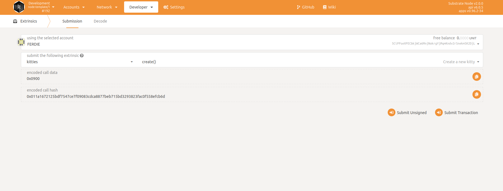

# How do on-chain upgrades work and how to compile a runtime?


## Explaining the problem

Decentralization of blockchains has advantages and disadvantages, one of the major advantage is that there is no one central unit which has the whole power of over the system. From the other side disadvantage is that in the environment without one central unit upgrading is hard due to coordination so many nodes at one time. One of the well known solution of upgrading blockchains is so called `hard fork` but as I have written is hard and has many potential vectors of attack. 

## Solution to the problem

The unique and newest solution how to make upgrade of decentralized system based on Substrate framework is called `runtime-upgrade`. The solution works smoothly and in the article I will show you how you can upgrade your Substrate based chain on your machine, locally and be honest - it is quite easy

## Prerequisites

You have very basic knowledge about Rust language and Substrate framework.

## Let's start coding

During the tutorial we are going to make following steps:
1. build the simplest Substrate based blockchain
2. build runtime part where is implement logic (wasm file)
3. run locally the blockchain
4. check version already installed runtime
5. upgrade runtime
6. verify of the upgrade

Upgrading runtime blockchains consists of following steps: 

- bump spec_version
- build wasm file
  - WASM_TARGET_DIRECTORY="$(pwd)" cargo build
- Use sudo to perform runtime

### Ad. 1: Building the simplest Substrate based blockchain

Execute `make init` and after around 10 minutes (depends on performance of your machine) you should see something like:

```
Compiling sc-finality-grandpa v0.8.0
Compiling rocksdb v0.15.0
Compiling kvdb-rocksdb v0.9.1
Compiling sc-client-db v0.8.0
Compiling sc-service v0.8.0
Compiling sc-cli v0.8.0
Compiling frame-benchmarking-cli v2.0.0
Finished dev [unoptimized + debuginfo] target(s) in 13m 01s
```

Hint: If you want build optimized version of the project execute `cargo build --release`

### Ad. 2: Build ewasm - runtime

Execute following command in order to build runtime wasm file: `WASM_TARGET_DIRECTORY="$(pwd)" cargo build`

After successfully build a new file should appear in current directory:


### Ad. 3: Run locally blockchain

`make run`

```
Running `target/debug/node-template --dev -lruntime=debug`
Sep 29 18:18:09.106  WARN Running in --dev mode, RPC CORS has been disabled.    
Sep 29 18:18:09.106  INFO Substrate Node    
Sep 29 18:18:09.106  INFO ✌️  version 2.0.0-73d7748-x86_64-linux-gnu    
Sep 29 18:18:09.106  INFO ❤️  by Substrate DevHub <https://github.com/substrate-developer-hub>, 2017-2021    
Sep 29 18:18:09.106  INFO 📋 Chain specification: Development    
Sep 29 18:18:09.106  INFO 🏷  Node name: frantic-insect-7496    
Sep 29 18:18:09.106  INFO 👤 Role: AUTHORITY    
Sep 29 18:18:09.107  INFO 💾 Database: RocksDb at /home/tomek/.local/share/node-template/chains/dev/db    
Sep 29 18:18:09.107  INFO ⛓  Native runtime: node-template-1 (node-template-1.tx1.au1)    
Sep 29 18:18:10.070  INFO 🔨 Initializing Genesis block/state (state: 0x0f2a…c2cc, header-hash: 0x1e1d…f017)    
Sep 29 18:18:10.073  INFO 👴 Loading GRANDPA authority set from genesis on what appears to be first startup.    
Sep 29 18:18:10.294  INFO ⏱  Loaded block-time = 2000 milliseconds from genesis on first-launch    
Sep 29 18:18:10.295  WARN Using default protocol ID "sup" because none is configured in the chain specs    
Sep 29 18:18:10.296  INFO 🏷  Local node identity is: 12D3KooWNo1348XGxpiA9uFJn4GJdptp7NcX72pFXsGZXghPKLYa (legacy representation: 12D3KooWNo1348XGxpiA9uFJn4GJdptp7NcX72pFXsGZXghPKLYa)    
Sep 29 18:18:10.618  INFO 📦 Highest known block at #0    
Sep 29 18:18:10.620  INFO 〽️ Prometheus server started at 127.0.0.1:9615    
Sep 29 18:18:10.624  INFO Listening for new connections on 127.0.0.1:9944.    
Sep 29 18:18:12.249  INFO 🙌 Starting consensus session on top of parent 0x1e1dd820c46a22dbd297afd5a62e73511208bafe64c6dc9e6a171562c443f017    
Sep 29 18:18:12.397  INFO 🎁 Prepared block for proposing at 1 [hash: 0x3b7c2d4f453358a70095cc0ad55a5f157a5be3d145c42213ea88c419b48966bf; parent_hash: 0x1e1d…f017; extrinsics (1): [0xff0f…0d06]]    
Sep 29 18:18:12.515  INFO 🔖 Pre-sealed block for proposal at 1. Hash now 0xc61a8f6ea035c0fd2e8acef986a60ec92abbaaa1f30c4781603d4ec83591b216, previously 0x3b7c2d4f453358a70095cc0ad55a5f157a5be3d145c42213ea88c419b48966bf.    
Sep 29 18:18:12.517  INFO ✨ Imported #1 (0xc61a…b216)    
Sep 29 18:18:14.123  INFO 🙌 Starting consensus session on top of parent 0xc61a8f6ea035c0fd2e8acef986a60ec92abbaaa1f30c4781603d4ec83591b216
```

Access frontend of running locally node via: https://polkadot.js.org/apps/#/extrinsics?rpc=ws://127.0.0.1:9944



We can see that kitties has only `create()` function


## Troubleshooting

### 1. Problem: First build could be not easy

The possible issue you can face with while building is error shown below, it means that you do not have installed proper version of Rust language.

```
   Compiling prost-derive v0.6.1
error[E0034]: multiple applicable items in scope
   --> /home/tomek/.cargo/registry/src/github.com-1ecc6299db9ec823/prost-derive-0.6.1/src/lib.rs:111:14
    |
111 |             .intersperse(quote!(|));
    |              ^^^^^^^^^^^ multiple `intersperse` found
    |
    = note: candidate #1 is defined in an impl of the trait `Iterator` for the type `Map<I, F>`
    = note: candidate #2 is defined in an impl of the trait `Itertools` for the type `T`
help: disambiguate the associated function for candidate #1
    |
107 ~         let tags = Iterator::intersperse(field
108 +             .tags()
109 +             .into_iter()
110 +             .map(|tag| quote!(#tag)), {
111 +         let mut _s = $crate::__private::TokenStream::new();
112 +         $crate::quote_each_token!(_s $($tt)*);
  ...
help: disambiguate the associated function for candidate #2
    |
107 ~         let tags = Itertools::intersperse(field
108 +             .tags()
109 +             .into_iter()
110 +             .map(|tag| quote!(#tag)), {
111 +         let mut _s = $crate::__private::TokenStream::new();
112 +         $crate::quote_each_token!(_s $($tt)*);
  ...

For more information about this error, try `rustc --explain E0034`.
   Compiling asn1_der_derive v0.1.2
error: could not compile `prost-derive` due to previous error
warning: build failed, waiting for other jobs to finish...
error: build failed
make: *** [Makefile:11: build-full] Error 101
```

### Solution - configure and make default proper version of Rust language on your machine

You need to install and make default `rustup update nightly-2020-08-23` Rust language

1. Installation

`rustup update nightly-2020-08-23`

2. Make default version

`rustup default nightly-2020-08-23-x86_64-unknown-linux-gnu`

3. Checking of default version

`rustup show` and in the output you should see following output:

``
active toolchain
----------------

nightly-2020-08-23-x86_64-unknown-linux-gnu (default)
rustc 1.47.0-nightly (663d2f5cd 2020-08-22)
``

Twitter's thread to the most possible issues: https://twitter.com/tomaszwaszczyk/status/1343512637909458944
