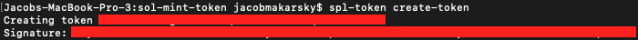
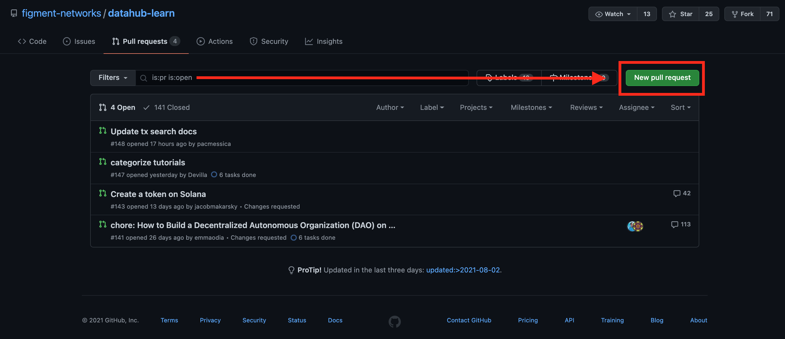

# How to create a token on Solana

# Minting a fungible token on the Solana blockchain

## Introduction

In this tutorial we will be creating a **token** on the **Solana** blockchain with no coding needed. Tokens have many functionalties, such as a [social token](https://www.nasdaq.com/articles/social-tokens%3A-get-ready-for-the-next-massive-crypto-trend-2021-04-29), a [utility token](https://invao.org/token-classes-explained-coin-vs-utility-token-vs-security-token/), or a [coin](https://invao.org/token-classes-explained-coin-vs-utility-token-vs-security-token/). This tutorial will typically show a call to action in the form of a bullet point. 

Solana has a [Token Program](https://spl.solana.com/token), written in [Rust](https://www.rust-lang.org/), that will allow us to create our own token. We will only need to use a simple command-line interface to create and send our tokens around. 

Please note that if you need help with or would like to explore the usage of any command referenced in this tutorial, add the --help flag after the command.

* For example:
```bash
solana --help
```

# Prerequisites

* Basic familiarity with a [command-line interface](https://en.wikipedia.org/wiki/Command-line_interface)
* Basic familiarity with Git & Github
* Around $1 USD of [SOL](https://coinmarketcap.com/currencies/solana/) accessible. We can get SOL through an exchange, such as [FTX](https://ftx.com/#a=13426316), or by swapping tokens on [Serum](https://projectserum.com/#/).

# Requirements

* [Github Account](https://github.com/) created
* [Git](https://git-scm.com/book/en/v2/Getting-Started-Installing-Git) installed
* [Rust](https://rustup.rs/) installed
* [Solana Tool Suite](https://docs.solana.com/cli/install-solana-cli-tools) installed

## **1) Create an SOL wallet**

First we are going to create an SOL wallet to handle our transactions, using the command line.

* Create a new wallet, which will return the **pubkey**
```bash
solana-keygen new --force
```

The output should look something like:

```bash
Generating a new keypair

For added security, enter a BIP39 passphrase

NOTE! This passphrase improves security of the recovery seed phrase NOT the
keypair file itself, which is stored as insecure plain text

BIP39 Passphrase (empty for none): 
```
You can enter a passphrase or just skip ahead and leave it empty.

```bash
Wrote new keypair to /Users/username/.config/solana/id.json
================================================================================
pubkey: 7UX2i7SucgLMQcfZ75s3VXmZZY4YRUyJN9X1RgfMoDUi
================================================================================
Save this seed phrase and your BIP39 passphrase to recover your new keypair:
still auto damp sphere silly remain first utility announce material luxury robe
================================================================================
```

Write the seed phrase down somewhere safe. 

The created JSON wallet file is located at ```~/.config/solana/id.json``` in your filesystem. 

## **2) Fund the wallet**

We will now use that public key (pubkey) to fund our wallet with SOL. The SOL is needed to pay for transactions and any changes we make to the blockchain, for example, the transaction that creates our token.

* Send 0.1 SOL to our command-line wallet

I sent SOL to this wallet from my [Sollet](https://chrome.google.com/webstore/detail/sollet/fhmfendgdocmcbmfikdcogofphimnkno?hl=en) browser wallet, where I acquired SOL from [FTX](https://ftx.com/#a=13426316). I used the public key of my command-line wallet as shown above, which is ```7UX2i7SucgLMQcfZ75s3VXmZZY4YRUyJN9X1RgfMoDUi```.


---

**NOTE:** FTX and Solana are closely linked; FTX's sister company Alameda Research is an investor in Solana, and FTX also operates its own decentralized exchange called Serum on the Solana blockchain.

---

* Check the balance of the wallet with the public key in this input being **your** wallet's public key
```bash
solana balance 7UX2i7SucgLMQcfZ75s3VXmZZY4YRUyJN9X1RgfMoDUi
```

The returned balance should match the exact amount that you sent to the wallet.

## **3) Create the token**

* Install the **spl-token** CLI
```bash
cargo install spl-token-cli
```

* Create the token, which will return the **tokenAddress**
```bash
spl-token create-token
```



---

**NOTE:** If you do not have any SOL in your wallet to pay for the transaction, you will recieve an error:

```bash
Creating token AQoKYV7tYpTrFZN6P5oUufbQKAUr9mNYGe1TTJC9wajM
Fee payer, 7UX2i7SucgLMQcfZ75s3VXmZZY4YRUyJN9X1RgfMoDUi, has insufficient balance: 0.0014716 required, 0 available
```

---

After running ```create-token``` above, we have created our own token on Solana. There is much more you can do with this.

* Check the balance of the wallet with the public key in this input being **your** wallet's public key
```bash
solana balance 7UX2i7SucgLMQcfZ75s3VXmZZY4YRUyJN9X1RgfMoDUi
```

Your balance will decrease, indicating the transaction fees and deployment cost have been paid. The token is officially created 👍

## **4) Create an account to handle the tokens**

Now we need to create an [account](https://docs.solana.com/developing/programming-model/accounts) that can work with the tokens. 

* Create an account, which will return the **accountAddress**, with **tokenAddress** being your token's address.
```bash
spl-token create-account tokenAddress
```

For example:
```bash
spl-token create-account AQoKYV7tYpTrFZN6P5oUufbQKAUr9mNYGe1TTJC9wajM
```

The output will look something like:

```bash
Creating account 7UX2i7SucgLMQcfZ75s3VXmZZY4YRUyJN9X1RgfMoDUi
Signature: 42Sa5eK9dMEQyvD9GMHuKxXf55WLZ7tfjabUKDhNoZRAxj9MsnN7omriWMEHXLea3aYpjZ862qocRLVikvkHkyfy
```

* Check the balance of the wallet with the public key in this input being **your** wallet's public key
```bash
solana balance 7UX2i7SucgLMQcfZ75s3VXmZZY4YRUyJN9X1RgfMoDUi
```

## **5) Mint the tokens**

It's time to mint some tokens and practice transferring them around. For the **mintAmount**, you can specify any number. Why not try 💰 1,000,000 💰 just for fun? Normally this would be based on factors like how big you expect the tokens market cap to be and if you plan to airdrop any amount. 

The recipientAddress would be the account you created to handle the tokens. 

* Mint tokens
```bash
spl-token mint tokenAddress mintAmount recipientAddress
```

For example:
```bash
spl-token mint AQoKYV7tYpTrFZN6P5oUufbQKAUr9mNYGe1TTJC9wajM 100 7UX2i7SucgLMQcfZ75s3VXmZZY4YRUyJN9X1RgfMoDUi
```

The output should look something like:

```bash
Minting 100 tokens
  Token: AQoKYV7tYpTrFZN6P5oUufbQKAUr9mNYGe1TTJC9wajM
  Recipient: 7UX2i7SucgLMQcfZ75s3VXmZZY4YRUyJN9X1RgfMoDUi
Signature: 41mARH42fPkbYn1mvQ6hYLjmJtjW98NXwd6pHqEYg9p8RnuoUsMxVd16RkStDHEzcS2sfpSEpFscrJQn3HkHzLaa
```

Remember, if you are lost or would like to to explore what any of these commands do or how to use them, it's always possible to use the ```--help``` flag with any of the Solana CLI tools to get more information.

* For example:
```bash
spl-token mint --help
```


Go ahead and check the wallet balance after this transaction if you'd like. Once the tokens have finished minting, it's time to think about security: What's stopping me from minting an infinite amount of these tokens?

## **6) Limit supply to prevent unlimited minting**

It is crucial to prevent infinite minting of our token, once enough has been created.

* Disable minting
```bash
spl-token authorize tokenAddress mint --disable
```

This will show the mint authority, which should match the public key of your wallet. The new mint authority should now be disabled.

* Check token balance of existing accounts
```bash
spl-token accounts
```

The output should look something like:
```bash
Token                                         Balance
------------------------------------------------------------
AQoKYV7tYpTrFZN6P5oUufbQKAUr9mNYGe1TTJC9wajM  1000000
```

Check the wallet balance too if you'd like. It will show the difference after the transaction. 

## **7) Transfer token to browser wallet**

This step is optional, but now we are going to send all of the token from our command-line-created wallet to our browser wallet. You must have some SOL in your browser wallet so it can automatically add the token. 

* Send token to browser wallet
```bash
spl-token transfer --fund-recipient tokenAddress transferAmount recipientAddress
```

For example:
```bash
spl-token transfer AQoKYV7tYpTrFZN6P5oUufbQKAUr9mNYGe1TTJC9wajM 1000000 vines1vzrYbzLMRdu58ou5XTby4qAqVRLmqo36NKPTg
```

This time, the recipientAddress should be your browser wallet's address. For example, I'm using my Sollet wallet (as mentioned in section 2 above), so I will need the SOL address of that wallet. 

The output should look something like
```bash
Transfer 50 tokens
  Sender: 7UX2i7SucgLMQcfZ75s3VXmZZY4YRUyJN9X1RgfMoDUi
  Recipient: vines1vzrYbzLMRdu58ou5XTby4qAqVRLmqo36NKPTg
  Recipient associated token account: F59618aQB8r6asXeMcB9jWuY6NEx1VduT9yFo1GTi1ks

Signature: 5a3qbvoJQnTAxGPHCugibZTbSu7xuTgkxvF4EJupRjRXGgZZrnWFmKzfEzcqKF2ogCaF4QKVbAtuFx7xGwrDUcGd
```


After the transaction goes through, you should see your new token in your browser wallet! But, there's an obvious problem. It has no name...

## **8) Submit pull request to Solana to register token**

Our token is created and live on the blockchain, but Solana is not yet officially recognizing it. We need to get all the required information for the token ready for submission. 

I created a ```turotial``` folder on my desktop, and changed the directory using ```cd``` in the terminal to the location of the folder.

* Enter where you want to clone the token list on your computer
```bash
cd /Users/jacobmakarsky/Desktop/tutorial
```

* Clone the [Solana token list](https://github.com/solana-labs/token-list) 
```bash
git clone https://github.com/solana-labs/token-list
```

We now have the ```token-list``` cloned, so we can add our token's image and information for uploading. 

* Copy and paste the token's logo inside the ```token-list``` folder, in the following directory
```bash
assets/mainnet/<mint address>/*.<png/svg>
```

The ```mint address``` is the ```tokenAddress``` we used before. Go ahead and name the file ```logo.png``` or ```logo.svg```. It looks like they prefer be either of those file types. 

* Open the token list file in the following directory
```bash
token-list/src/tokens/solana.tokenlist.json
```

* Add your token to the list like so:


My example token will be a social token, so make sure to not copy that unless yours is one too. 

The link for the token image must be that exact format; just change the token address to your token address, and the logo filename to your logo filename and type.

* Save the file 

* Fork the [token-list](https://github.com/solana-labs/token-list) repository to your Github by pressing the **Fork** button in the top right of the repository page. 

This will add the ```token-list``` Github repository to your Github, which will allow us to upload our changes to our forked repository and eventually request the original repository to copy our changes.

* While still inside your ```token-list``` folder in the command line, set the url of your local repository to your forked version on Github
```bash
git remote set-url origin https://github.com/jacobmakarsky/token-list
```

* Add all the files
```bash
git add .
```

* Commit the files
```bash
git commit -m "first commit for JMK social token"
```

* Push our changes
```bash
git push origin main
```

You should now see the changes in your forked repository on Github. 

* Go to the [pull requests page](https://github.com/solana-labs/token-list/pulls)

* Select the **New pull request** button

* Select the highlighted **compare across forks** option in the subtitle below the **Compare changes** header

* Select your forked repository from the **head repository** dropdown list

You should see 2 changed files; your token changes and the logo image. 

* Ensure these details are correct, for example, the folder's name holding the logo image should exactly match your token address in the token list. 



We are now ready to create the pull request! 

* Go ahead and click the green **Create pull request** button.

* Once finished adding a title and filling out the details, press the green **Create pull request** button again. 

Congratulations! Your token is now on the way to being official. Only if we could actually trade the token though...

## **9) BONUS: Add a market for your token on Serum**

You've made it! Your token is live and has a name. It can now be sent around and used for whatever its utility may be. But, there is no trading pair for the token to be traded on. I did not make a market for my social token as I do not want it to be traded. 

Note: It costs roughly **10-15 SOL** to create a market, which right now is around **$350 USD**. 

* Head over to [Serum](https://dex.projectserum.com/#/list-new-market) and connect your chosen wallet in the top right. 

* Fill out the form

The **Base Token Mint Address** will be your tokenAddress, and the **Quote Token Mint Address** will be what token you want your token paired to. I would use USDT for my example. 

Once submitted, you should have a live market that can trade the tokens.

## Conclusion

Woohoo! If you made it through all the steps, you have succesfully created your own token on the Solana blockchain. If you completed the bonus, you now have a tradeable token 👍

## What's next?

In this tutorial, we built our own token on the Solana blockchain using Solana's command-line interface or "CLI". Feel free to continue experimenting by attempting to mint more of the token, sending the token around to other wallets, creating a market for it, making a liquidity pool on [Raydium](https://raydium.io/liquidity/), etc. Check back in the future for a tutorial on how to make a [non-fungible token](https://www.blockchain-council.org/blockchain/a-quick-guide-to-fungible-vs-non-fungible-tokens/) on Solana as well.

## About the Author

This tutorial was created by Jacob Makarsky. You can find him on [Github](https://github.com/jacobmakarsky) or the [Figment Forum](https://community.figment.io/u/jacobmakarsky/summary) for any further help.

If you had any difficulties following this tutorial or simply want to discuss Solana's tech with us you can [join our community today](https://discord.gg/fszyM7K)!


## References

* [Solana Token Program](https://spl.solana.com/token)
* [Loop Creative Andy](https://www.youtube.com/watch?v=1cn-HnG_yns)
* Special thanks to [pyR0gan](https://github.com/pyr0gan) for thoroughly reviewing this tutorial before posting 🙏
